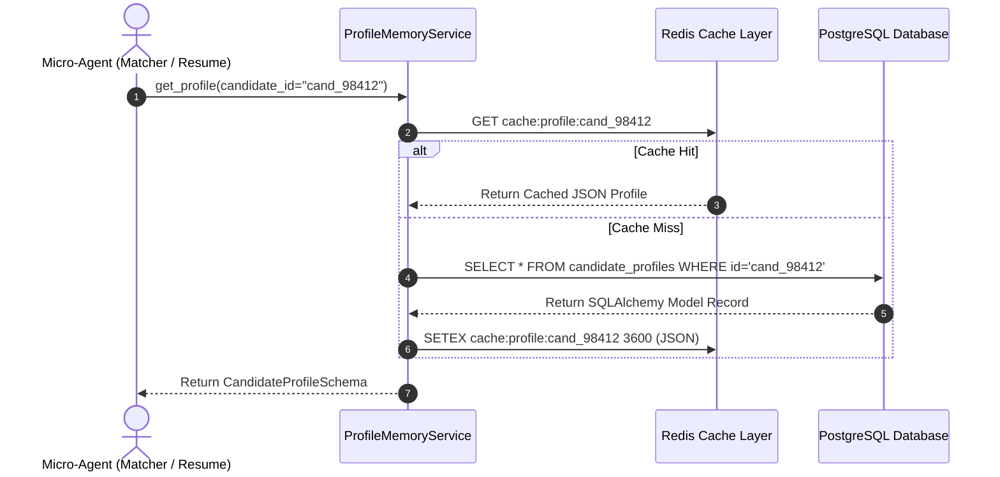
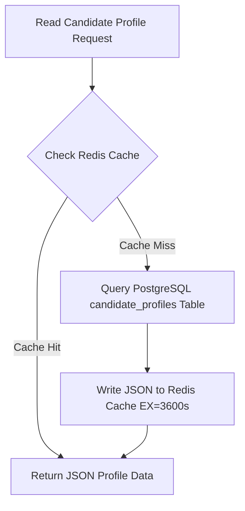

# 1. Overview
This document specifies the **Candidate Master Profile Memory Subsystem**, detailing master profile data schema, relational persistence in PostgreSQL, profile versioning, and profile retrieval service ([profile.py](file:///d:/Personal%20Imp/Projects/Automated-job-Agent/backend/app/models/profile.py)).

---

# 2. Why This Exists
An automated job application agent requires an authoritative, structured master record of candidate data: personal contact details, work experience history, education, technical skill taxonomies, portfolio links, EEOC demographics, and job preference settings ([profile.py](file:///d:/Personal%20Imp/Projects/Automated-job-Agent/backend/app/models/profile.py)).

---

# 3. Responsibilities
- Maintain master candidate profile record in PostgreSQL `candidate_profiles` table ([profile.py](file:///d:/Personal%20Imp/Projects/Automated-job-Agent/backend/app/models/profile.py)).
- Support candidate profile editing, resume re-parsing sync, and versioning.
- Supply structured profile context to Matcher Agent, Resume Agent, and Application Agent.

---

# 4. Inputs
- Candidate registration data, parsed resume data, profile API update requests.

---

# 5. Outputs
- `CandidateProfile` ORM model and serialized Pydantic profile dictionary.

---

# 6. Components
- **CandidateProfileModel**: SQLAlchemy ORM model ([profile.py](file:///d:/Personal%20Imp/Projects/Automated-job-Agent/backend/app/models/profile.py)).
- **ProfileMemoryService**: CRUD service managing candidate profile persistence.

---

# 7. Folder Structure
```text
docs/Phase-08-Memory/
├── User-Profile-Memory.md
├── Semantic-Memory.md
├── Procedural-Memory.md
├── Application-History-Memory.md
├── Reflection-Memory.md
├── Conversation-Memory.md
├── Connector-Memory.md
└── Cache-Memory.md
```

---

# 8. Data Models
```python
from pydantic import BaseModel, EmailStr
from typing import List, Optional

class WorkExperienceItem(BaseModel):
    company: str
    title: str
    location: str
    start_date: str
    end_date: Optional[str] = None
    is_current: bool = False
    achievements: List[str]

class CandidateProfileSchema(BaseModel):
    id: str
    full_name: str
    email: EmailStr
    phone: str
    location: str
    portfolio_url: Optional[str] = None
    github_url: Optional[str] = None
    linkedin_url: Optional[str] = None
    skills: List[str]
    work_history: List[WorkExperienceItem]
    expected_salary_min: Optional[int] = None
    visa_sponsorship_required: bool = False
```

---

# 9. API Contracts
Candidate Profile REST API Payload:
```json
{
  "endpoint": "/api/v1/profile/me",
  "method": "GET",
  "response": {
    "id": "cand_98412",
    "full_name": "John Doe",
    "email": "john.doe@example.com",
    "skills": ["Python", "FastAPI", "PostgreSQL", "Docker"]
  }
}
```

---

# 10. Sequence Diagram


---

# 11. Flow Diagram


---

# 12. Internal Working
The profile memory subsystem stores structured JSON fields in PostgreSQL using `JSONB` columns (`work_history`, `education`, `preferences`). Redis caches active profile records for 1 hour to maximize read performance.

---

# 13. Configuration
- Specified in [backend/app/models/profile.py](file:///d:/Personal%20Imp/Projects/Automated-job-Agent/backend/app/models/profile.py).

---

# 14. Error Handling
Missing candidate profile records raise `CandidateProfileNotFoundError` (HTTP 404).

---

# 15. Retry Strategy
- Database reads retry up to 2 times on connection pool exhaustion.

---

# 16. Security
- Profile records enforce strict row-level security ensuring candidates access only their own profile data.

---

# 17. Logging
- Profile memory events log `candidate_id`, `cache_hit`, `read_duration_ms`.

---

# 18. Metrics
- Profile Read Speed (<2ms cached, <12ms DB).

---

# 19. Testing Strategy
- Unit test profile memory CRUD methods using pytest-asyncio and SQLite/PostgreSQL fixtures.

---

# 20. Performance Considerations
- Redis caching cuts PostgreSQL database query load by over 80%.

---

# 21. Best Practices
- Invalidate Redis profile cache immediately upon any profile edit mutation.

---

# 22. Production Improvements
- Enable field-level encryption for sensitive profile fields (SSN, phone, address).

---

# 23. Common Failure Scenarios
- **Scenario**: Candidate updates work history, but old cached profile is served.
  - **Resolution**: `ProfileMemoryService.update_profile()` explicitly issues `redis.delete(cache_key)`.

---

# 24. Future Enhancements
- Profile completion percentage score calculator encouraging candidates to add missing skills.

---

# 25. References
- Candidate Master Profile Architecture Specifications.
