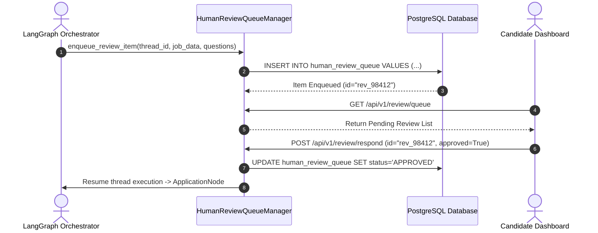
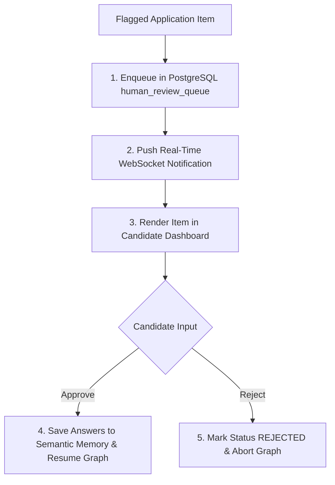

# 1. Overview
This document specifies the **Human Review Handler & Intercept Queue Architecture**, detailing review item formatting, queue priority ordering, approval dashboard API contracts, and automatic answer learning ([human_review.py](file:///d:/Personal%20Imp/Projects/Automated-job-Agent/backend/app/automation/review/human_review.py)).

---

# 2. Why This Exists
When applications require candidate confirmation (70-85% match score, unmapped custom questionnaire fields, salary expectations, security clearances), items are pushed to the Human Review Intercept Queue. Structuring this queue guarantees timely candidate notifications and clean state resume handling ([human_review.py](file:///d:/Personal%20Imp/Projects/Automated-job-Agent/backend/app/automation/review/human_review.py)).

---

# 3. Responsibilities
- Enqueue flagged review items into PostgreSQL `human_review_queue` table ([human_review.py](file:///d:/Personal%20Imp/Projects/Automated-job-Agent/backend/app/automation/review/human_review.py)).
- Serve pending review list to candidate React dashboard API.
- Process candidate approval dispatches and update `SemanticMemory` with candidate answers.

---

# 4. Inputs
- LangGraph thread ID, flagged questions, match score evaluation report.

---

# 5. Outputs
- Saved review queue item, WebSocket alert dispatch, and candidate response handler.

---

# 6. Components
- **HumanReviewQueueManager**: Manages enqueueing, listing, and resolving review items ([human_review.py](file:///d:/Personal%20Imp/Projects/Automated-job-Agent/backend/app/automation/review/human_review.py)).
- **AnswerLearner**: Saves candidate approved custom question answers to `SemanticMemory`.

---

# 7. Folder Structure
```text
docs/Phase-09-Verification/
└── Human-Review-Handler.md
```

---

# 8. Data Models
```python
from pydantic import BaseModel
from typing import List, Dict, Any, Optional
from datetime import datetime

class HumanReviewQueueItemSchema(BaseModel):
    id: str
    thread_id: str
    candidate_id: str
    job_id: str
    company_name: str
    job_title: str
    match_score: float
    flagged_questions: List[Dict[str, Any]]
    tailored_resume_url: str
    status: str = "PENDING"  # PENDING, APPROVED, REJECTED, EXPIRED
    created_at: datetime = Field(default_factory=datetime.utcnow)
```

---

# 9. API Contracts
Human Review Queue API Endpoint:
```json
{
  "endpoint": "/api/v1/review/queue",
  "method": "GET",
  "response": {
    "pending_count": 2,
    "items": [
      {
        "id": "rev_98412",
        "company_name": "Acme Corp",
        "job_title": "Senior Backend Engineer",
        "match_score": 78.5,
        "flagged_questions": [
          {"question": "Expected Salary", "suggested_answer": "$150,000"}
        ]
      }
    ]
  }
}
```

---

# 10. Sequence Diagram


---

# 11. Flow Diagram


---

# 12. Internal Working
When a candidate approves custom question answers, `AnswerLearner` automatically embeds the question-answer pairs and stores them in Qdrant `qa_history` collection (`Semantic-Memory.md`), so identical questions are auto-filled in future applications.

---

# 13. Configuration
- Specified in [backend/app/automation/review/human_review.py](file:///d:/Personal%20Imp/Projects/Automated-job-Agent/backend/app/automation/review/human_review.py).
- Item Expiration: `REVIEW_ITEM_TTL_HOURS = 24`

---

# 14. Error Handling
Review items older than 24 hours automatically transition to `EXPIRED` status via a background cleanup job.

---

# 15. Retry Strategy
- N/A.

---

# 16. Security
- API endpoints enforce candidate user ownership validation on review items.

---

# 17. Logging
- Review events log `review_id`, `candidate_id`, `job_id`, `status`, `wait_duration_seconds`.

---

# 18. Metrics
- Average Review Queue Processing Time (under 5 minutes).

---

# 19. Testing Strategy
- Unit test review queue manager enqueue, list, and approval endpoints using pytest-asyncio.

---

# 20. Performance Considerations
- Database index on `(candidate_id, status)` ensures sub-5ms queue fetching.

---

# 21. Best Practices
- Provide clear context previews (job title, company, match score, tailored resume link) for every review item.

---

# 22. Production Improvements
- Batch approval feature allowing candidates to approve multiple pending review items with 1 click.

---

# 23. Common Failure Scenarios
- **Scenario**: Candidate approves review item after thread has timed out.
  - **Resolution**: Manager detects expired thread and prompts candidate to restart campaign step.

---

# 24. Future Enhancements
- Interactive email review links allowing 1-click application approvals directly from candidate email inbox.

---

# 25. References
- Human Review Handler Architecture Specifications.
