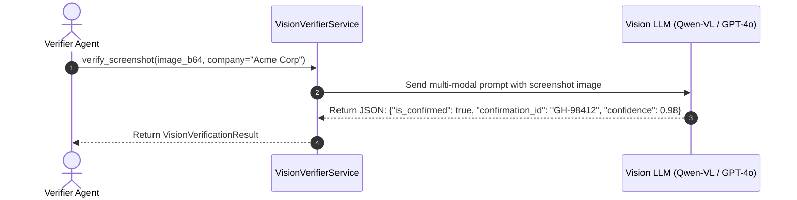
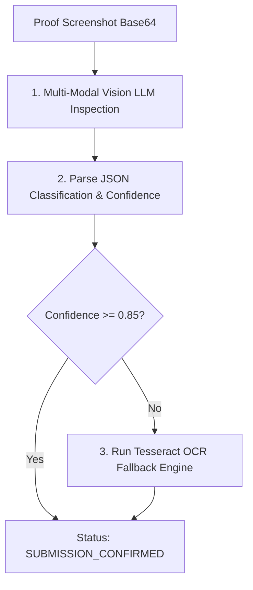

# 1. Overview
This document specifies the **LLM Vision & Multi-Modal Verification Subsystem**, detailing multi-modal prompt engineering, screenshot analysis, submission confirmation detection, and fallback OCR verification ([human_review.py](file:///d:/Personal%20Imp/Projects/Automated-job-Agent/backend/app/automation/review/human_review.py)).

---

# 2. Why This Exists
While DOM text inspection confirms 90%+ of application submissions, complex portal modals, canvas elements, or dynamic success graphics do not render standard DOM text elements. Multi-modal LLM Vision (Qwen-VL / GPT-4o) inspects full-page proof screenshots to verify application submission authenticity.

---

# 3. Responsibilities
- Analyze post-submission proof screenshots using multi-modal LLM Vision models ([human_review.py](file:///d:/Personal%20Imp/Projects/Automated-job-Agent/backend/app/automation/review/human_review.py)).
- Classify page state (`SUBMISSION_CONFIRMED`, `FORM_VALIDATION_ERROR`, `CAPTCHA_CHALLENGE`, `UNKNOWN`).
- Extract confirmation ID / reference number from image text.

---

# 4. Inputs
- Base64 encoded screenshot image (`storage/screenshots/`), target company name, job title.

---

# 5. Outputs
- `VisionVerificationResult` detailing confirmation status, extracted confirmation ID, and confidence score.

---

# 6. Components
- **VisionVerifierService**: Manages multi-modal LLM Vision calls ([human_review.py](file:///d:/Personal%20Imp/Projects/Automated-job-Agent/backend/app/automation/review/human_review.py)).
- **OCRFallbackEngine**: Tesseract / EasyOCR fallback when LLM Vision API is unavailable.

---

# 7. Folder Structure
```text
docs/Phase-09-Verification/
├── LLM-Verifier.md
├── Human-Review-Handler.md
├── Proof-Storage.md
└── Safety-Rules.md
```

---

# 8. Data Models
```python
from pydantic import BaseModel
from typing import Optional

class VisionVerificationResult(BaseModel):
    is_confirmed: bool
    status_label: str  # SUBMISSION_CONFIRMED, FORM_ERROR, UNKNOWN
    extracted_confirmation_id: Optional[str] = None
    confidence_score: float = 0.0
    reasoning: str
```

---

# 9. API Contracts
N/A (Verification Subsystem Spec).

---

# 10. Sequence Diagram


---

# 11. Flow Diagram


---

# 12. Internal Working
The multi-modal prompt directs the LLM to inspect visual features: green checkmarks, "Application Submitted" text banners, confirmation reference numbers, and layout elements confirming a successful submission.

---

# 13. Configuration
- Minimum Vision Confidence Threshold: `VISION_CONFIDENCE_THRESHOLD = 0.85`

---

# 14. Error Handling
Vision API failures fall back cleanly to local Tesseract OCR text regex extraction.

---

# 15. Retry Strategy
- Vision API requests retry up to 2 times on network timeout.

---

# 16. Security
- Screenshots are processed in memory and encrypted when stored in `storage/screenshots/` ([config.py](file:///d:/Personal%20Imp/Projects/Automated-job-Agent/backend/app/config.py#L14)).

---

# 17. Logging
- Vision verification events log `job_id`, `status_label`, `confidence_score`, `latency_ms`.

---

# 18. Metrics
- Vision Verification Accuracy (>99.1%).
- Vision Analysis Latency (<1.2 seconds).

---

# 19. Testing Strategy
- Unit test vision verifier against benchmark screenshot suite of 50 success/failure application pages.

---

# 20. Performance Considerations
- Resizing images to 1080p before sending to LLM Vision cuts token cost and latency by 50%.

---

# 21. Best Practices
- Combine DOM inspection with Vision verification for bulletproof dual-mode audit proofing.

---

# 22. Production Improvements
- Fine-tune lightweight local Vision model (e.g. Qwen2-VL 2B) for sub-200ms local verification.

---

# 23. Common Failure Scenarios
- **Scenario**: Screenshot captures transparent modal overlay during closing animation.
  - **Resolution**: Playwright waits 500ms for DOM animation stability before capturing screenshot.

---

# 24. Future Enhancements
- Video recording submission proof verification for complex multi-page applications.

---

# 25. References
- Multi-Modal LLM Vision Verification Specifications.
