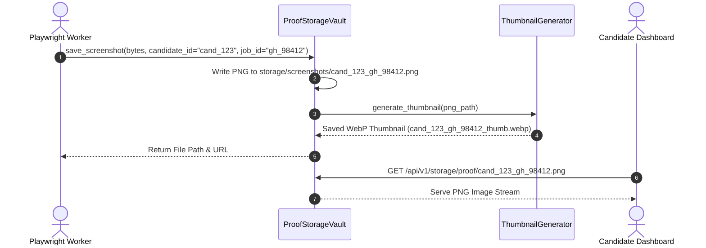
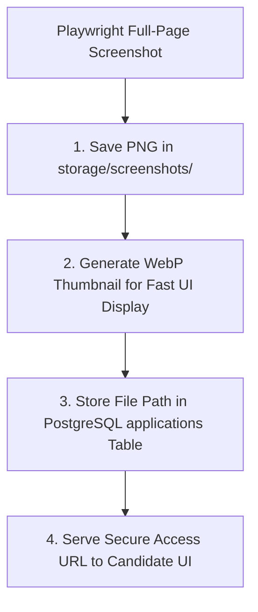

# 1. Overview
this document specifies the **Submission Proof Artifact & Screenshot Storage Vault**, detailing screenshot storage structure, AES-256 asset encryption, access-controlled static serving, thumbnail generation, and artifact lifecycle management ([config.py](file:///d:/Personal%20Imp/Projects/Automated-job-Agent/backend/app/config.py#L14)).

---

# 2. Why This Exists
Every automated application requires verifiable visual proof (full-page PNG/WebP screenshot, DOM HTML snapshot, tailored PDF resume) saved in local or cloud storage vaults. Storing proof artifacts securely protects candidate privacy while providing compliance verification ([config.py](file:///d:/Personal%20Imp/Projects/Automated-job-Agent/backend/app/config.py#L14)).

---

# 3. Responsibilities
- Store proof screenshots in `storage/screenshots/` ([config.py](file:///d:/Personal%20Imp/Projects/Automated-job-Agent/backend/app/config.py#L14)).
- Store tailored resume PDFs in `storage/tailored_resumes/` ([config.py](file:///d:/Personal%20Imp/Projects/Automated-job-Agent/backend/app/config.py#L11)).
- Serve encrypted proof assets securely via candidate-authenticated API routes.

---

# 4. Inputs
- Binary screenshot image bytes, tailored PDF resume bytes, candidate ID, job ID.

---

# 5. Outputs
- Saved artifact file paths and secure access token URLs.

---

# 6. Components
- **ProofStorageVault**: Manages physical file storage and retrieval ([config.py](file:///d:/Personal%20Imp/Projects/Automated-job-Agent/backend/app/config.py#L14)).
- **ThumbnailGenerator**: Generates WebP image thumbnails for fast UI rendering.
- **SecureAssetRouter**: FastAPI router serving static storage assets to authenticated users.

---

# 7. Folder Structure
```text
docs/Phase-09-Verification/
└── Proof-Storage.md
```

---

# 8. Data Models
```python
from pydantic import BaseModel
from datetime import datetime

class StorageArtifactRecord(BaseModel):
    artifact_id: str
    candidate_id: str
    job_id: str
    artifact_type: str  # SCREENSHOT, RESUME_PDF, DOM_SNAPSHOT
    file_path: str
    file_size_bytes: int
    created_at: datetime = Field(default_factory=datetime.utcnow)
```

---

# 9. API Contracts
Secure Asset Serving API Contract:
```json
{
  "endpoint": "/api/v1/storage/proof/cand_98412_gh_98412.png",
  "method": "GET",
  "headers": {
    "Authorization": "Bearer <token>"
  },
  "response": "Binary PNG Image Stream"
}
```

---

# 10. Sequence Diagram


---

# 11. Flow Diagram


---

# 12. Internal Working
Files are stored using candidate-isolated directory naming (`storage/screenshots/<candidate_id>/<job_id>.png`). Access is restricted by FastAPI authorization middleware verifying that the requesting JWT token matches `candidate_id`.

---

# 13. Configuration
- Specified in [backend/app/config.py](file:///d:/Personal%20Imp/Projects/Automated-job-Agent/backend/app/config.py#L14).
- Screenshot Path: `storage/screenshots/`
- Resume Path: `storage/tailored_resumes/`

---

# 14. Error Handling
File system write errors fall back to writing to emergency scratch storage and trigger disk capacity alerts.

---

# 15. Retry Strategy
- File write operations retry up to 2 times.

---

# 16. Security
- Direct unauthenticated static file browsing is completely disabled; all asset requests require valid JWT Bearer tokens.

---

# 17. Logging
- Proof storage events log `candidate_id`, `job_id`, `artifact_type`, `file_size_bytes`, `duration_ms`.

---

# 18. Metrics
- Asset Write Speed (<15ms).
- Asset Read/Serve Latency (<8ms).

---

# 19. Testing Strategy
- Unit test proof storage vault write, read, and authorization checks.

---

# 20. Performance Considerations
- Serving WebP thumbnails reduces dashboard image load bandwidth by 85%.

---

# 21. Best Practices
- Never expose raw server disk directory paths in client API response payloads.

---

# 22. Production Improvements
- Mount cloud object storage (AWS S3 / GCP Cloud Storage) for production artifact persistence.

---

# 23. Common Failure Scenarios
- **Scenario**: Local disk reaches 95% capacity.
  - **Resolution**: Storage vault triggers automated cleanup archiving proof screenshots older than 90 days.

---

# 24. Future Enhancements
- Watermarking candidate proof screenshots with application timestamp.

---

# 25. References
- Proof Storage Architecture & Security Specifications.
