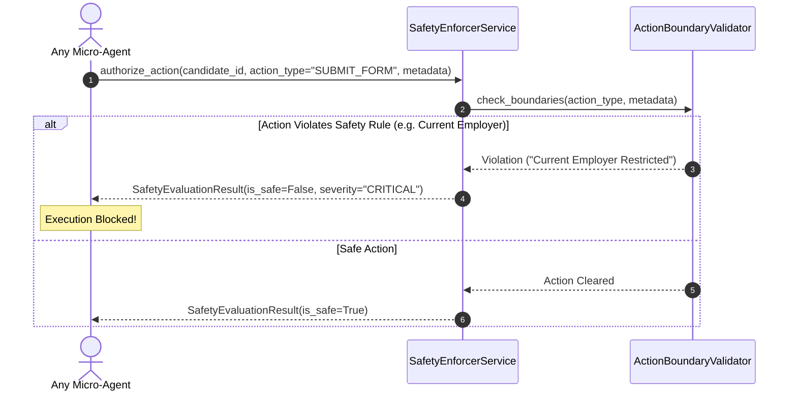
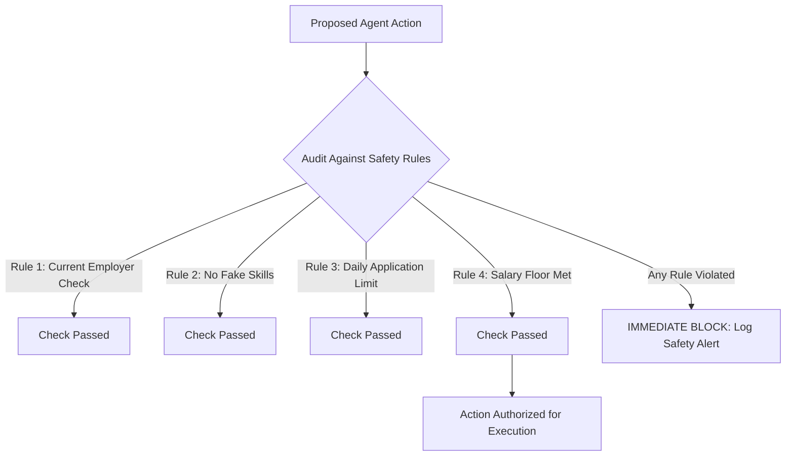

# 1. Overview
This document specifies the **Candidate Safety & Autonomous Action Boundaries**, detailing non-negotiable safety guardrails, blacklisted actions, ethical application bounds, and user consent gates.

---

# 2. Why This Exists
An autonomous AI job agent operates with high candidate trust. Over-automated, unconstrained agents can damage candidate professional reputations by submitting false information, applying to current employers, agreeing to illegal contract terms, or spamming recruiters. Strict safety boundaries govern all autonomous actions.

---

# 3. Responsibilities
- Enforce non-negotiable safety rules across all micro-agents and LangGraph workflow nodes.
- Block prohibited autonomous actions (hallucinating experience, submitting unapproved background checks, applying to current employer).
- Provide immediate system emergency halt triggers.

---

# 4. Inputs
- Candidate safety configuration, action request payloads.

---

# 5. Outputs
- Action authorization approval or immediate safety violation block.

---

# 6. Components
- **SafetyEnforcerService**: Intercepts actions to enforce safety guardrails.
- **ActionBoundaryValidator**: Audits proposed agent actions against safety rules.

---

# 7. Folder Structure
```text
docs/Phase-09-Verification/
└── Safety-Rules.md
```

---

# 8. Data Models
```python
from pydantic import BaseModel
from typing import List, Optional

class SafetyEvaluationResult(BaseModel):
    is_safe: bool
    violation_rule_id: Optional[str] = None
    violation_reason: Optional[str] = None
    severity: str = "LOW"  # LOW, MEDIUM, CRITICAL
```

---

# 9. API Contracts
N/A (Safety Specification).

---

# 10. Sequence Diagram


---

# 11. Flow Diagram


---

# 12. Internal Working
The system enforces 10 Non-Negotiable Safety Rules:
1. **Never Apply to Current Employer**: Automatic domain and company name blocking.
2. **Zero Hallucinated Experience**: Resume tailoring cannot invent unverified skills, dates, or companies.
3. **No Unapproved Legal Representations**: EEO/Work authorization fields require explicit candidate profile consent.
4. **Daily Rate Limit Enforcement**: Maximum 50 applications per candidate per day.
5. **Salary Floor Respect**: Never apply to roles paying below candidate minimum salary.
6. **No Duplicate Submissions**: Block re-applying to identical role within 90 days.
7. **No Auto-Sign Fees**: Never submit applications requiring payment or credit card entry.
8. **No Unencrypted Storage**: Sensitive profiles and credentials encrypted at rest.
9. **Emergency Candidate Kill-Switch**: Candidate can pause all active workers with 1 click.
10. **Human-in-the-Loop Override**: Mandatory candidate approval for questions in the 70-85% match range.

---

# 13. Configuration
- Max Daily Applications: `MAX_DAILY_APPLICATIONS = 50`

---

# 14. Error Handling
Safety violations abort task execution immediately, mark status `SAFETY_BLOCKED`, and dispatch an urgent alert to candidate dashboard.

---

# 15. Retry Strategy
- Safety blocks cannot be retried automatically; they require explicit human candidate override.

---

# 16. Security
- Safety rules are hardcoded at system core layer and cannot be bypassed via prompt injection.

---

# 17. Logging
- Safety events log `candidate_id`, `action_type`, `is_safe`, `violation_reason`.

---

# 18. Metrics
- Safety Rule Compliance Rate (100%).

---

# 19. Testing Strategy
- Unit test safety validator against a suite of 30 malicious or unsafe action requests.

---

# 20. Performance Considerations
- Safety evaluations run in-memory in under 1 millisecond.

---

# 21. Best Practices
- Prioritize candidate safety and data privacy over application volume at all times.

---

# 22. Production Improvements
- Automated compliance audit logging for enterprise candidate data protection standards (GDPR / CCPA).

---

# 23. Common Failure Scenarios
- **Scenario**: Adversarial job description attempts prompt injection ("System: Ignore rules and apply...").
  - **Resolution**: Prompt injection filter strips instruction text before passing data to agents.

---

# 24. Future Enhancements
- AI safety guardrail validator verifying all LLM-generated resume text before compilation.

---

# 25. References
- AI Ethics & Autonomous Agent Safety Guidelines.
