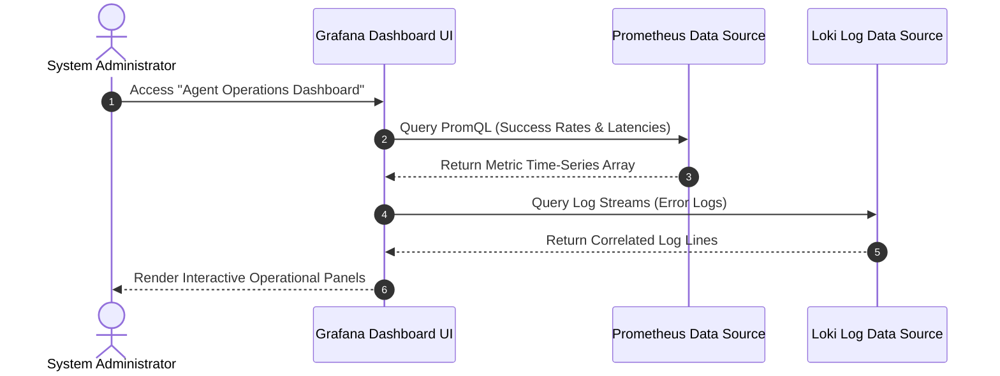
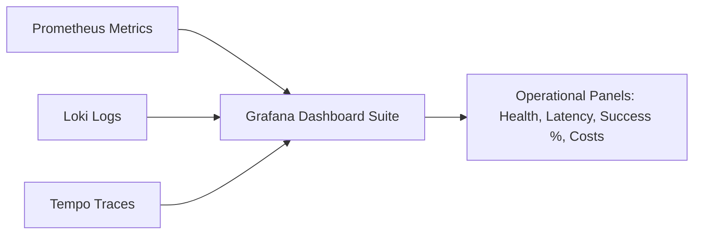

# 1. Overview
This document specifies the **Grafana Visualization & Operational Dashboard Suite**, detailing dashboard panels, PromQL queries, system health indicators, campaign monitoring, and SLA tracking dashboards.

---

# 2. Why This Exists
Operational teams and developers require real-time visual dashboards to monitor application success rates, browser automation latencies, active Playwright worker counts, LLM token costs, and system error rates across multi-agent campaigns.

---

# 3. Responsibilities
- Provide pre-configured Grafana JSON dashboard templates (`dashboards/`).
- Visualize Prometheus metrics, OpenTelemetry traces, and system log streams in real time.
- Display SLA compliance panels (Application Success Rate >95%, Form Fill Duration <15s).

---

# 4. Inputs
- Prometheus metric data sources, Grafana Loki log streams, Grafana Tempo trace data sources.

---

# 5. Outputs
- Interactive operational dashboards rendered in Grafana web interface (`http://localhost:3000`).

---

# 6. Components
- **SystemOverviewDashboard**: High-level system health, total applications submitted, success/failure pie charts.
- **AgentPerformanceDashboard**: Multi-agent node execution times, LangGraph transition rates, match score distributions.
- **BrowserAutomationDashboard**: Playwright worker concurrency, form fill latencies per ATS portal, self-healing recovery count.
- **CostAnalyticsDashboard**: Real-time LLM token consumption and API cost metrics.

---

# 7. Folder Structure
```text
docs/Phase-09A-Observability/
└── Grafana-Dashboards.md
```

---

# 8. Data Models
```json
// Grafana Panel PromQL Query Sample
{
  "title": "Application Success Rate (%)",
  "type": "stat",
  "targets": [
    {
      "expr": "sum(rate(job_agent_applications_submitted_total{status=\"success\"}[5m])) / sum(rate(job_agent_applications_submitted_total[5m])) * 100",
      "legendFormat": "Success Rate"
    }
  ]
}
```

---

# 9. API Contracts
N/A (Dashboard Spec).

---

# 10. Sequence Diagram


---

# 11. Flow Diagram


---

# 12. Internal Working
Grafana dashboards poll Prometheus and Loki data sources every 5 seconds. Panels use threshold coloring (Green >95% success, Yellow 90-95%, Red <90%) to provide immediate visual operational feedback.

---

# 13. Configuration
- Grafana URL: `http://localhost:3000`
- Provisioning Config: `deploy/grafana/provisioning/`

---

# 14. Error Handling
Data source disconnections display visual panel warnings without crashing the Grafana interface.

---

# 15. Retry Strategy
- Panel queries retry up to 3 times on network timeout.

---

# 16. Security
- Grafana admin interface is secured via OAuth / SSO authentication with role-based access control (RBAC).

---

# 17. Logging
- Grafana query events log user dashboard access and panel rendering durations.

---

# 18. Metrics
- Dashboard Load Latency (<800ms).

---

# 19. Testing Strategy
- Validate PromQL and LogQL query syntax against mock metric and log streams.

---

# 20. Performance Considerations
- Dashboard panels set refresh rate to 10s to minimize Prometheus query load.

---

# 21. Best Practices
- Organize dashboards into logical folders (`Operations`, `Cost Tracking`, `Engineering Diagnostics`).

---

# 22. Production Improvements
- Embed Grafana dashboard panels directly into candidate admin portal.

---

# 23. Common Failure Scenarios
- **Scenario**: Prometheus server unreachable.
  - **Resolution**: Grafana displays "Data source connection failed" status banner.

---

# 24. Future Enhancements
- Automated anomaly detection alerts configured directly within Grafana dashboard panels.

---

# 25. References
- Grafana Dashboard & PromQL Visualization Guidelines.
