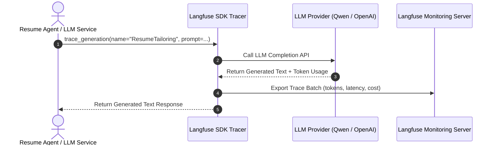
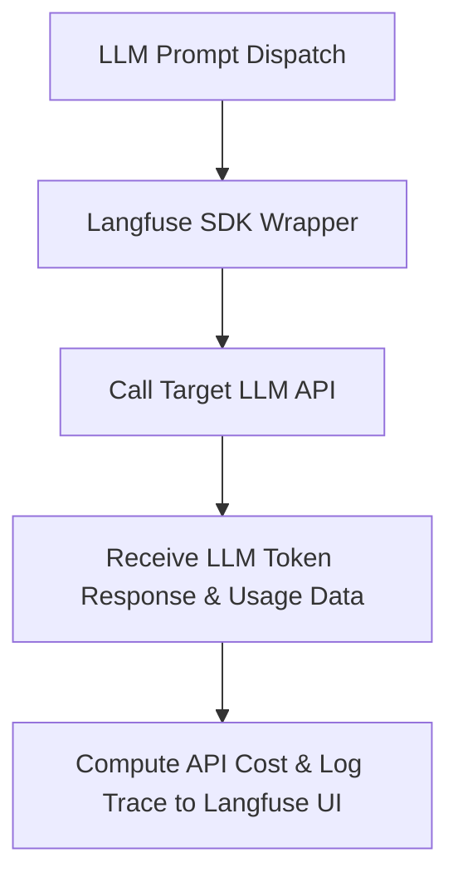

# 1. Overview
This document specifies the **Langfuse LLM Tracing & Token Cost Tracking Engine**, detailing prompt versioning, LLM input/output logging, token count tracking, cost calculation, and hallucination monitoring ([config.py](file:///d:/Personal%20Imp/Projects/Automated-job-Agent/backend/app/config.py#L9)).

---

# 2. Why This Exists
LLM operations (Resume Tailoring, Cover Letter Generation, Match Score Evaluation, Question Answering) generate significant token consumption and API costs. Tracking prompts, responses, token usage, latency, and cost per candidate application in Langfuse guarantees cost visibility and prompt optimization.

---

# 3. Responsibilities
- Trace every LLM API call (Qwen, Gemini, OpenAI) with Langfuse SDK wrapper ([config.py](file:///d:/Personal%20Imp/Projects/Automated-job-Agent/backend/app/config.py#L9)).
- Record prompt versions, system instructions, input tokens, output tokens, and total cost.
- Log candidate feedback and hallucination guardrail evaluation scores.

---

# 4. Inputs
- LLM generation requests, model parameters, candidate ID, job ID.

---

# 5. Outputs
- Traced LLM generation event logged to Langfuse Server (`http://localhost:3000` or Cloud).

---

# 6. Components
- **LangfuseTracer**: Wrapper service interfacing with Langfuse Python SDK ([config.py](file:///d:/Personal%20Imp/Projects/Automated-job-Agent/backend/app/config.py#L9)).
- **CostCalculator**: Computes exact API cost based on model pricing tables (e.g. `$0.15 / 1M tokens`).

---

# 7. Folder Structure
```text
docs/Phase-09A-Observability/
└── Langfuse-LLM-Tracing.md
```

---

# 8. Data Models
```python
from pydantic import BaseModel
from typing import Optional, Dict, Any

class LLMTraceRecord(BaseModel):
    trace_id: str
    name: str  # ResumeTailoring, CoverLetterSynthesis, MatchEvaluation
    model: str  # qwen-max, gpt-4o-mini, gemini-1.5-flash
    prompt_name: str
    prompt_version: int
    input_tokens: int
    output_tokens: int
    total_cost_usd: float
    latency_ms: float
    metadata: Dict[str, Any]
```

---

# 9. API Contracts
Langfuse Trace Payload Sample:
```json
{
  "name": "ResumeTailoring",
  "model": "qwen-max",
  "input_tokens": 1240,
  "output_tokens": 420,
  "total_cost_usd": 0.0018,
  "latency_ms": 1850.0,
  "metadata": {
    "candidate_id": "cand_98412",
    "job_id": "gh_98412"
  }
}
```

---

# 10. Sequence Diagram


---

# 11. Flow Diagram


---

# 12. Internal Working
The system wraps LLM client calls using `@observe()` decorators or `langfuse.trace()`. Every generation records input prompts, output text, latency, token counts, and computed cost USD.

---

# 13. Configuration
- Specified in [backend/app/config.py](file:///d:/Personal%20Imp/Projects/Automated-job-Agent/backend/app/config.py#L9).
- Public Key: `LANGFUSE_PUBLIC_KEY`
- Secret Key: `LANGFUSE_SECRET_KEY`
- Host: `LANGFUSE_HOST`

---

# 14. Error Handling
If Langfuse server is unreachable, traces buffer asynchronously in background threads without blocking main LLM completions.

---

# 15. Retry Strategy
- Langfuse trace exports retry up to 3 times with exponential backoff.

---

# 16. Security
- Sensitive tokens and candidate PII strings in prompts can be masked before sending traces to external servers.

---

# 17. Logging
- Langfuse events log `trace_id`, `model`, `tokens_total`, `cost_usd`, `duration_ms`.

---

# 18. Metrics
- Average Cost per Application (<$0.015 total LLM cost per tailored job application).

---

# 19. Testing Strategy
- Unit test Langfuse tracer wrapper using mock SDK response fixtures.

---

# 20. Performance Considerations
- Non-blocking async trace flushing adds zero latency to LLM response delivery.

---

# 21. Best Practices
- Always tag traces with `candidate_id` and `job_id` to enable per-user cost tracking.

---

# 22. Production Improvements
- Implement automated prompt A/B testing evaluation directly within Langfuse UI.

---

# 23. Common Failure Scenarios
- **Scenario**: API model price changes.
  - **Resolution**: `CostCalculator` updates pricing tables dynamically without redeploying code.

---

# 24. Future Enhancements
- Automated LLM output hallucination scoring integrated with Langfuse evaluation API.

---

# 25. References
- Langfuse Python SDK & LLM Observability Specifications.
