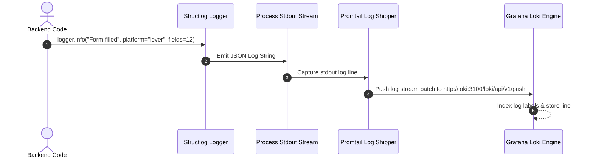
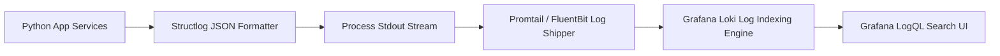

# 1. Overview
This document specifies the **Structured JSON Logging & Grafana Loki Aggregation Engine**, detailing structlog JSON formatting, log contextual fields, Loki log shipping, and LogQL diagnostic queries.

---

# 2. Why This Exists
Debugging asynchronous multi-agent executions across worker threads requires structured, machine-parseable log outputs containing unified trace IDs, candidate IDs, job IDs, and component names. Standard plain-text logs make multi-threaded troubleshooting difficult.

---

# 3. Responsibilities
- Emit structured JSON log lines using Python `structlog` library.
- Attach contextual metadata (`trace_id`, `candidate_id`, `job_id`, `node_name`, `platform`) to all log records.
- Ship log streams to Grafana Loki using Promtail / FluentBit collector.

---

# 4. Inputs
- Internal service log calls (`logger.info(...)`, `logger.error(...)`).

---

# 5. Outputs
- Formatted JSON log lines streamed to stdout and Grafana Loki storage.

---

# 6. Components
- **StructlogConfigurator**: Configures global Python JSON log formatters.
- **ContextLogger**: Binds request context (`trace_id`, `user_id`) to all downstream logger instances.

---

# 7. Folder Structure
```text
docs/Phase-09A-Observability/
└── Log-Aggregation.md
```

---

# 8. Data Models
```json
{
  "timestamp": "2026-07-28T14:32:00.124Z",
  "level": "info",
  "event": "Application form submission complete",
  "service": "job_agent_backend",
  "logger": "app.automation.connectors.greenhouse",
  "trace_id": "4bf92f3577b34da6a3ce929d0e0e4736",
  "candidate_id": "cand_98412",
  "job_id": "gh_98412",
  "platform": "greenhouse",
  "execution_time_seconds": 11.8
}
```

---

# 9. API Contracts
N/A (Observability Spec).

---

# 10. Sequence Diagram


---

# 11. Flow Diagram


---

# 12. Internal Working
`structlog` processes log calls through a pipeline: adding timestamp ISO strings, adding log level, binding context variables (`contextvars`), and formatting output as single-line JSON.

---

# 13. Configuration
- Specified in `backend/app/observability/logging_config.py`.
- Output Format: JSON (Production), Colored Text (Development console)

---

# 14. Error Handling
Log formatting errors fall back to standard Python `logging` text format to ensure logs are never lost.

---

# 15. Retry Strategy
- Log shippers (Promtail) buffer logs locally on disk and retry shipping during Loki network outages.

---

# 16. Security
- Sensitive keys (`password`, `access_token`, `credit_card`) are automatically masked by structlog redactor processors.

---

# 17. Logging
- Logging system self-logs initialization and shipper connection statuses.

---

# 18. Metrics
- Logging Overhead (<0.2ms per log line).

---

# 19. Testing Strategy
- Unit test structlog JSON outputs to verify field presence and redactor masking.

---

# 20. Performance Considerations
- Asynchronous non-blocking stdout logging prevents log I/O from blocking fast HTTP handlers.

---

# 21. Best Practices
- Always pass key-value pairs (`logger.info("event", key=value)`) rather than string interpolation (`f"event {value}"`).

---

# 22. Production Improvements
- Implement log level dynamic modification via admin API endpoint (`SET /api/v1/admin/loglevel?level=DEBUG`).

---

# 23. Common Failure Scenarios
- **Scenario**: Application generates 10,000 log lines/sec during debug loop.
  - **Resolution**: Promtail applies rate limiting and drops low-priority debug logs to protect Loki storage.

---

# 24. Future Enhancements
- AI-driven log clustering detecting novel error message signatures automatically.

---

# 25. References
- Structlog Python Documentation & Grafana Loki Specifications.
