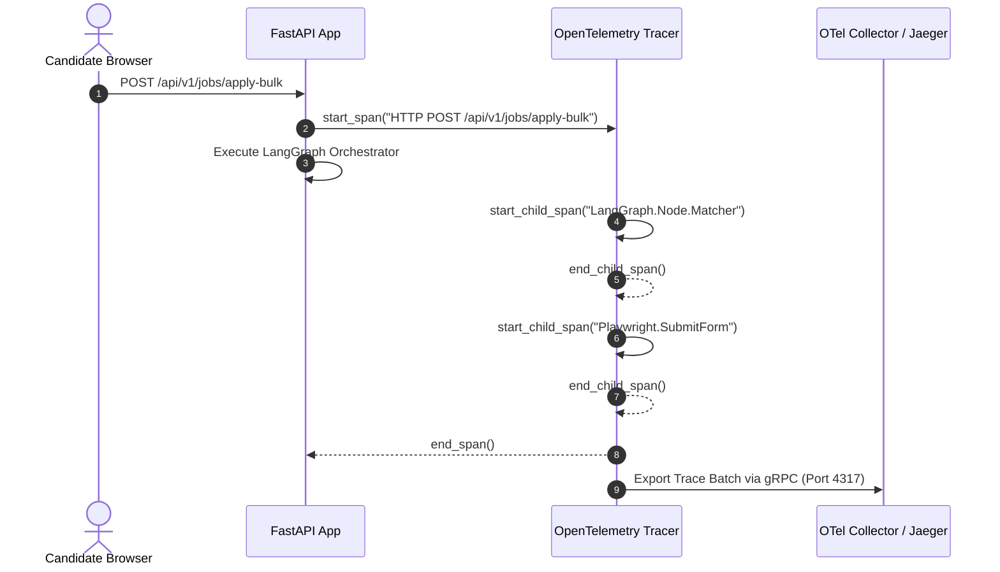
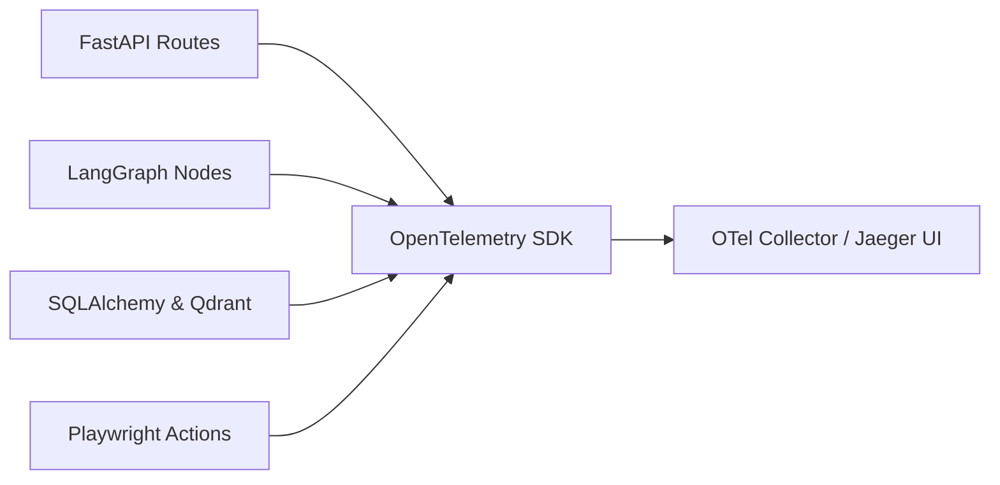

# 1. Overview
This document specifies the **Distributed OpenTelemetry Tracing Architecture**, detailing span generation across FastAPI routes, LangGraph node executions, Qdrant vector queries, and Playwright browser automation tasks.

---

# 2. Why This Exists
Processing a single candidate application spans REST API endpoints, LangGraph planner nodes, vector database lookups, LLM API calls, and headless browser automation. Distributed OpenTelemetry (OTel) tracing tracks request lifecycles across microservices, identifying latency bottlenecks and execution errors.

---

# 3. Responsibilities
- Instrument FastAPI routes, SQLAlchemy DB queries, Qdrant vector lookups, and Playwright actions with OpenTelemetry spans.
- Propagate trace contexts across async task boundaries (`traceparent` headers).
- Export telemetry spans to Jaeger / OpenTelemetry Collector over gRPC.

---

# 4. Inputs
- Incoming HTTP requests, background task executions, multi-agent node dispatches.

---

# 5. Outputs
- OpenTelemetry span traces exported to OTel Collector (`http://localhost:4317`).

---

# 6. Components
- **TracerProvider**: OpenTelemetry SDK tracer initializer.
- **FastAPIInstrumentor**: Auto-instruments FastAPI HTTP routes.
- **OTLPSpanExporter**: Exports spans to OpenTelemetry Collector over gRPC.

---

# 7. Folder Structure
```text
docs/Phase-09A-Observability/
├── OpenTelemetry-Tracing.md
├── Prometheus-Metrics.md
├── Grafana-Dashboards.md
├── Langfuse-LLM-Tracing.md
└── Log-Aggregation.md
```

---

# 8. Data Models
```python
# OpenTelemetry Span Context Example
{
  "trace_id": "4bf92f3577b34da6a3ce929d0e0e4736",
  "span_id": "00f067aa0ba902b7",
  "name": "LangGraph.Node.TailorResume",
  "start_time": "2026-07-28T14:32:00.124Z",
  "attributes": {
    "candidate_id": "cand_98412",
    "job_id": "gh_98412",
    "ats_score_before": 72.0,
    "ats_score_after": 94.5
  }
}
```

---

# 9. API Contracts
N/A (Observability Spec).

---

# 10. Sequence Diagram


---

# 11. Flow Diagram


---

# 12. Internal Working
The tracer registers custom span processors. Spans record attributes (`candidate_id`, `job_id`, `node_name`, `error_flag`). Context propagation preserves trace IDs across Celery / Redis background worker threads.

---

# 13. Configuration
- Specified in `backend/app/observability/tracer.py`.
- OTLP Endpoint: `localhost:4317`
- Sampling Ratio: `1.0` (Development), `0.1` (Production)

---

# 14. Error Handling
Tracing export failures drop spans gracefully without affecting main backend application performance.

---

# 15. Retry Strategy
- OTLP exporter retries up to 3 times on collector connection drops.

---

# 16. Security
- Spans sanitize attribute values to strip passwords, tokens, and candidate PII text.

---

# 17. Logging
- Tracer initialization logs `service_name`, `otlp_endpoint`, `sampling_rate`.

---

# 18. Metrics
- Tracing Overhead (<1.5% CPU / RAM latency addition).

---

# 19. Testing Strategy
- Unit test span creation and attribute injection using OpenTelemetry InMemorySpanExporter.

---

# 20. Performance Considerations
- Asynchronous batch span processors export telemetry in background threads.

---

# 21. Best Practices
- Always attach `candidate_id` and `job_id` to root spans for rapid trace filtering in Jaeger.

---

# 22. Production Improvements
- Connect OTel traces to Grafana Tempo for unified trace-to-log correlation.

---

# 23. Common Failure Scenarios
- **Scenario**: OTel Collector crashes during high-traffic campaign run.
  - **Resolution**: SDK memory buffer drops unsent spans safely to prevent worker RAM leaks.

---

# 24. Future Enhancements
- Auto-sampling trace rates dynamically based on system error spikes.

---

# 25. References
- OpenTelemetry Python SDK & W3C Trace Context Specifications.
