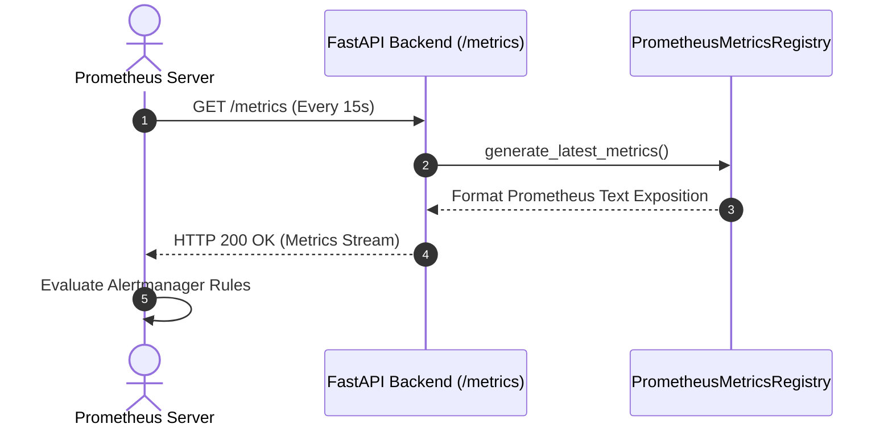
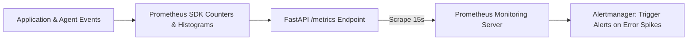

# 1. Overview
This document specifies the **Prometheus Real-Time Metrics & Alerting Architecture**, detailing metric types (Counters, Gauges, Histograms), `/metrics` scraping endpoints, custom system metrics, and alerting rules.

---

# 2. Why This Exists
Monitoring application throughput, success rates, LLM token consumption, Playwright form fill durations, and database query latencies in real time is critical for operational stability. Prometheus scrapes metrics continuously and triggers alerts when anomalies occur.

---

# 3. Responsibilities
- Expose `/metrics` Prometheus endpoint in FastAPI backend app.
- Track application throughput, success/failure counts, LLM token costs, and browser fill latencies.
- Define Alertmanager rules for high error rates or database connection drops.

---

# 4. Inputs
- System metrics emitted by backend services and worker processes.

---

# 5. Outputs
- Prometheus text-format metric stream served on `http://localhost:8000/metrics`.

---

# 6. Components
- **PrometheusMetricsRegistry**: Manages metric definitions using `prometheus_client`.
- **Alertmanager**: Evaluates alert conditions and sends Slack/PagerDuty notifications.

---

# 7. Folder Structure
```text
docs/Phase-09A-Observability/
└── Prometheus-Metrics.md
```

---

# 8. Data Models
```python
# Prometheus Metric Definitions
from prometheus_client import Counter, Histogram, Gauge

APPLICATIONS_SUBMITTED = Counter(
    'job_agent_applications_submitted_total',
    'Total job applications submitted',
    ['platform', 'status']  # e.g., platform="greenhouse", status="success"
)

FORM_FILL_DURATION = Histogram(
    'job_agent_form_fill_duration_seconds',
    'Form fill execution duration in seconds',
    ['platform'],
    buckets=[1, 2, 5, 10, 20, 30, 60]
)

ACTIVE_WORKERS = Gauge(
    'job_agent_active_playwright_workers',
    'Current active Playwright browser worker count'
)
```

---

# 9. API Contracts
Prometheus Metrics Scraping Response Sample:
```text
# HELP job_agent_applications_submitted_total Total job applications submitted
# TYPE job_agent_applications_submitted_total counter
job_agent_applications_submitted_total{platform="greenhouse",status="success"} 142
job_agent_applications_submitted_total{platform="workday",status="success"} 89
```

---

# 10. Sequence Diagram


---

# 11. Flow Diagram


---

# 12. Internal Working
The backend instruments key events using `prometheus_client`. Counters track totals, Histograms track latency distributions, and Gauges track live worker resource concurrency.

---

# 13. Configuration
- Metric Endpoint: `http://localhost:8000/metrics`
- Scrape Interval: `15s`

---

# 14. Error Handling
If metric scraping endpoint fails, Prometheus flags target as `DOWN` and triggers an infrastructure alert.

---

# 15. Retry Strategy
- N/A.

---

# 16. Security
- The `/metrics` endpoint is protected by internal IP whitelist or HTTP Basic Auth in production.

---

# 17. Logging
- Metrics collector logs scraping events and counter update spikes.

---

# 18. Metrics
- Metrics Endpoint Latency (<5ms).

---

# 19. Testing Strategy
- Unit test metric counters and histograms using pytest and prometheus_client test registry.

---

# 20. Performance Considerations
- Atomic in-memory metric updates add less than 0.1ms overhead to application requests.

---

# 21. Best Practices
- Never use high-cardinality labels (such as `user_id` or `job_id`) in Prometheus metrics to prevent TSDB index explosion.

---

# 22. Production Improvements
- Multi-process metric aggregation using `PROMETHEUS_MULTIPROC_DIR` for Gunicorn/Uvicorn worker clusters.

---

# 23. Common Failure Scenarios
- **Scenario**: Application error rate exceeds 10% in 5 minutes.
  - **Resolution**: Alertmanager fires `HighApplicationFailureRate` alert to operations Slack channel.

---

# 24. Future Enhancements
- Automated capacity planning metrics predicting required Playwright worker scaling.

---

# 25. References
- Prometheus Metric Naming & Exposition Specifications.
