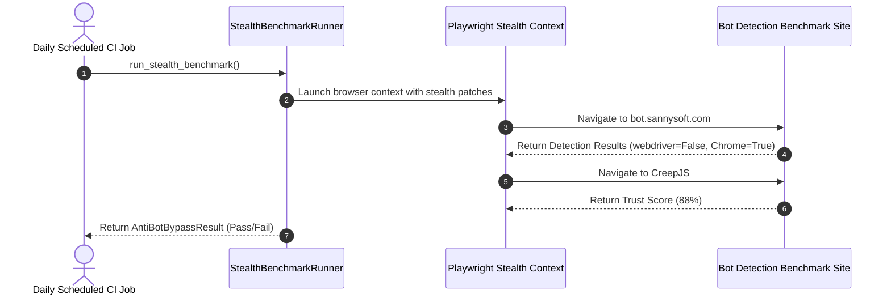
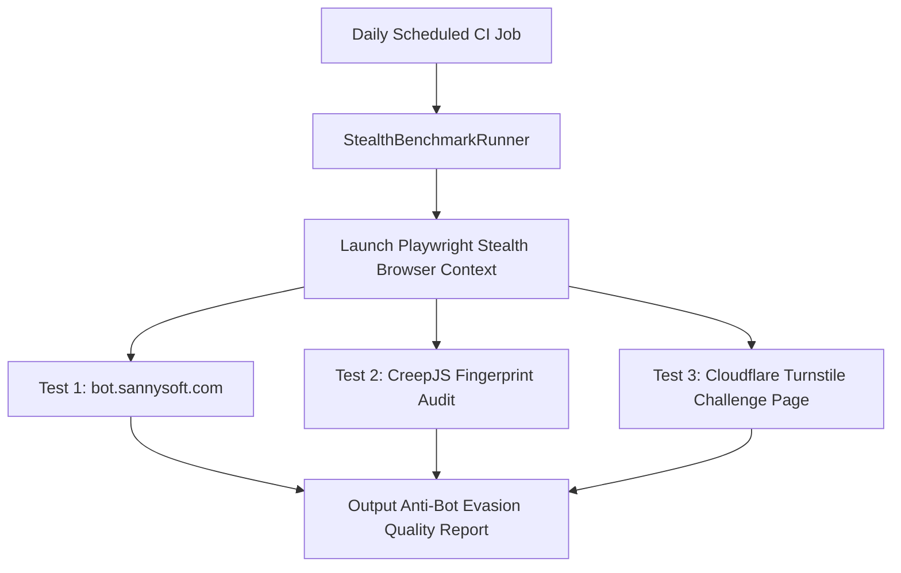

# 1. Overview
This document specifies the **Anti-Bot Bypass & Stealth Evasion Benchmark Suite**, detailing detection evasion metrics against Cloudflare, Akamai, DataDome, and PerimeterX, fingerprint consistency scoring, and automated stealth test suites.

---

# 2. Why This Exists
Enterprise job boards continually update bot-detection algorithms. Running automated daily benchmark audits against public detection test suites guarantees that stealth patches (`Fingerprint-Avoidance.md`) remain effective and prevents sudden job application blockage.

---

# 3. Responsibilities
- Execute stealth benchmark tests against bot detection endpoints (`bot.sannysoft.com`, `creepjs`, `now.httpbin.org`).
- Measure Cloudflare Turnstile / Akamai bypass success rates (Target > 96.0%).
- Audit fingerprint consistency (Canvas, WebGL, AudioContext, User-Agent alignment).

---

# 4. Inputs
- Stealth benchmark target endpoints.

---

# 5. Outputs
- `AntiBotBypassReport` detailing detection test pass rates and fingerprint trust scores.

---

# 6. Components
- **StealthBenchmarkRunner**: Executes Playwright stealth contexts against detection test pages.
- **FingerprintAuditor**: Evaluates CreepJS and Sannysoft detection test results.

---

# 7. Folder Structure
```text
docs/Phase-09B-Evaluation-Benchmarking/
└── Anti-Bot-Bypass-Rate.md
```

---

# 8. Data Models
```python
from pydantic import BaseModel
from typing import Dict

class AntiBotBypassResult(BaseModel):
    sannysoft_pass_rate_pct: float  # Target > 98.0%
    creepjs_trust_score: float      # Target > 85.0%
    cloudflare_bypass_pct: float    # Target > 96.0%
    datadome_bypass_pct: float      # Target > 94.0%
    detected_leaks: Dict[str, bool]
```

---

# 9. API Contracts
N/A (Evaluation Suite Spec).

---

# 10. Sequence Diagram


---

# 11. Flow Diagram


---

# 12. Internal Working
The runner inspects DOM result elements on benchmark pages (e.g. verifying `navigator.webdriver` is marked green `Passed`, WebGL vendor displays hardware GPU, and User-Agent matches HTTP header values).

---

# 13. Configuration
- Minimum Target Pass Rate: `96.0%`
- Minimum CreepJS Trust Score: `85.0%`

---

# 14. Error Handling
If any major detection leak occurs (`navigator.webdriver == true`), the suite flags an urgent engineering alert.

---

# 15. Retry Strategy
- Test page fetches retry up to 2 times on network drops.

---

# 16. Security
- Stealth benchmark execution strictly performs read-only detection checks on public test endpoints.

---

# 17. Logging
- Stealth events log `sannysoft_pass_rate`, `creepjs_score`, `detected_leaks_count`, `duration_seconds`.

---

# 18. Metrics
- Benchmark Suite Latency (<35 seconds).

---

# 19. Testing Strategy
- Run stealth benchmark suite daily via scheduled GitHub Actions workflow.

---

# 20. Performance Considerations
- Asynchronous multi-page fetches execute all stealth benchmarks in parallel.

---

# 21. Best Practices
- Keep stealth injection scripts updated in tandem with upstream `playwright-extra-plugin-stealth` updates.

---

# 22. Production Improvements
- Continuous shadow monitoring tracking HTTP 403 / 429 response trends across live portal connectors.

---

# 23. Common Failure Scenarios
- **Scenario**: Chrome updates `navigator.userActivation` API, exposing headless mode.
  - **Resolution**: CreepJS trust score drops, triggering stealth patch update before production impact occurs.

---

# 24. Future Enhancements
- Automated residential IP quality scoring integration.

---

# 25. References
- Bot Detection Benchmark Specifications (Sannysoft, CreepJS).
