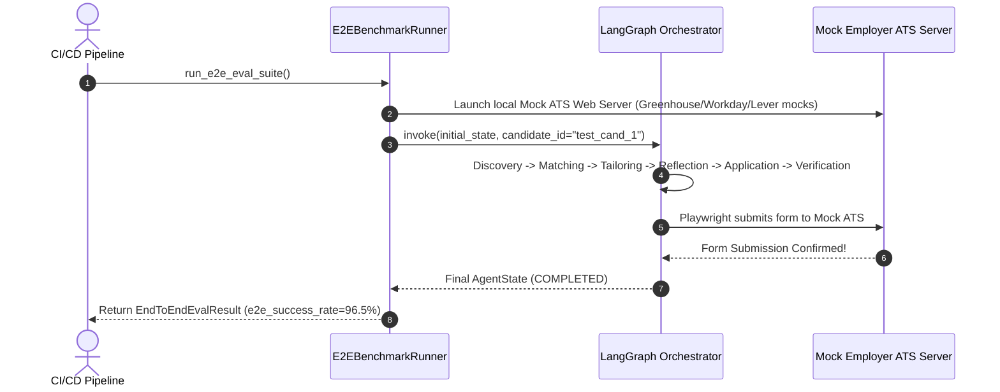
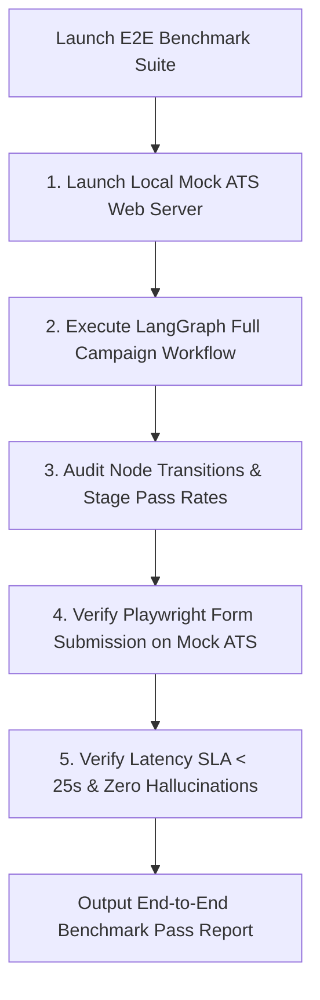

# 1. Overview
This document specifies the **End-to-End Application Pipeline Evaluation Suite**, detailing full lifecycle testing (Discovery -> Matching -> Tailoring -> Reflection -> Application -> Verification), SLA verification, automated regression testing, and CI/CD integration.

---

# 2. Why This Exists
While individual component benchmarks verify isolated subsystems, an End-to-End (E2E) Evaluation Suite tests the entire multi-agent system working in unison across realistic job application scenarios.

---

# 3. Responsibilities
- Execute full lifecycle agent application campaigns across a test matrix of candidate profiles and mock employer job portals.
- Verify end-to-end campaign success rate (Target > 95.0%).
- Enforce system SLAs (Total End-to-End Application Latency < 25 seconds per job).

---

# 4. Inputs
- E2E test matrix configuration (`tests/e2e/e2e_campaign_test_matrix.json`).

---

# 5. Outputs
- `EndToEndEvalReport` detailing overall success rate, stage-by-stage pass rates, and SLA compliance metrics.

---

# 6. Components
- **E2EBenchmarkRunner**: Orchestrates full campaign execution against mock test environment.
- **StageProgressAuditor**: Audits state transitions across all 7 LangGraph planning nodes.

---

# 7. Folder Structure
```text
docs/Phase-09B-Evaluation-Benchmarking/
└── End-To-End-Eval-Suite.md
```

---

# 8. Data Models
```python
from pydantic import BaseModel
from typing import Dict, Any

class EndToEndEvalResult(BaseModel):
    total_campaign_tasks: int
    successful_applications: int
    e2e_success_rate_pct: float  # Target > 95.0%
    stage_pass_rates: Dict[str, float]
    avg_e2e_latency_seconds: float  # Target < 25.0s
    total_llm_cost_usd: float
```

---

# 9. API Contracts
N/A (Evaluation Suite Spec).

---

# 10. Sequence Diagram


---

# 11. Flow Diagram


---

# 12. Internal Working
The suite launches a local mock ATS HTTP server (serving realistic Greenhouse, Workday, and Lever HTML forms). The test runner invokes the LangGraph orchestrator, allowing the real agents to run discovery, matching, tailoring, reflection, Playwright form fill, and verification against the local mock server.

---

# 13. Configuration
- Min Target E2E Success Rate: `95.0%`
- Max Target E2E Latency: `25.0 seconds`

---

# 14. Error Handling
Stage failures record stage-specific error diagnostics to highlight whether failure occurred in Discovery, Matching, Tailoring, or Browser Automation.

---

# 15. Retry Strategy
- N/A.

---

# 16. Security
- E2E tests run completely in isolated local environments using synthetic test data.

---

# 17. Logging
- E2E events log `total_tasks`, `e2e_success_rate_pct`, `avg_latency_seconds`, `total_cost_usd`.

---

# 18. Metrics
- E2E Test Suite Latency (<90 seconds for full 20-campaign test matrix).

---

# 19. Testing Strategy
- Execute full E2E evaluation suite automatically prior to any production deployment merge.

---

# 20. Performance Considerations
- Running mock ATS servers locally eliminates external network dependency and guarantees deterministic test execution.

---

# 21. Best Practices
- Never use live candidate credentials or real production employer forms in automated CI test suites.

---

# 22. Production Improvements
- Continuous synthetic worker running daily E2E tests against staging environments.

---

# 23. Common Failure Scenarios
- **Scenario**: Matcher agent updates break state dictionary schema expected by Resume agent.
  - **Resolution**: E2E suite catches schema mismatch immediately, failing build before deployment.

---

# 24. Future Enhancements
- Chaos testing injecting simulated network latency and proxy drops into E2E evaluation suite.

---

# 25. References
- End-to-End System Evaluation & Integration Testing Guidelines.
