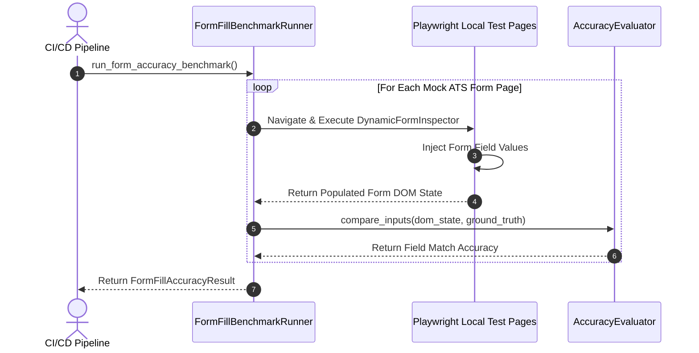
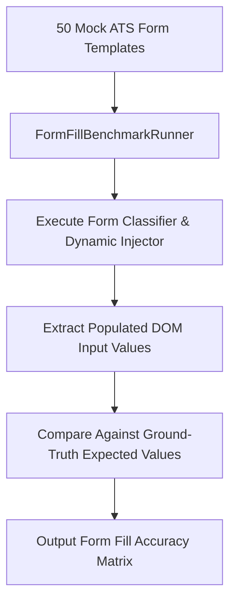

# 1. Overview
This document specifies the **Browser Form Fill Accuracy & Field Mapping Benchmark**, detailing field classification accuracy metrics, question-to-profile mapping precision, form validation error rates, and portal-specific form completion benchmark suites.

---

# 2. Why This Exists
Failing to map dynamic form questions accurately results in unsubmitted forms or invalid field values (e.g. entering email into phone number fields). Evaluating form fill accuracy against a diverse suite of target ATS application forms guarantees reliability.

---

# 3. Responsibilities
- Evaluate form field classification precision across 50 benchmark ATS form templates (Greenhouse, Workday, Lever, Taleo, Indeed, custom portals).
- Measure field mapping accuracy (Target > 97.5%).
- Track form validation error rate (Target < 1.5%).

---

# 4. Inputs
- Form fill benchmark test suite (`tests/benchmarks/data/form_fill_benchmark_suite.json`).

---

# 5. Outputs
- `FormFillAccuracyReport` detailing mapping precision, validation error counts, and portal breakdown.

---

# 6. Components
- **FormFillBenchmarkRunner**: Executes form filling against local mock HTML forms.
- **AccuracyEvaluator**: Compares filled input values against ground-truth expected values.

---

# 7. Folder Structure
```text
docs/Phase-09B-Evaluation-Benchmarking/
└── Form-Fill-Accuracy.md
```

---

# 8. Data Models
```python
from pydantic import BaseModel
from typing import Dict

class FormFillAccuracyResult(BaseModel):
    total_fields_tested: int
    correctly_mapped_fields: int
    mapping_accuracy_pct: float  # Target > 97.5%
    validation_error_rate_pct: float  # Target < 1.5%
    accuracy_by_portal: Dict[str, float]
```

---

# 9. API Contracts
N/A (Evaluation Suite Spec).

---

# 10. Sequence Diagram


---

# 11. Flow Diagram


---

# 12. Internal Working
The suite launches headless Playwright against local HTML files mimicking complex ATS forms. Input values after form fill execution are extracted and compared character-for-character against expected profile mappings.

---

# 13. Configuration
- Min Target Accuracy: `97.5%`
- Max Validation Error Rate: `1.5%`

---

# 14. Error Handling
If accuracy drops below 97.5%, the benchmark runner outputs a diff of failed field labels to assist developer debugging.

---

# 15. Retry Strategy
- N/A.

---

# 16. Security
- Mock form benchmarks use synthetic candidate profile fixtures.

---

# 17. Logging
- Benchmark logs record `total_fields`, `mapping_accuracy_pct`, `error_count`, `duration_seconds`.

---

# 18. Metrics
- Benchmark Execution Speed (<25 seconds for 50 forms).

---

# 19. Testing Strategy
- Run form fill benchmark suite on every pull request modifying `DynamicFormInspector` or `QuestionClassifier`.

---

# 20. Performance Considerations
- Serving test HTML pages from local filesystem avoids network request latency during benchmark execution.

---

# 21. Best Practices
- Continually expand benchmark form templates whenever new ATS field patterns are encountered in production.

---

# 22. Production Improvements
- Continuous production sampling auditing form fill accuracy across candidate applications.

---

# 23. Common Failure Scenarios
- **Scenario**: Portal introduces custom React slider control.
  - **Resolution**: Form classifier fails on slider input, benchmark flags unmapped component type, prompting developer to add slider support.

---

# 24. Future Enhancements
- Visual layout alignment auditor verifying input text cursor positioning.

---

# 25. References
- Form Filling Benchmark & Evaluation Specifications.
