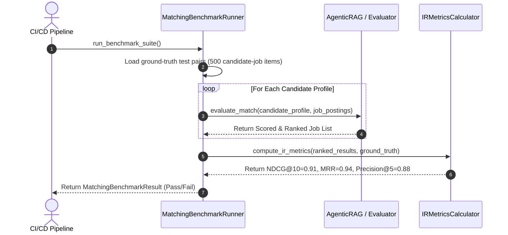
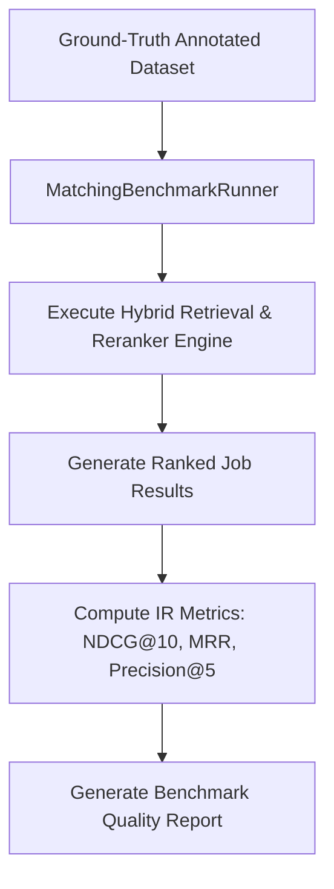

# 1. Overview
this document specifies the **Candidate Matching Engine Benchmark & Accuracy Suite**, detailing benchmark datasets, evaluation metrics (NDCG@10, MRR, Precision@K, Recall@K), ground-truth candidate-job relevance matrices, and automated evaluation pipelines ([evaluator.py](file:///d:/Personal%20Imp/Projects/Automated-job-Agent/backend/app/services/matching/evaluator.py)).

---

# 2. Why This Exists
Evaluating matching engine quality requires quantitative benchmark metrics rather than subjective opinion. Running continuous benchmark evaluations against annotated candidate-job pairs guarantees that vector store or reranker model changes improve match precision.

---

# 3. Responsibilities
- Evaluate matching engine accuracy across a benchmark suite of 500+ annotated candidate-job pairs.
- Calculate IR metrics: Normalized Discounted Cumulative Gain (NDCG@10), Mean Reciprocal Rank (MRR), Precision@5, Recall@10.
- Compare Hybrid Retrieval (BM25 + Qdrant Dense + Cross-Encoder) against baseline dense-only search.

---

# 4. Inputs
- Ground-truth annotated evaluation dataset (`tests/benchmarks/data/matching_eval_dataset.json`).

---

# 5. Outputs
- `MatchingBenchmarkReport` containing quantitative score metrics and performance diffs.

---

# 6. Components
- **MatchingBenchmarkRunner**: Executes match evaluation over test pairs ([evaluator.py](file:///d:/Personal%20Imp/Projects/Automated-job-Agent/backend/app/services/matching/evaluator.py)).
- **IRMetricsCalculator**: Computes NDCG@10, MRR, Precision, and Recall scores.

---

# 7. Folder Structure
```text
docs/Phase-09B-Evaluation-Benchmarking/
├── Matching-Benchmarks.md
├── Resume-Tailoring-Eval.md
├── Form-Fill-Accuracy.md
├── Anti-Bot-Bypass-Rate.md
└── End-To-End-Eval-Suite.md
```

---

# 8. Data Models
```python
from pydantic import BaseModel
from typing import Dict, Any

class MatchingBenchmarkResult(BaseModel):
    total_test_pairs: int
    ndcg_at_10: float  # Target > 0.88
    mrr: float         # Target > 0.92
    precision_at_5: float  # Target > 0.85
    recall_at_10: float    # Target > 0.90
    hybrid_lift_over_dense_pct: float
```

---

# 9. API Contracts
N/A (Evaluation Suite Spec).

---

# 10. Sequence Diagram


---

# 11. Flow Diagram


---

# 12. Internal Working
The benchmark runner compares engine rank order against expert human annotations (relevance scale 0-3). NDCG@10 measures ranking quality, while MRR measures how quickly the top relevant job appears.

---

# 13. Configuration
- Metric Targets: `NDCG@10 >= 0.88`, `MRR >= 0.90`

---

# 14. Error Handling
If benchmark score drops below target thresholds, CI/CD pipeline fails build and blocks model deployment.

---

# 15. Retry Strategy
- N/A.

---

# 16. Security
- Evaluation datasets use anonymized synthetic candidate profiles.

---

# 17. Logging
- Benchmark events log `ndcg_at_10`, `mrr`, `precision_at_5`, `test_duration_seconds`.

---

# 18. Metrics
- Benchmark Suite Execution Speed (<45 seconds).

---

# 19. Testing Strategy
- Run benchmark suite on every pull request modifying vector search or reranker logic.

---

# 20. Performance Considerations
- Pre-computed embeddings in test fixtures speed up benchmark suite execution.

---

# 21. Best Practices
- Never train rerankers or embeddings on benchmark test datasets.

---

# 22. Production Improvements
- Continuous shadow evaluation scoring production match recommendations against candidate application decisions.

---

# 23. Common Failure Scenarios
- **Scenario**: Reranker model update deprioritizes niche tech skills.
  - **Resolution**: Precision@5 metric drops, CI build fails, alerting engineer to tune skill weightings.

---

# 24. Future Enhancements
- Multi-objective optimization balancing candidate skill fit with target salary maximization.

---

# 25. References
- Information Retrieval Evaluation Metrics Specifications (NDCG, MRR, MAP).
