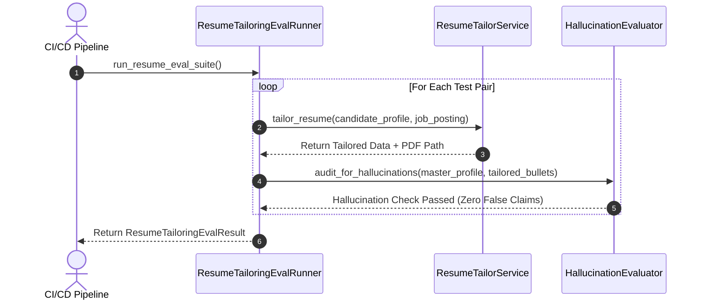
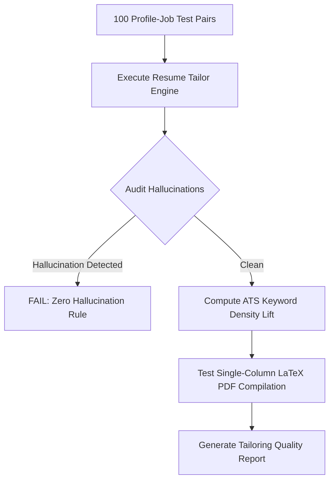

# 1. Overview
This document specifies the **Resume Tailoring & ATS Score Evaluation Suite**, detailing factual accuracy audit metrics, hallucination detection rates, ATS keyword density improvement scores, and LaTeX PDF compilation benchmarks.

---

# 2. Why This Exists
Tailoring resume bullet points using LLMs carries two distinct risks: hallucinating false skills/experience (which ruins candidate credibility) or making insufficient edits (which fails ATS keyword filters). Running automated evaluation suites verifies that tailoring increases ATS scores while maintaining 100% factual accuracy.

---

# 3. Responsibilities
- Evaluate tailored resumes for zero hallucination against candidate master profile history.
- Measure average ATS score improvement (Delta ATS Score target > +15%).
- Verify single-column LaTeX PDF compilation success rate (Target > 99.8%).

---

# 4. Inputs
- Test dataset of 100 candidate profiles paired with target job descriptions (`tests/benchmarks/data/resume_tailor_eval.json`).

---

# 5. Outputs
- `ResumeTailoringEvalReport` detailing ATS score lift, hallucination rate, and PDF compilation status.

---

# 6. Components
- **HallucinationEvaluator**: Audits generated bullet points against master profile skill set.
- **ATSDensityAnalyzer**: Computes ATS keyword coverage increase.
- **PDFCompilationTester**: Verifies syntax validity of generated LaTeX code.

---

# 7. Folder Structure
```text
docs/Phase-09B-Evaluation-Benchmarking/
└── Resume-Tailoring-Eval.md
```

---

# 8. Data Models
```python
from pydantic import BaseModel

class ResumeTailoringEvalResult(BaseModel):
    total_test_resumes: int
    avg_ats_score_before: float
    avg_ats_score_after: float
    avg_ats_score_delta: float  # Target > +15.0%
    hallucination_rate_pct: float  # Target == 0.0%
    pdf_compilation_success_rate: float  # Target > 99.8%
```

---

# 9. API Contracts
N/A (Evaluation Suite Spec).

---

# 10. Sequence Diagram


---

# 11. Flow Diagram


---

# 12. Internal Working
The suite checks generated n-grams against master profile n-grams. Any technical term present in the tailored resume that does not appear in candidate skills or work history is flagged as a hallucination.

---

# 13. Configuration
- Max Allowable Hallucination Rate: `0.0%`
- Min Target ATS Score Delta: `+15.0%`

---

# 14. Error Handling
If any hallucination is detected, the evaluation suite fails CI build immediately.

---

# 15. Retry Strategy
- N/A.

---

# 16. Security
- Test candidate profiles contain zero real PII.

---

# 17. Logging
- Evaluation logs record `avg_ats_delta`, `hallucinations_detected`, `pdf_compilation_rate`.

---

# 18. Metrics
- Tailoring Benchmark Execution Time (<60 seconds).

---

# 19. Testing Strategy
- Execute evaluation suite automatically on every prompt template update.

---

# 20. Performance Considerations
- Parallel mock LLM responses speed up evaluation execution.

---

# 21. Best Practices
- Never compromise on the zero-hallucination policy.

---

# 22. Production Improvements
- Continuous production sampling auditing tailored resumes generated for candidates.

---

# 23. Common Failure Scenarios
- **Scenario**: LLM adds a related framework not explicitly listed in candidate master profile.
  - **Resolution**: `HallucinationEvaluator` flags missing skill, failing test until prompt guardrails are reinforced.

---

# 24. Future Enhancements
- Fine-tuned evaluation LLM scoring bullet point impact and readability.

---

# 25. References
- Resume Tailoring Evaluation & ATS Benchmark Specifications.
