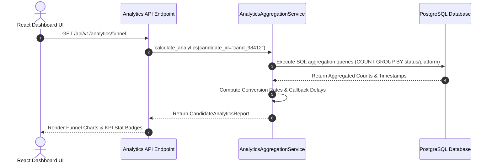
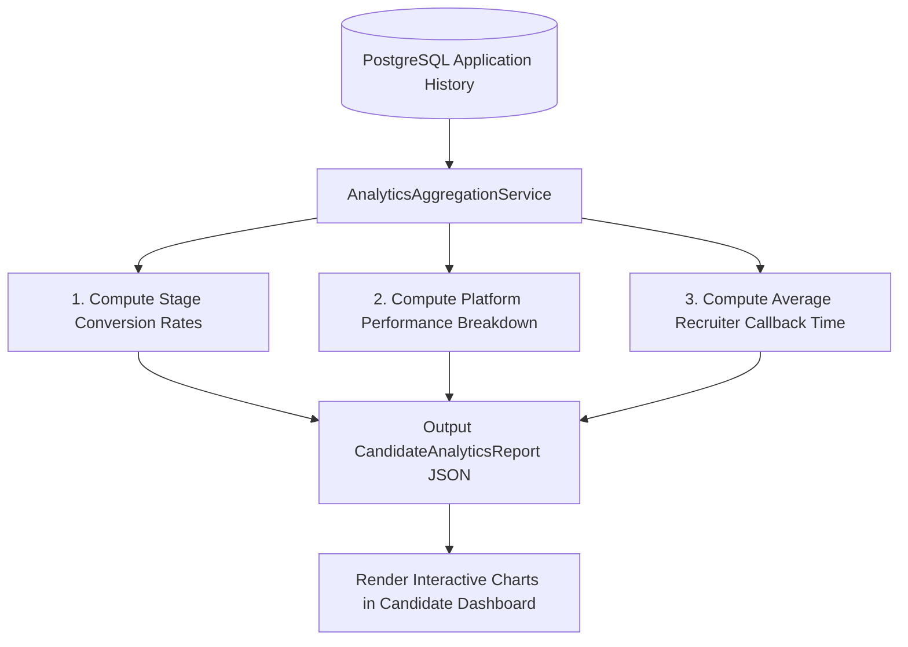

# 1. Overview
This document specifies the **Candidate Search Funnel Analytics & Conversion Dashboard**, detailing conversion rate calculations, job board efficiency metrics, salary analytics, and candidate performance aggregation APIs.

---

# 2. Why This Exists
Candidates need clear metrics to measure their job search campaign effectiveness: application volume over time, callback conversion rates (Applied -> Interview %), top performing job boards (Greenhouse vs LinkedIn vs Naukri), and salary distribution insights.

---

# 3. Responsibilities
- Aggregate job application status statistics and funnel conversion rates.
- Compute conversion metrics: Application-to-Interview Rate (%), Application-to-Offer Rate (%), Average Callback Time (days).
- Serve aggregated analytics payloads to candidate frontend dashboard components.

---

# 4. Inputs
- Candidate application history records from PostgreSQL `applications` and `application_status_history` tables.

---

# 5. Outputs
- Serialized `CandidateAnalyticsReport` JSON payload feeding frontend chart components (Recharts / Chart.js).

---

# 6. Components
- **AnalyticsAggregationService**: Computes funnel statistics and conversion metrics.
- **ConversionFunnelCalculator**: Calculates stage-by-stage percentage conversion deltas.

---

# 7. Folder Structure
```text
docs/Phase-10-Tracking/
└── Analytics-Dashboard.md
```

---

# 8. Data Models
```python
from pydantic import BaseModel
from typing import Dict, List

class ConversionFunnelMetrics(BaseModel):
    total_discovered: int
    total_matched: int
    total_applied: int
    total_screening: int
    total_interviewing: int
    total_offers: int
    applied_to_interview_rate_pct: float
    applied_to_offer_rate_pct: float

class CandidateAnalyticsReport(BaseModel):
    candidate_id: str
    funnel: ConversionFunnelMetrics
    platform_breakdown: Dict[str, int]
    avg_callback_days: float
    top_matching_skills: List[str]
```

---

# 9. API Contracts
Candidate Analytics REST API Endpoint:
```json
{
  "endpoint": "/api/v1/analytics/funnel",
  "method": "GET",
  "response": {
    "candidate_id": "cand_98412",
    "funnel": {
      "total_applied": 42,
      "total_interviewing": 5,
      "total_offers": 1,
      "applied_to_interview_rate_pct": 11.9,
      "applied_to_offer_rate_pct": 2.38
    },
    "platform_breakdown": {
      "greenhouse": 18,
      "linkedin": 14,
      "workday": 10
    },
    "avg_callback_days": 6.4
  }
}
```

---

# 10. Sequence Diagram


---

# 11. Flow Diagram


---

# 12. Internal Working
The service executes optimized SQL `COUNT(*)` queries grouped by `status` and `platform`, computing stage conversion rates: $Rate = (Interviewing / Applied) \cdot 100$.

---

# 13. Configuration
- Cache Duration: `ANALYTICS_CACHE_TTL_SECONDS = 300` (5 minutes)

---

# 14. Error Handling
If candidate has zero submitted applications, the service returns zeroed metric payloads cleanly to avoid divide-by-zero errors.

---

# 15. Retry Strategy
- N/A.

---

# 16. Security
- Analytics queries enforce candidate user isolation (`WHERE candidate_id = :id`).

---

# 17. Logging
- Analytics events log `candidate_id`, `total_applied`, `applied_to_interview_rate_pct`, `query_duration_ms`.

---

# 18. Metrics
- Analytics Query Execution Latency (<12ms).

---

# 19. Testing Strategy
- Unit test analytics calculator against mock candidate application histories.

---

# 20. Performance Considerations
- Database index on `(candidate_id, status, platform)` ensures sub-15ms query execution.

---

# 21. Best Practices
- Cache aggregated analytics payloads in Redis to prevent repeated heavy database aggregation queries on dashboard refresh.

---

# 22. Production Improvements
- Predictive AI recommendations advising candidate which platforms yield highest interview callback rates.

---

# 23. Common Failure Scenarios
- **Scenario**: Candidate queries analytics with 10,000+ historical applications.
  - **Resolution**: Redis caching serves pre-aggregated payload in under 2ms.

---

# 24. Future Enhancements
- Industry benchmark comparison overlay comparing candidate interview conversion rates against peer benchmarks.

---

# 25. References
- Candidate Job Search Analytics & Conversion Funnel Specifications.
