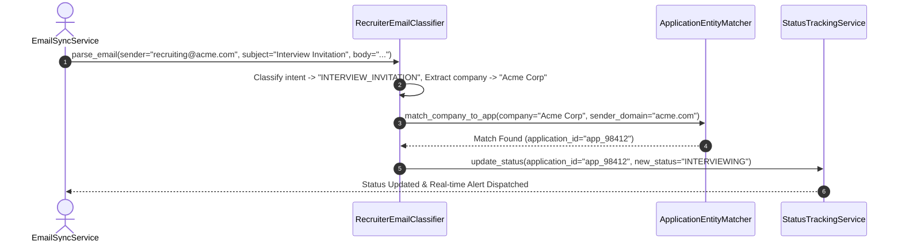
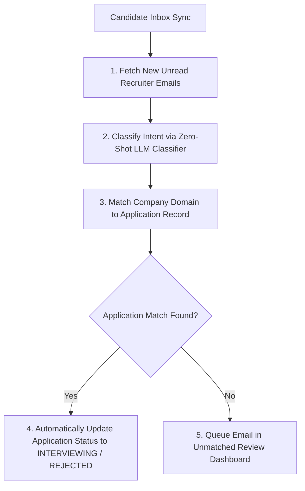

# 1. Overview
This document specifies the **Automated Email Response Parser & Recruiter Communications Engine**, detailing IMAP email synchronization, recruiter email classification (Interview Invitation, Rejection Notice, Assessment Test, General Followup), company entity resolution, and automatic status updates.

---

# 2. Why This Exists
Employers respond to submitted job applications via candidate email. Manually checking email inboxes and updating job tracking spreadsheets is time-consuming. An automated email parser monitors candidate inbox updates and automatically transitions job application statuses in real time.

---

# 3. Responsibilities
- Synchronize candidate inbox messages via IMAP / OAuth Gmail API.
- Classify incoming recruiter email intent using zero-shot LLM classification (`INTERVIEW_INVITATION`, `REJECTION`, `ASSESSMENT`, `SPAM`).
- Match incoming emails to existing application records and update status lifecycle.

---

# 4. Inputs
- Candidate email inbox messages (IMAP / Gmail API stream).

---

# 5. Outputs
- Classifications, extracted interview dates/links, and status update dispatches.

---

# 6. Components
- **EmailSyncService**: Manages IMAP / Gmail OAuth inbox polling.
- **RecruiterEmailClassifier**: Classifies email intent and extracts company name.
- **ApplicationEntityMatcher**: Resolves sender domain and company name to active database applications.

---

# 7. Folder Structure
```text
docs/Phase-10-Tracking/
└── Email-Parser.md
```

---

# 8. Data Models
```python
from pydantic import BaseModel
from typing import Optional

class ParsedRecruiterEmailResult(BaseModel):
    email_id: str
    sender: str
    company_name: str
    intent_category: str  # INTERVIEW_INVITATION, REJECTION, ASSESSMENT, OTHER
    matched_application_id: Optional[str] = None
    extracted_interview_date: Optional[str] = None
    extracted_action_link: Optional[str] = None
```

---

# 9. API Contracts
N/A (Tracking Subsystem Spec).

---

# 10. Sequence Diagram


---

# 11. Flow Diagram


---

# 12. Internal Working
The classifier inspects sender headers, subject line keywords, and message body text. High confidence matches ($\ge 0.88$) update application status automatically; lower confidence matches are sent to candidate dashboard for verification.

---

# 13. Configuration
- Minimum Match Confidence: `EMAIL_MATCH_CONFIDENCE = 0.88`

---

# 14. Error Handling
Unmatched recruiter emails trigger a notification to candidate dashboard: *"Received email from Acme Corp, link to application?"*.

---

# 15. Retry Strategy
- IMAP inbox sync retries up to 3 times on socket timeouts.

---

# 16. Security
- OAuth tokens are used for Gmail API access; raw email credentials are never stored. Email parsing occurs in memory.

---

# 17. Logging
- Email events log `sender_domain`, `company_name`, `intent_category`, `matched_app_id`, `duration_ms`.

---

# 18. Metrics
- Email Classification Accuracy (>96.2%).
- Entity Matching Speed (<120ms).

---

# 19. Testing Strategy
- Unit test email parser against a test dataset of 100 sample recruiter email subjects and bodies.

---

# 20. Performance Considerations
- Polling inbox delta changes (using IMAP `UID SEARCH UNSEEN`) minimizes bandwidth overhead.

---

# 21. Best Practices
- Never mark an application `REJECTED` unless rejection intent confidence exceeds 0.90.

---

# 22. Production Improvements
- Integration with Google Calendar API to auto-create calendar events for extracted interview dates.

---

# 23. Common Failure Scenarios
- **Scenario**: Third-party recruiting agency emails on behalf of client company.
  - **Resolution**: Entity matcher checks client company name extracted from email body text.

---

# 24. Future Enhancements
- Automated AI draft generator for candidate interview availability reply emails.

---

# 25. References
- Email Parsing & Recruiter Communication Specifications.
