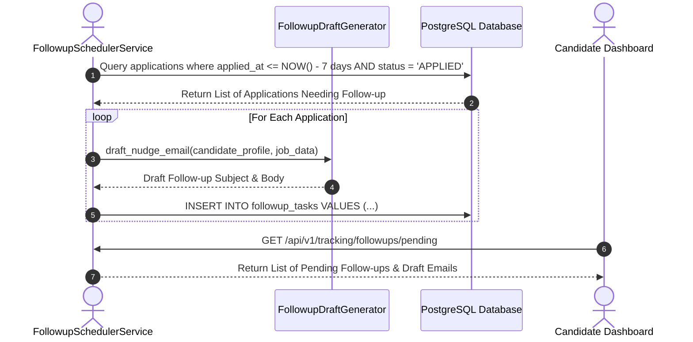

# 1. Overview
This document specifies the **Candidate Follow-up & Recruiter Nudge Scheduler**, detailing automated follow-up timer generation, polite recruiter nudge email drafting, candidate notification alerts, and cadence management.

---

# 2. Why This Exists
Recruiters receive hundreds of applications daily. Sending a polite, professional follow-up email 7–10 days after applying increases candidate response rates by up to 25%. Automating follow-up scheduling guarantees candidates never miss a follow-up window.

---

# 3. Responsibilities
- Monitor submitted applications and calculate follow-up due dates (Default: 7 days after submission).
- Draft personalized polite recruiter follow-up email text.
- Present draft follow-up emails to candidate dashboard for candidate review and sending.

---

# 4. Inputs
- Submitted application record, candidate follow-up preference rules.

---

# 5. Outputs
- Draft follow-up email artifact and scheduled candidate reminder.

---

# 6. Components
- **FollowupSchedulerService**: Calculates follow-up timers and triggers reminders.
- **FollowupDraftGenerator**: Synthesizes concise 2-paragraph recruiter nudge emails.

---

# 7. Folder Structure
```text
docs/Phase-10-Tracking/
└── Followup-Scheduler.md
```

---

# 8. Data Models
```python
from pydantic import BaseModel
from typing import Optional
from datetime import datetime

class FollowupTaskRecord(BaseModel):
    id: str
    application_id: str
    candidate_id: str
    company_name: str
    job_title: str
    scheduled_for: datetime
    draft_email_subject: str
    draft_email_body: str
    status: str = "PENDING"  # PENDING, SENT, CANCELLED, DISMISSED
```

---

# 9. API Contracts
Follow-up Scheduler API Endpoint:
```json
{
  "endpoint": "/api/v1/tracking/followups/pending",
  "method": "GET",
  "response": {
    "pending_followups": [
      {
        "id": "fol_98412",
        "company_name": "Acme Corp",
        "job_title": "Senior Backend Engineer",
        "scheduled_for": "2026-08-04T10:00:00Z",
        "draft_email_subject": "Following up on Senior Backend Engineer Application - John Doe"
      }
    ]
  }
}
```

---

# 10. Sequence Diagram


---

# 11. Flow Diagram
```mermaid
flowchart TD
    AppSubmitted[Application Submitted State: APPLIED] --> Timer[1. Schedule Follow-up Timer +7 Days]
    Timer --> Audit{Has Status Changed?}
    Audit -->|Yes (Interviewing / Rejected)| Cancel[Cancel Follow-up Timer]
    Audit -->|No (Still APPLIED after 7 days)| Draft[2. Generate Polite Recruiter Nudge Email]
    Draft --> Alert[3. Alert Candidate in Dashboard to Review & Send Email]
```

---

# 12. Internal Working
If an application status transitions to `INTERVIEWING`, `REJECTED`, or `WITHDRAWN`, the scheduler automatically cancels the pending follow-up task. Follow-up emails are never sent automatically without candidate confirmation.

---

# 13. Configuration
- Default Follow-up Delay: `DEFAULT_FOLLOWUP_DAYS = 7`
- Max Follow-ups per Job: `MAX_FOLLOWUPS_PER_JOB = 1`

---

# 14. Error Handling
If draft generation fails, the task notifies the candidate with a generic follow-up template.

---

# 15. Retry Strategy
- N/A.

---

# 16. Security
- Draft emails are stored securely in PostgreSQL and served only to authenticated candidates.

---

# 17. Logging
- Follow-up events log `application_id`, `company_name`, `scheduled_for`, `status`.

---

# 18. Metrics
- Draft Generation Latency (<1.5 seconds).
- Candidate Follow-up Approval Rate (>72%).

---

# 19. Testing Strategy
- Unit test follow-up timer scheduling and draft generation logic using pytest-asyncio.

---

# 20. Performance Considerations
- Celery beat scheduled background tasks evaluate follow-up triggers once every hour to minimize CPU load.

---

# 21. Best Practices
- Keep recruiter nudge emails under 150 words and maintain a professional, courteous tone.

---

# 22. Production Improvements
- Integration with Gmail API allowing candidates to send follow-up drafts with 1 click directly from dashboard.

---

# 23. Common Failure Scenarios
- **Scenario**: Candidate manually updates status to `REJECTED` after draft is generated.
  - **Resolution**: Scheduler immediately marks task status `CANCELLED`.

---

# 24. Future Enhancements
- Optimal send time predictor analyzing recruiter response hours.

---

# 25. References
- Candidate Recruiter Communication & Follow-up Specifications.
