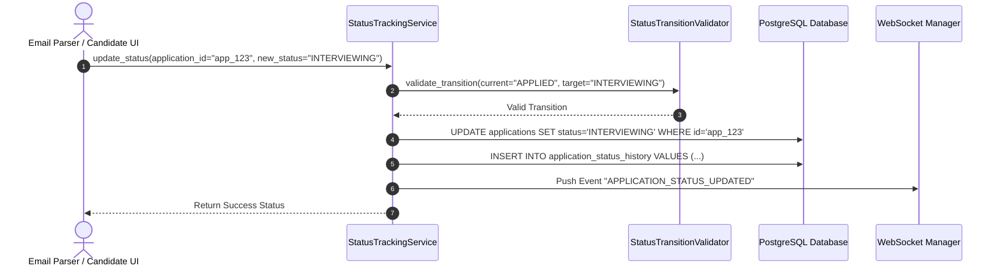
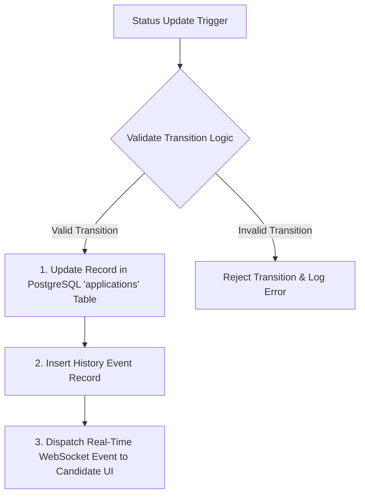

# 1. Overview
this document specifies the **Application Status Lifecycle Tracking Engine**, detailing state transitions (`DISCOVERED` -> `MATCHED` -> `TAILORING` -> `APPLIED` -> `SCREENING` -> `INTERVIEWING` -> `OFFER` -> `REJECTED`), status update APIs, and history event logs ([models.py](file:///d:/Personal%20Imp/Projects/Automated-job-Agent/backend/app/models/models.py)).

---

# 2. Why This Exists
Submitting an application is only the first step in a candidate's job search. Tracking application progression through interview stages, offer letters, or rejections provides complete visibility over candidate job search funnels ([models.py](file:///d:/Personal%20Imp/Projects/Automated-job-Agent/backend/app/models/models.py)).

---

# 3. Responsibilities
- Manage application status lifecycle transitions in PostgreSQL `applications` table ([models.py](file:///d:/Personal%20Imp/Projects/Automated-job-Agent/backend/app/models/models.py)).
- Update application states automatically when triggered by `EmailParser` or candidate manual updates.
- Maintain immutable audit trail of state transitions in `application_status_history` table.

---

# 4. Inputs
- Application ID, new status label, status update source (`EMAIL_PARSER`, `CANDIDATE_MANUAL`, `CONNECTOR_SYNC`).

---

# 5. Outputs
- Updated `ApplicationRecord` state and dispatch of WebSocket status change events.

---

# 6. Components
- **StatusTrackingService**: Core status transition manager.
- **StatusTransitionValidator**: Enforces valid state machine state transitions.

---

# 7. Folder Structure
```text
docs/Phase-10-Tracking/
├── Status-Tracking.md
├── Email-Parser.md
├── Followup-Scheduler.md
└── Analytics-Dashboard.md
```

---

# 8. Data Models
```python
from pydantic import BaseModel
from typing import Optional
from datetime import datetime

class ApplicationStatusUpdateSchema(BaseModel):
    application_id: str
    previous_status: str
    new_status: str  # APPLIED, SCREENING, INTERVIEWING, OFFER, REJECTED, WITHDRAWN
    update_source: str = "CANDIDATE_MANUAL"
    notes: Optional[str] = None
    updated_at: datetime = Field(default_factory=datetime.utcnow)
```

---

# 9. API Contracts
Application Status Transition REST API Endpoint:
```json
{
  "endpoint": "/api/v1/applications/app_98412/status",
  "method": "PATCH",
  "request": {
    "status": "INTERVIEWING",
    "notes": "Technical screening scheduled for Thursday"
  },
  "response": {
    "status": "Success",
    "current_status": "INTERVIEWING"
  }
}
```

---

# 10. Sequence Diagram


---

# 11. Flow Diagram


---

# 12. Internal Working
Allowed lifecycle transitions:
- `DISCOVERED` -> `MATCHED` -> `TAILORING` -> `APPLIED`
- `APPLIED` -> `SCREENING` -> `INTERVIEWING` -> `OFFER`
- `APPLIED` / `SCREENING` / `INTERVIEWING` -> `REJECTED` / `WITHDRAWN`

---

# 13. Configuration
- Specified in [backend/app/models/models.py](file:///d:/Personal%20Imp/Projects/Automated-job-Agent/backend/app/models/models.py).

---

# 14. Error Handling
Invalid transitions (e.g. attempting to move from `REJECTED` directly to `OFFER` without intermediate steps) raise `InvalidStatusTransitionError`.

---

# 15. Retry Strategy
- N/A.

---

# 16. Security
- API endpoints enforce candidate ownership verification before modifying application records.

---

# 17. Logging
- Status events log `application_id`, `candidate_id`, `previous_status`, `new_status`, `update_source`.

---

# 18. Metrics
- Status Update Execution Latency (<4ms).

---

# 19. Testing Strategy
- Unit test status transition validator against all valid and invalid state transition combinations.

---

# 20. Performance Considerations
- Direct indexed primary key updates ensure sub-5ms transaction completion.

---

# 21. Best Practices
- Always record transition notes to provide candidates with audit context for status changes.

---

# 22. Production Improvements
- Integration with Google Calendar for automatic interview meeting scheduling.

---

# 23. Common Failure Scenarios
- **Scenario**: Email parser attempts to update status for non-existent application ID.
  - **Resolution**: Service catches `ApplicationNotFoundError` and routes email to manual review queue.

---

# 24. Future Enhancements
- Predictive interview conversion probability tracking based on funnel progression speeds.

---

# 25. References
- Candidate Application Lifecycle Management Specifications.
