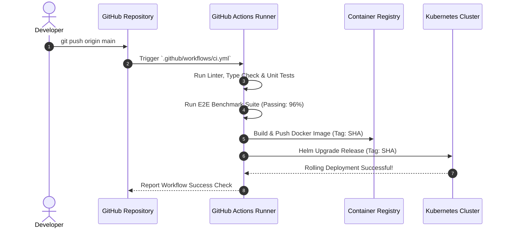
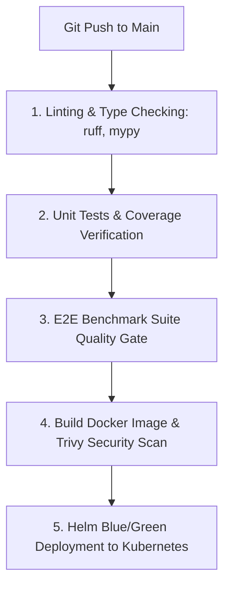

# 1. Overview
This document specifies the **GitHub Actions CI/CD Pipeline & Automated Release Architecture**, detailing automated linting, unit testing, benchmark evaluation checks, container image building, vulnerability scanning, and blue/green Kubernetes deployment triggers.

---

# 2. Why This Exists
Manual deployments are error-prone and slow down feature iteration. An automated CI/CD pipeline enforces quality gates (linting, type checks, unit tests, benchmark evaluation scores, security scans) before deploying backend and frontend code to production.

---

# 3. Responsibilities
- Execute linting (`ruff`, `flake8`, `black`) and static type checking (`mypy`) on every push.
- Execute unit and integration test suites with coverage enforcement (>85%).
- Run E2E benchmark evaluation suite (`Phase-09B-Evaluation-Benchmarking`).
- Build Docker container images, scan with Trivy, and deploy to Kubernetes cluster.

---

# 4. Inputs
- Git push events to `main` and `develop` branches, pull request creation events.

---

# 5. Outputs
- Test reports, container registry push artifacts, and deployed Kubernetes releases.

---

# 6. Components
- **TestWorkflow**: GitHub Actions workflow executing unit tests and benchmarks (`.github/workflows/test.yml`).
- **DeployWorkflow**: GitHub Actions workflow building containers and deploying via Helm (`.github/workflows/deploy.yml`).

---

# 7. Folder Structure
```text
docs/Phase-11-Deployment/
└── CICD-Pipeline.md
```

---

# 8. Data Models
```yaml
# GitHub Actions Main CI Workflow (.github/workflows/ci.yml)
name: Production CI/CD Pipeline

on:
  push:
    branches: [ main ]
  pull_request:
    branches: [ main ]

jobs:
  lint-and-test:
    runs-on: ubuntu-latest
    steps:
    - uses: actions/checkout@v3
    - name: Set up Python 3.11
      uses: actions/setup-python@v4
      with:
        python-version: '3.11'
    - name: Install Dependencies
      run: |
        pip install -r requirements.txt
        pip install pytest ruff mypy
    - name: Run Ruff Linter
      run: ruff check backend/
    - name: Run Pytest Unit Tests
      run: pytest --cov=backend --cov-report=xml
    - name: Run E2E Benchmark Suite
      run: python -m tests.benchmarks.run_all

  build-and-deploy:
    needs: lint-and-test
    if: github.ref == 'refs/heads/main'
    runs-on: ubuntu-latest
    steps:
    - uses: actions/checkout@v3
    - name: Build & Push Docker Image
      run: |
        docker build -t gcr.io/job-agent/backend:${{ github.sha }} -f Dockerfile.backend .
        docker push gcr.io/job-agent/backend:${{ github.sha }}
    - name: Deploy to Kubernetes
      run: |
        helm upgrade --install job-agent deploy/helm/job-agent --set image.tag=${{ github.sha }}
```

---

# 9. API Contracts
N/A (CI/CD Pipeline Spec).

---

# 10. Sequence Diagram


---

# 11. Flow Diagram


---

# 12. Internal Working
The pipeline uses GitHub Actions matrix strategies for fast parallel test execution. Deployments use Helm `helm upgrade --install` to execute rolling zero-downtime container updates.

---

# 13. Configuration
- Minimum Test Coverage: `85.0%`
- Deployment Strategy: Blue/Green Rolling Update

---

# 14. Error Handling
If any stage fails (linter error, failing unit test, benchmark drop below SLA, Trivy CRITICAL vulnerability), the pipeline halts immediately and notifies developers.

---

# 15. Retry Strategy
- Flaky browser tests retry up to 2 times in CI runner before failing.

---

# 16. Security
- Secrets (GCP Service Account Keys, Registry Tokens) are injected via GitHub Encrypted Secrets (`secrets.GCP_SA_KEY`).

---

# 17. Logging
- CI/CD workflow logs capture step execution durations, test output XML, and deployment logs.

---

# 18. Metrics
- Total CI Pipeline Duration (<4.5 minutes).

---

# 19. Testing Strategy
- Test CI/CD pipeline changes on feature branches before merging to `main`.

---

# 20. Performance Considerations
- Caching `pip` and Docker layers cuts workflow execution time by 60%.

---

# 21. Best Practices
- Never bypass CI/CD quality gates for production deployments.

---

# 22. Production Improvements
- Implement automated canary deployments monitoring error rates for 10 minutes before routing 100% of traffic.

---

# 23. Common Failure Scenarios
- **Scenario**: Unit test fails due to unhandled database migration.
  - **Resolution**: CI pipeline catches migration error and blocks deployment.

---

# 24. Future Enhancements
- GitOps deployment synchronization via ArgoCD.

---

# 25. References
- GitHub Actions & Helm Release Management Specifications.
