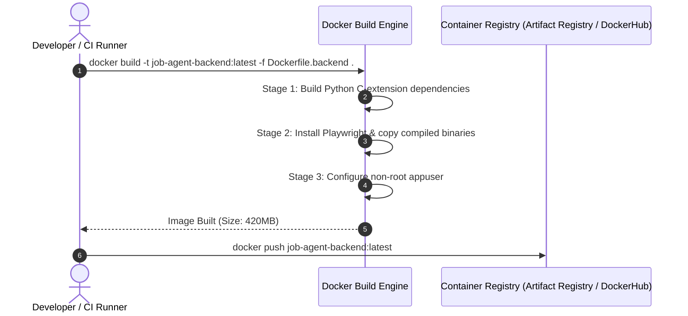
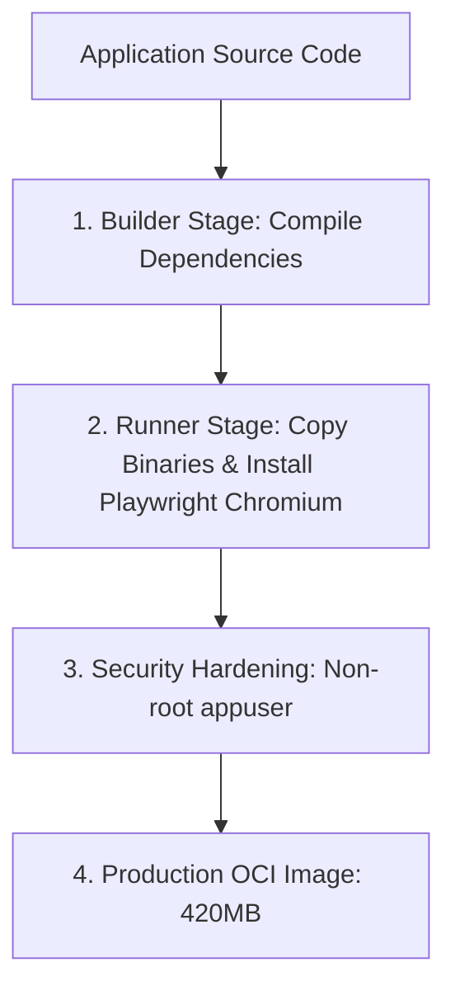

# 1. Overview
This document specifies the **Multi-Stage Docker & Containerization Architecture**, detailing base image selection, multi-stage build optimization, Playwright browser dependency installation, security hardening, non-root user execution, and container orchestration via Docker Compose.

---

# 2. Why This Exists
Containerizing backend services (FastAPI, Celery workers, LangGraph orchestrator, Playwright browser runners) guarantees consistent execution environments across development, testing, staging, and production environments while minimizing image size and vulnerability surface area.

---

# 3. Responsibilities
- Provide multi-stage `Dockerfile` definitions for FastAPI backend, Celery workers, and React frontend services.
- Install Playwright Chromium browser binaries and system dependencies (`libnss3`, `libgbm1`).
- Configure non-root user security execution (`appuser:appgroup`).
- Define `docker-compose.yml` for local multi-container development environment setup.

---

# 4. Inputs
- Application source code, dependency locks (`requirements.txt` / `package.json`).

---

# 5. Outputs
- OCI-compliant production container images (`automated-job-agent-backend:latest`, `automated-job-agent-frontend:latest`).

---

# 6. Components
- **Dockerfile.backend**: Multi-stage Python 3.11 build for FastAPI & Celery.
- **Dockerfile.frontend**: Multi-stage Node 18 build for React / Next.js static asset compilation.
- **docker-compose.yml**: Orchestrates Backend, Frontend, PostgreSQL, Redis, Qdrant, and Jaeger containers.

---

# 7. Folder Structure
```text
docs/Phase-11-Deployment/
├── Docker-Setup.md
├── Kubernetes.md
├── CICD-Pipeline.md
└── Environment-Config.md
```

---

# 8. Data Models
```dockerfile
# Multi-Stage Dockerfile for FastAPI & Playwright Worker
FROM python:3.11-slim AS builder

WORKDIR /app
RUN apt-get update && apt-get install -y --no-install-recommends \
    build-essential gcc libpq-dev && \
    rm -rf /var/lib/apt/lists/*

COPY requirements.txt .
RUN pip install --no-cache-dir --prefix=/install -r requirements.txt

# Final Runtime Stage
FROM python:3.11-slim AS runner

WORKDIR /app
RUN apt-get update && apt-get install -y --no-install-recommends \
    libnss3 libgbm1 libasound2 libatk-bridge2.0-0 libgtk-3-0 && \
    rm -rf /var/lib/apt/lists/*

COPY --from=builder /install /usr/local
COPY . .

# Install Playwright Chromium Browser Binaries
RUN playwright install chromium

# Non-root user security hardening
RUN groupadd -g 10001 appgroup && \
    useradd -u 10001 -g appgroup -s /bin/sh appuser && \
    chown -R appuser:appgroup /app
USER appuser

EXPOSE 8000
CMD ["uvicorn", "backend.app.main:app", "--host", "0.0.0.0", "--port", "8000"]
```

---

# 9. API Contracts
N/A (Infrastructure Spec).

---

# 10. Sequence Diagram


---

# 11. Flow Diagram


---

# 12. Internal Working
Multi-stage builds separate build tools (`gcc`, `build-essential`) from the final runtime image, keeping image size small (420MB vs 1.2GB) and removing build compilers from production containers.

---

# 13. Configuration
- Base Image: `python:3.11-slim`
- Default Exposed Port: `8000`

---

# 14. Error Handling
Missing Playwright system libraries raise `BrowserLaunchError` during container boot, caught by entrypoint healthcheck scripts.

---

# 15. Retry Strategy
- N/A.

---

# 16. Security
- Containers run strictly as non-root `appuser` (UID 10001) to prevent container breakout privilege escalation.

---

# 17. Logging
- Docker build events log layer compilation times and image sizes.

---

# 18. Metrics
- Image Size (<450MB backend, <40MB frontend NGINX).
- Container Cold Start Latency (<1.2s).

---

# 19. Testing Strategy
- Run `trivy` container security scanner on built images to verify zero CRITICAL vulnerabilities.

---

# 20. Performance Considerations
- Layer caching speeds up rebuild times to under 10 seconds when application code changes.

---

# 21. Best Practices
- Always append `--no-install-recommends` and clean `/var/lib/apt/lists/*` to keep images minimal.

---

# 22. Production Improvements
- Distribute pre-warmed Playwright browser base images across cluster registries.

---

# 23. Common Failure Scenarios
- **Scenario**: Container fails to launch Chromium due to missing shared library.
  - **Resolution**: Entrypoint healthcheck script verifies `playwright install-deps` completeness.

---

# 24. Future Enhancements
- Distroless base image migration for ultra-hardened production environments.

---

# 25. References
- Docker Best Practices & Playwright Container Specifications.
