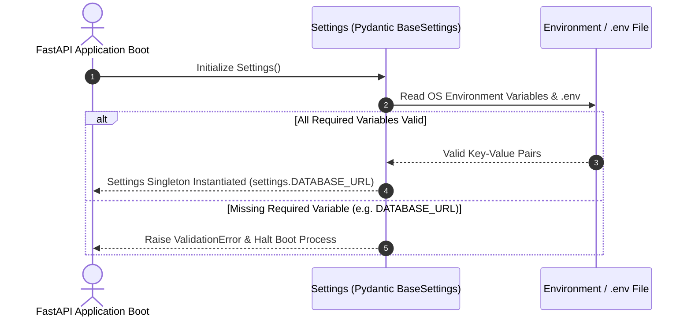
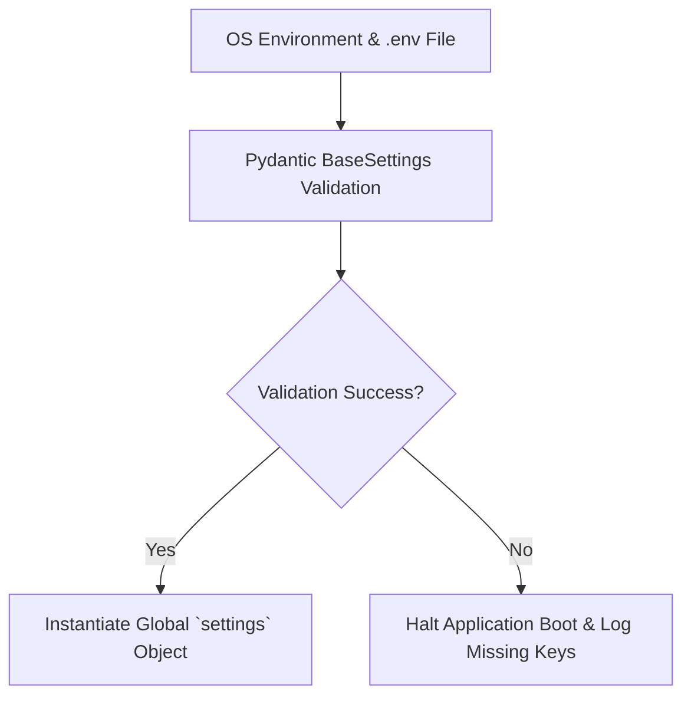

# 1. Overview
this document specifies the **Environment Configuration & Secret Management Architecture**, detailing `.env` template definitions, environment variable validation via Pydantic BaseSettings, secret injection, and multi-stage configs (Development, Staging, Production) ([config.py](file:///d:/Personal%20Imp/Projects/Automated-job-Agent/backend/app/config.py)).

---

# 2. Why This Exists
An enterprise application requires strict separation of code and configuration (12-Factor App methodology). Hardcoding API keys, database credentials, or secret keys in source code creates critical security vulnerabilities. Pydantic `BaseSettings` validates all required environment parameters on application boot ([config.py](file:///d:/Personal%20Imp/Projects/Automated-job-Agent/backend/app/config.py)).

---

# 3. Responsibilities
- Define application configuration schema using Pydantic `BaseSettings` ([config.py](file:///d:/Personal%20Imp/Projects/Automated-job-Agent/backend/app/config.py)).
- Validate environment variables on boot, raising descriptive errors if required keys are missing.
- Manage environment separation (`DEVELOPMENT`, `STAGING`, `PRODUCTION`).

---

# 4. Inputs
- `.env` files, OS environment variables, Kubernetes Secret objects.

---

# 5. Outputs
- Strongly-typed, validated `Settings` singleton object available across backend services.

---

# 6. Components
- **Settings**: Pydantic settings singleton ([config.py](file:///d:/Personal%20Imp/Projects/Automated-job-Agent/backend/app/config.py)).
- **EnvTemplate**: Template `.env.example` documenting all configuration keys.

---

# 7. Folder Structure
```text
docs/Phase-11-Deployment/
└── Environment-Config.md
```

---

# 8. Data Models
```python
# Pydantic Settings Schema in backend/app/config.py
from pydantic_settings import BaseSettings
from pydantic import Field, HttpUrl

class Settings(BaseSettings):
    ENV: str = Field(default="DEVELOPMENT", description="DEVELOPMENT, STAGING, PRODUCTION")
    DATABASE_URL: str = Field(..., description="PostgreSQL connection string")
    REDIS_URL: str = Field(default="redis://localhost:6379/0")
    QDRANT_HOST: str = Field(default="localhost")
    QDRANT_PORT: int = Field(default=6333)
    
    # LLM API Keys
    OPENAI_API_KEY: str = Field(..., description="OpenAI API Key")
    DASHSCOPE_API_KEY: str = Field(default="", description="Alibaba Qwen API Key")
    
    # Storage Paths
    TAILORED_RESUMES_DIR: str = Field(default="storage/tailored_resumes")
    SCREENSHOTS_DIR: str = Field(default="storage/screenshots")
    
    class Config:
        env_file = ".env"
        env_file_encoding = "utf-8"

settings = Settings()
```

---

# 9. API Contracts
N/A (Configuration Spec).

---

# 10. Sequence Diagram


---

# 11. Flow Diagram


---

# 12. Internal Working
When `Settings()` is instantiated during application boot, Pydantic parses OS environment variables first, falling back to `.env` values. Types are automatically cast (strings to ints, URLs to HttpUrl objects).

---

# 13. Configuration
- Specified in [backend/app/config.py](file:///d:/Personal%20Imp/Projects/Automated-job-Agent/backend/app/config.py).

---

# 14. Error Handling
Missing required fields raise `pydantic.ValidationError`, displaying missing key names to console before exiting boot.

---

# 15. Retry Strategy
- N/A.

---

# 16. Security
- Secrets are excluded from `.gitignore` and logs mask secret key values automatically.

---

# 17. Logging
- Config events log `environment`, `database_host`, `qdrant_host`, `redis_host` (without logging secret keys).

---

# 18. Metrics
- Config Validation Latency (<2ms).

---

# 19. Testing Strategy
- Unit test configuration validator against valid and invalid `.env` files.

---

# 20. Performance Considerations
- Instantiating settings as a module singleton ensures environment parsing occurs only once during application boot.

---

# 21. Best Practices
- Never commit `.env` files containing real production secrets to version control repositories.

---

# 22. Production Improvements
- Dynamic secret rotation integration with HashiCorp Vault / GCP Secret Manager.

---

# 23. Common Failure Scenarios
- **Scenario**: Developer forgets to add new API key to `.env`.
  - **Resolution**: App fails to start with explicit `ValidationError: field 'OPENAI_API_KEY' required`.

---

# 24. Future Enhancements
- Live configuration re-reading without requiring service process restarts.

---

# 25. References
- Pydantic Settings & 12-Factor App Configuration Guidelines.
