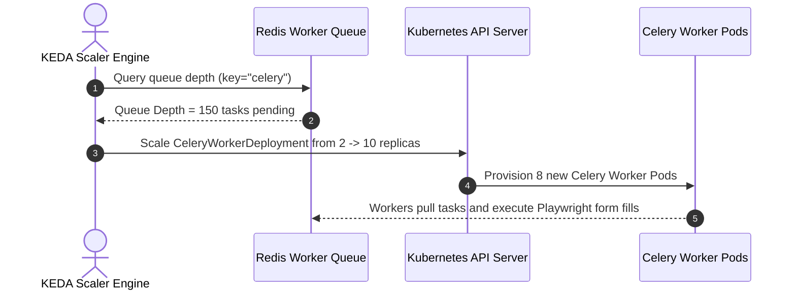

# 1. Overview
This document specifies the **Kubernetes Orchestration & Production Deployment Architecture**, detailing Deployment manifests, StatefulSets, Ingress controllers, Horizontal Pod Autoscalers (HPA), KEDA worker scaling, resource limits, and readiness/liveness probes.

---

# 2. Why This Exists
Deploying a multi-tenant automated job agent platform requires auto-scaling backend pods based on CPU/memory load and scaling Celery/Playwright worker pods based on queue depth. Kubernetes provides container orchestration, self-healing, rolling updates, and high availability.

---

# 3. Responsibilities
- Manage Kubernetes Deployment manifests for FastAPI backend, Celery worker pool, and React frontend services.
- Configure Horizontal Pod Autoscaler (HPA) and KEDA (Kubernetes Event-driven Autoscaling) for worker queue depth scaling.
- Configure NGINX Ingress Controller with TLS certificate automation via cert-manager.

---

# 4. Inputs
- Production container images, environment secret references.

---

# 5. Outputs
- Deployed Kubernetes resources running in `job-agent-prod` namespace.

---

# 6. Components
- **FastAPIDeployment**: 3-replica deployment for backend API services.
- **CeleryWorkerDeployment**: KEDA-scaled worker deployment running Playwright automation.
- **NGINXIngress**: Ingress routing `https://api.jobagent.ai` to backend service.
- **HPA**: Auto-scales API pods between 3 and 15 replicas based on 70% CPU target.

---

# 7. Folder Structure
```text
docs/Phase-11-Deployment/
└── Kubernetes.md
```

---

# 8. Data Models
```yaml
# FastAPI Backend Kubernetes Deployment Manifest
apiVersion: apps/v1
kind: Deployment
metadata:
  name: backend-api
  namespace: job-agent-prod
  labels:
    app: backend-api
spec:
  replicas: 3
  selector:
    matchLabels:
      app: backend-api
  template:
    metadata:
      labels:
        app: backend-api
    spec:
      containers:
      - name: api
        image: gcr.io/job-agent/backend:v1.0.0
        ports:
        - containerPort: 8000
        resources:
          requests:
            cpu: "250m"
            memory: "512Mi"
          limits:
            cpu: "1000m"
            memory: "1024Mi"
        livenessProbe:
          httpGet:
            path: /api/v1/health
            port: 8000
          initialDelaySeconds: 15
          periodSeconds: 10
        readinessProbe:
          httpGet:
            path: /api/v1/health
            port: 8000
          initialDelaySeconds: 5
          periodSeconds: 5
```

---

# 9. API Contracts
N/A (Infrastructure Spec).

---

# 10. Sequence Diagram


---

# 11. Flow Diagram
```mermaid
flowchart TD
    Ingress[NGINX Ingress Controller] -->|TLS HTTPS| Service[ClusterIP Service]
    Service --> Pods[FastAPI Backend Pods (HPA 3-15 Replicas)]
    Redis[(Redis Queue)] <--> KEDA[KEDA Queue Depth Scaler]
    KEDA <--> WorkerPods[Celery Worker Pods (Scaled 2-50 Replicas)]
```

---

# 12. Internal Working
KEDA monitors Redis queue depth (`listLength` on `celery`). When queue depth exceeds threshold (10 tasks per worker), KEDA scales worker pods dynamically up to 50 replicas.

---

# 13. Configuration
- Namespace: `job-agent-prod`
- API Replicas: `3` (Min) to `15` (Max)
- Worker Replicas: `2` (Min) to `50` (Max)

---

# 14. Error Handling
Failed pods that fail liveness probes 3 consecutive times are automatically terminated and replaced by Kubernetes.

---

# 15. Retry Strategy
- Pod restart policy is set to `Always`.

---

# 16. Security
- Pod Security Admission standards (`restricted` profile) enforce read-only root filesystems and prohibit root user execution.

---

# 17. Logging
- Kubernetes events log pod provisioning, scaling actions, and probe failures.

---

# 18. Metrics
- Pod Provisioning Speed (<5 seconds).
- HPA Metric Response Time (<15 seconds).

---

# 19. Testing Strategy
- Execute `kubeval` and `conftest` static validation on Kubernetes YAML manifests before applying.

---

# 20. Performance Considerations
- Setting explicit memory requests and limits prevents OOM (Out Of Memory) pod evictions.

---

# 21. Best Practices
- Always configure readiness and liveness probes for all production deployment manifests.

---

# 22. Production Improvements
- Implement Karpenter for node-level autoscaling on Cloud Kubernetes clusters (GKE / EKS).

---

# 23. Common Failure Scenarios
- **Scenario**: Sudden traffic spike overloads API backend.
  - **Resolution**: HPA detects CPU utilization > 70% and provisions additional API replicas within 15 seconds.

---

# 24. Future Enhancements
- Istio service mesh integration for mTLS service-to-service encryption.

---

# 25. References
- Kubernetes Official Documentation & KEDA Scaling Specifications.
