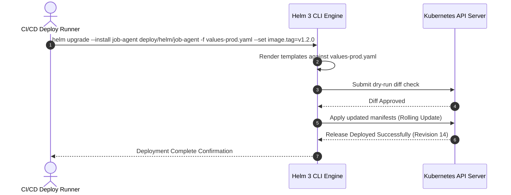
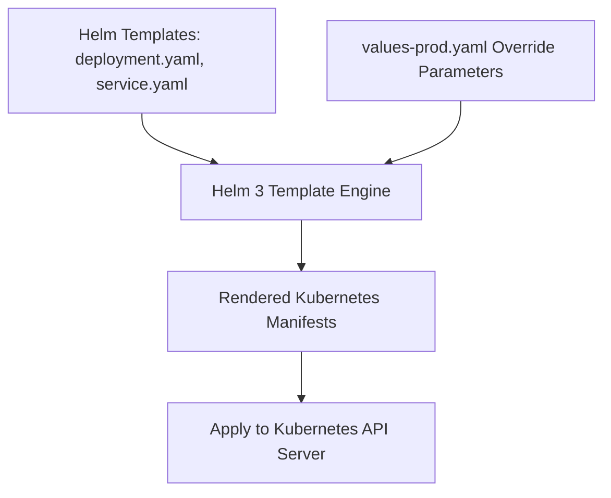

# 1. Overview
This document specifies the **Helm 3 Package Management & Chart Packaging Architecture**, detailing custom chart structures (`Chart.yaml`, `values.yaml`), sub-chart dependencies, environment override templates, and release rollback mechanisms.

---

# 2. Why This Exists
Managing dozens of individual Kubernetes YAML manifests across environments leads to duplication. Helm 3 packages Kubernetes resources into versioned, parameterizable charts, enabling simple 1-command deployments (`helm upgrade --install job-agent deploy/helm/job-agent`).

---

# 3. Responsibilities
- Package Kubernetes manifests (Deployments, Services, Ingress, ConfigMaps, HPA) into Helm chart format (`deploy/helm/job-agent`).
- Manage environment parameter values (`values.yaml`, `values-staging.yaml`, `values-prod.yaml`).
- Support 1-command release rollbacks (`helm rollback job-agent <revision>`).

---

# 4. Inputs
- Helm value override files (`values-prod.yaml`), image tag release parameters.

---

# 5. Outputs
- Versioned Helm release deployed to target Kubernetes cluster namespace.

---

# 6. Components
- **Chart.yaml**: Metadata definition for `job-agent` Helm chart.
- **values.yaml**: Default configuration parameters (replicas, image repos, resources).
- **templates/**: Parameterized Kubernetes YAML template manifests.

---

# 7. Folder Structure
```text
docs/Phase-11A-Infrastructure-as-Code/
└── Helm-Charts.md
```

---

# 8. Data Models
```yaml
# Helm values.yaml Excerpt (deploy/helm/job-agent/values.yaml)
replicaCount: 3

image:
  repository: gcr.io/job-agent/backend
  pullPolicy: IfNotPresent
  tag: "latest"

service:
  type: ClusterIP
  port: 8000

resources:
  requests:
    cpu: 250m
    memory: 512Mi
  limits:
    cpu: 1000m
    memory: 1024Mi

ingress:
  enabled: true
  className: nginx
  hosts:
    - host: api.jobagent.ai
      paths:
        - path: /
          pathType: Prefix
```

---

# 9. API Contracts
N/A (Helm Spec).

---

# 10. Sequence Diagram


---

# 11. Flow Diagram


---

# 12. Internal Working
Helm renders templates in memory using Go templating (`{{ .Values.image.repository }}:{{ .Values.image.tag }}`), compares rendered manifests against active cluster state, and applies necessary incremental updates.

---

# 13. Configuration
- Chart Path: `deploy/helm/job-agent/`
- Default Release Name: `job-agent`

---

# 14. Error Handling
If release deployment fails health checks, `helm upgrade --atomic` automatically rolls back to the previous stable release revision.

---

# 15. Retry Strategy
- N/A.

---

# 16. Security
- Secrets inside Helm values are encrypted using `helm-secrets` or External Secrets Operator.

---

# 17. Logging
- Helm events log release revision numbers, template rendering durations, and deployment statuses.

---

# 18. Metrics
- Helm Chart Render Latency (<300ms).

---

# 19. Testing Strategy
- Execute `helm lint` and `helm template` dry-run validations in CI pipeline before deployment.

---

# 20. Performance Considerations
- Helm template rendering executes locally in memory, imposing zero overhead on Kubernetes cluster API servers.

---

# 21. Best Practices
- Always use `--atomic` flag during `helm upgrade` to ensure automatic rollback on deployment failure.

---

# 22. Production Improvements
- Host versioned Helm charts in private Artifact Registry repository.

---

# 23. Common Failure Scenarios
- **Scenario**: Syntax error in `values-prod.yaml`.
  - **Resolution**: `helm lint` catches formatting error during CI stage, failing build before deployment attempt.

---

# 24. Future Enhancements
- Integration with FluxCD for GitOps automated Helm release reconciliation.

---

# 25. References
- Helm 3 Architecture & Chart Developer Guidelines.
