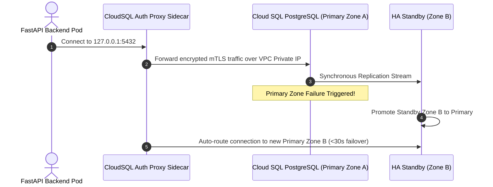
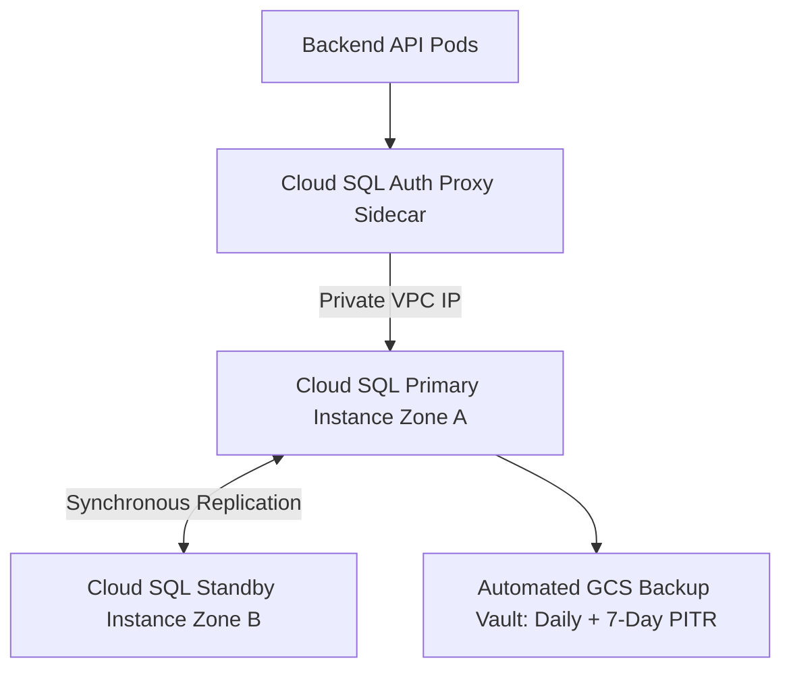

# 1. Overview
This document specifies the **Cloud SQL PostgreSQL High Availability & Backup Architecture**, detailing database tier selection, regional HA failover, automated point-in-time recovery (PITR), connection pooling via Cloud SQL Auth Proxy / PgBouncer, and performance tuning ([database.py](file:///d:/Personal%20Imp/Projects/Automated-job-Agent/backend/app/database.py)).

---

# 2. Why This Exists
Production relational data (candidate profiles, job postings, application history, reflection audits, review queues) requires a enterprise-grade database engine with regional failover, automated backups, and encrypted storage ([database.py](file:///d:/Personal%20Imp/Projects/Automated-job-Agent/backend/app/database.py)).

---

# 3. Responsibilities
- Provision Cloud SQL PostgreSQL 15 instance via Terraform (`db.tf`).
- Configure regional High Availability (HA) failover across zones.
- Enable automated daily backups and 7-day Point-in-Time Recovery (PITR).
- Configure Cloud SQL Auth Proxy for secure VPC connection pooling ([database.py](file:///d:/Personal%20Imp/Projects/Automated-job-Agent/backend/app/database.py)).

---

# 4. Inputs
- Database connection parameters, storage disk size limits, backup schedules.

---

# 5. Outputs
- Provisioned Cloud SQL instance connected to backend API services via VPC private IP.

---

# 6. Components
- **CloudSQLInstance**: Primary PostgreSQL 15 database instance (`db-custom-4-16384`).
- **HAReplica**: Regional failover replica instance in secondary availability zone.
- **CloudSQLAuthProxy**: Sidecar container managing encrypted database connections.

---

# 7. Folder Structure
```text
docs/Phase-11A-Infrastructure-as-Code/
└── Postgres-RDS-Setup.md
```

---

# 8. Data Models
```hcl
# Cloud SQL PostgreSQL 15 Terraform Definition (deploy/terraform/db.tf)
resource "google_sql_database_instance" "postgres" {
  name             = "job-agent-db-prod"
  database_version = "POSTGRES_15"
  region           = var.gcp_region

  settings {
    tier              = "db-custom-4-16384" # 4 vCPU, 16GB RAM
    availability_type = "REGIONAL"          # High Availability Failover

    disk_size         = 100
    disk_type         = "PD_SSD"
    disk_autoresize   = true

    ip_configuration {
      ipv4_enabled    = false
      private_network = module.vpc.network_id
    }

    backup_configuration {
      enabled                        = true
      start_time                     = "03:00"
      point_in_time_recovery_enabled = true
      transaction_log_retention_days = 7
    }
  }
}
```

---

# 9. API Contracts
N/A (IaC Spec).

---

# 10. Sequence Diagram


---

# 11. Flow Diagram


---

# 12. Internal Working
Cloud SQL Auth Proxy establishes an encrypted mTLS tunnel using GCP IAM credentials, eliminating the need to whitelist IP addresses or manage database SSL certificates manually.

---

# 13. Configuration
- Specified in [backend/app/database.py](file:///d:/Personal%20Imp/Projects/Automated-job-Agent/backend/app/database.py).
- Engine: PostgreSQL 15
- Instance Tier: `db-custom-4-16384` (4 vCPU, 16GB RAM)

---

# 14. Error Handling
Zone failures trigger automatic failover to the standby replica within 30 seconds; application connection pools retry transparently.

---

# 15. Retry Strategy
- SQLAlchemy engine uses connection pool pre-ping (`pool_pre_ping=True`) to re-establish dropped database connections.

---

# 16. Security
- Storage disk is encrypted with AES-256 customer-managed encryption keys.

---

# 17. Logging
- PostgreSQL query logs capture slow queries (>200ms) and connection audit events.

---

# 18. Metrics
- Query Latency (<4ms average for indexed reads).
- Availability SLA (99.95% uptime).

---

# 19. Testing Strategy
- Test regional failover using GCP Cloud SQL failover injection testing utilities.

---

# 20. Performance Considerations
- Enabling `disk_autoresize = true` prevents database outages due to disk space exhaustion.

---

# 21. Best Practices
- Always enable Point-in-Time Recovery (PITR) for production databases.

---

# 22. Production Improvements
- Integrate PgBouncer dedicated connection pooler deployment for handling 1,000+ concurrent worker connections.

---

# 23. Common Failure Scenarios
- **Scenario**: Database disk fills to 90% capacity.
  - **Resolution**: Disk auto-resize expands storage disk by 20GB automatically.

---

# 24. Future Enhancements
- Read-replica load balancing for candidate analytics query isolation.

---

# 25. References
- Cloud SQL PostgreSQL High Availability & Disaster Recovery Guidelines.
