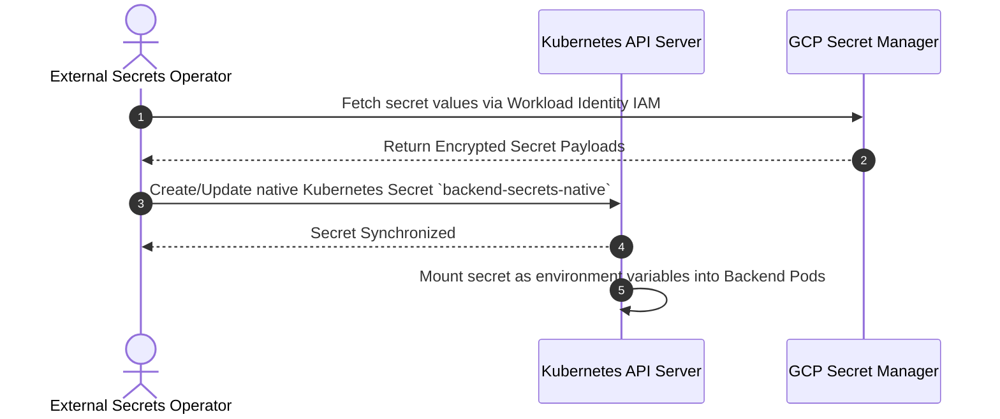
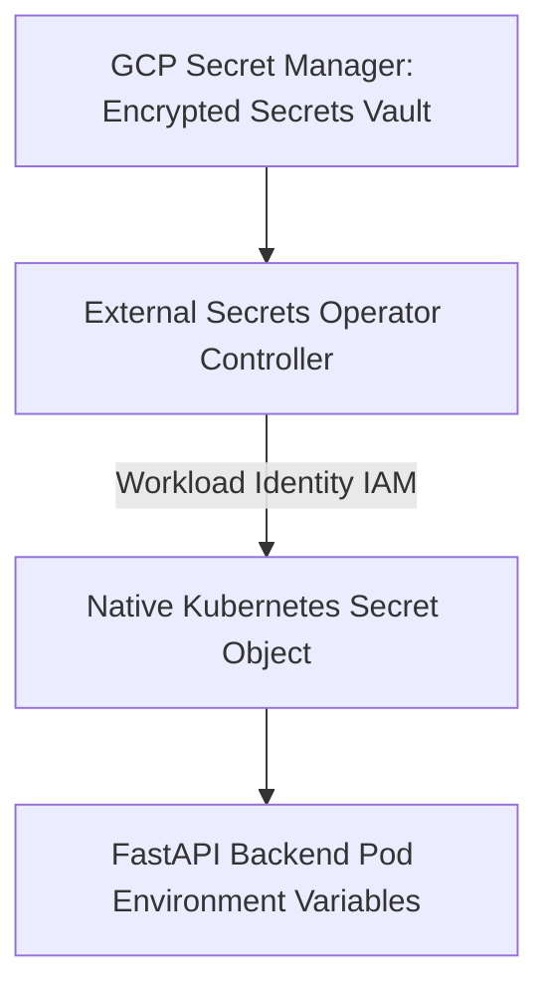

# 1. Overview
This document specifies the **Google Secret Manager & External Secrets Operator Integration**, detailing cloud secret storage, automatic Kubernetes secret synchronization, workload identity authentication, and secret rotation policies.

---

# 2. Why This Exists
Storing API keys (OpenAI, Qwen, 2Captcha) or database credentials directly in Kubernetes ConfigMaps or Git repositories is a critical security violation. Integrating Google Secret Manager with Kubernetes External Secrets Operator (ESO) synchronizes cloud secrets automatically while maintaining strict security.

---

# 3. Responsibilities
- Store sensitive credentials in Google Cloud Secret Manager.
- Deploy Kubernetes External Secrets Operator (ESO) to sync secrets into native Kubernetes `Secret` objects.
- Authenticate ESO via Workload Identity (service account IAM binding).

---

# 4. Inputs
- Secret payloads in GCP Secret Manager, `ExternalSecret` custom resource definitions.

---

# 5. Outputs
- Synchronized, encrypted native Kubernetes `Secret` objects available to backend deployment pods.

---

# 6. Components
- **SecretStore**: Kubernetes Custom Resource defining authentication to GCP Secret Manager.
- **ExternalSecret**: Custom Resource defining specific secret mapping (`DATABASE_URL`, `OPENAI_API_KEY`).
- **ESO Controller**: Syncs secret updates every 1 hour.

---

# 7. Folder Structure
```text
docs/Phase-11A-Infrastructure-as-Code/
└── Secret-Manager.md
```

---

# 8. Data Models
```yaml
# ExternalSecret Custom Resource Manifest
apiVersion: external-secrets.io/v1beta1
kind: ExternalSecret
metadata:
  name: backend-secrets
  namespace: job-agent-prod
spec:
  refreshInterval: 1h
  secretStoreRef:
    name: gcp-secret-store
    kind: ClusterSecretStore
  target:
    name: backend-secrets-native
    creationPolicy: Owner
  data:
  - secretKey: DATABASE_URL
    remoteRef:
      key: prod-db-connection-string
  - secretKey: OPENAI_API_KEY
    remoteRef:
      key: prod-openai-api-key
```

---

# 9. API Contracts
N/A (IaC Spec).

---

# 10. Sequence Diagram


---

# 11. Flow Diagram


---

# 12. Internal Working
Workload Identity binds the Kubernetes Service Account (`eso-sa`) directly to the GCP IAM Service Account (`eso-gcp-sa@project.iam.gserviceaccount.com`), eliminating the need for long-lived service account JSON key files.

---

# 13. Configuration
- Sync Refresh Interval: `1h`
- Namespace: `job-agent-prod`

---

# 14. Error Handling
If GCP Secret Manager is unreachable, ESO retains existing native Kubernetes secrets to ensure active application pods continue running uninterrupted.

---

# 15. Retry Strategy
- Secret sync retries up to 3 times with exponential backoff.

---

# 16. Security
- Secrets are encrypted at rest in GCP Secret Manager using customer-managed encryption keys (CMEK).

---

# 17. Logging
- ESO events log secret synchronization timestamps, version numbers, and audit statuses.

---

# 18. Metrics
- Secret Sync Speed (<500ms per secret).

---

# 19. Testing Strategy
- Unit test `ExternalSecret` manifest syntax using `conftest` static policy validator.

---

# 20. Performance Considerations
- 1-hour refresh interval minimizes GCP Secret Manager API call costs.

---

# 21. Best Practices
- Never check secret values into version control repositories.

---

# 22. Production Improvements
- Implement automated 90-day secret rotation triggers via Cloud Functions.

---

# 23. Common Failure Scenarios
- **Scenario**: GCP IAM permissions missing for Secret Manager access.
  - **Resolution**: ESO logs `PermissionDenied` error, alerting DevOps to grant `roles/secretmanager.secretAccessor` to workload identity.

---

# 24. Future Enhancements
- HashiCorp Vault Integration as secondary backup secret provider.

---

# 25. References
- External Secrets Operator & GCP Secret Manager Specifications.
