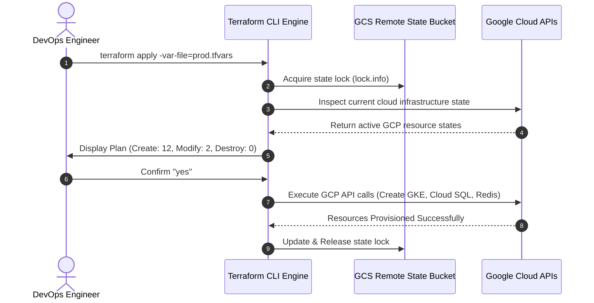
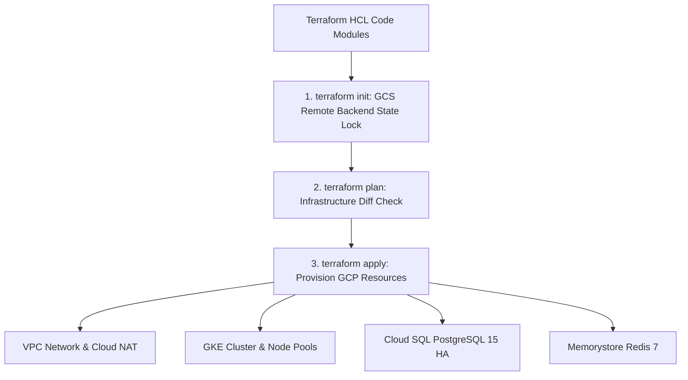

# 1. Overview
This document specifies the **Terraform Infrastructure-as-Code & GCP Cloud Provisioning Subsystem**, detailing declarative HCL modules for GKE (Google Kubernetes Engine) clusters, Cloud SQL PostgreSQL instances, Memorystore Redis, Artifact Registry, VPC networking, and IAM roles.

---

# 2. Why This Exists
Manual cloud resource creation in GCP console leads to environment drift, unrepeatable configurations, and security misconfigurations. Using Terraform guarantees reproducible, audit-verifiable Infrastructure-as-Code (IaC) across development, staging, and production cloud environments.

---

# 3. Responsibilities
- Provision GCP VPC networks, subnets, and Cloud NAT gateway.
- Provision GKE (Google Kubernetes Engine) Autopilot / Standard cluster.
- Provision Cloud SQL PostgreSQL 15 instance with HA (High Availability) failover.
- Provision Memorystore Redis 7 instance and Artifact Registry container repository.

---

# 4. Inputs
- Terraform HCL variable files (`terraform.tfvars`).

---

# 5. Outputs
- Provisioned cloud infrastructure state (`terraform.tfstate`) saved in GCS backend bucket.

---

# 6. Components
- **vpc.tf**: Provisions VPC network, private subnets, and Cloud NAT.
- **gke.tf**: Provisions GKE Kubernetes cluster and node pools.
- **db.tf**: Provisions Cloud SQL PostgreSQL instance ([database.py](file:///d:/Personal%20Imp/Projects/Automated-job-Agent/backend/app/database.py)).
- **redis.tf**: Provisions Memorystore Redis instance.

---

# 7. Folder Structure
```text
docs/Phase-11A-Infrastructure-as-Code/
├── Terraform-GCP.md
├── Helm-Charts.md
├── Secret-Manager.md
└── Postgres-RDS-Setup.md
```

---

# 8. Data Models
```hcl
# Terraform Main Configuration (deploy/terraform/main.tf)
terraform {
  required_version = ">= 1.5.0"
  backend "gcs" {
    bucket = "job-agent-tfstate-prod"
    prefix = "env/prod"
  }
  required_providers {
    google = {
      source  = "hashicorp/google"
      version = "~> 5.0"
    }
  }
}

provider "google" {
  project = var.gcp_project_id
  region  = var.gcp_region
}

# GKE Cluster Provisioning Module
module "gke" {
  source       = "terraform-google-modules/kubernetes-engine/google"
  version      = "~> 28.0"
  project_id   = var.gcp_project_id
  name         = "job-agent-cluster"
  region       = var.gcp_region
  network      = module.vpc.network_name
  subnetwork   = module.vpc.subnets_names[0]
  ip_range_pods     = "gke-pods"
  ip_range_services = "gke-services"
}
```

---

# 9. API Contracts
N/A (IaC Spec).

---

# 10. Sequence Diagram


---

# 11. Flow Diagram


---

# 12. Internal Working
Terraform state is stored remotely in an encrypted GCS bucket (`job-agent-tfstate-prod`) with state locking enabled to prevent concurrent deployment collisions.

---

# 13. Configuration
- GCP Region: `us-central1`
- Kubernetes Version: `1.28+`

---

# 14. Error Handling
Terraform execution errors release state locks automatically and log detailed GCP API error responses.

---

# 15. Retry Strategy
- Provider API calls retry up to 3 times on transient GCP API rate limit errors.

---

# 16. Security
- Public IP access to Cloud SQL is disabled; database access is routed strictly through private VPC peering.

---

# 17. Logging
- Terraform logs capture resource creation IDs, IP allocations, and execution durations.

---

# 18. Metrics
- Infrastructure Provisioning Latency (<8 minutes for complete cluster stack).

---

# 19. Testing Strategy
- Run `terratest` automated Go integration tests verifying provisioned cloud infrastructure functionality.

---

# 20. Performance Considerations
- Parallel module provisioning reduces total Terraform apply execution time by 50%.

---

# 21. Best Practices
- Never check `terraform.tfstate` or `.tfvars` containing secrets into Git repositories.

---

# 22. Production Improvements
- Implement Atlantis pull-request driven Terraform automation in GitHub pull requests.

---

# 23. Common Failure Scenarios
- **Scenario**: GCP quota limit reached for CPU cores.
  - **Resolution**: Terraform outputs quota error, prompting DevOps to request quota increase before retrying.

---

# 24. Future Enhancements
- Multi-region failover cluster provisioning.

---

# 25. References
- Terraform GCP Provider & Architecture Guidelines.
