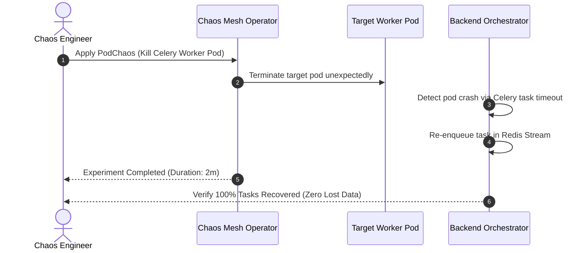
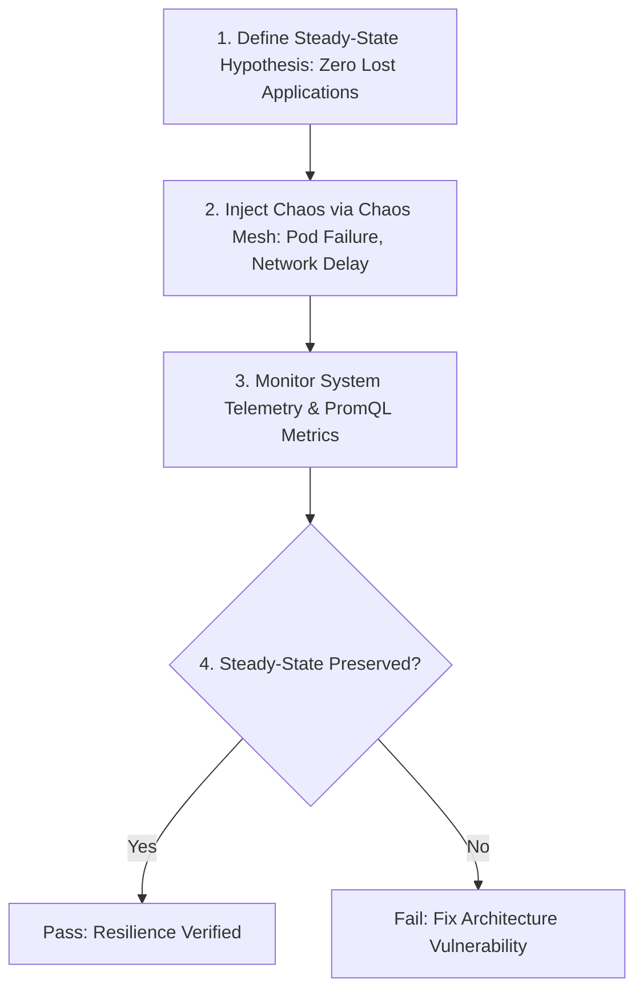

# 1. Overview
This document specifies the **Chaos Mesh Engine & Chaos Engineering Architecture**, detailing Chaos Mesh CRDs (`PodChaos`, `NetworkChaos`, `HTTPChaos`, `StressChaos`), chaos experiment orchestration, safety blast radius controls, and steady-state hypothesis validation.

---

# 2. Why This Exists
In complex distributed agent architectures, unexpected failure modes (database latency spikes, Redis connection drops, Playwright browser crashes, proxy IP timeouts) inevitably occur. Chaos engineering proactively injects controlled failures into staging environments to verify system resilience and self-healing.

---

# 3. Responsibilities
- Deploy Chaos Mesh operator into Kubernetes staging cluster.
- Define custom chaos experiment manifests (`PodChaos`, `NetworkChaos`, `HTTPChaos`).
- Validate steady-state system recovery (Zero lost job applications, automatic retry success).

---

# 4. Inputs
- Chaos Mesh experiment manifests, staging cluster target namespace (`job-agent-staging`).

---

# 5. Outputs
- Experiment execution metrics, resilience validation reports, self-healing verification.

---

# 6. Components
- **ChaosMeshOperator**: Kubernetes operator executing chaos experiments.
- **ChaosDashboard**: UI for visual chaos experiment management (`http://localhost:2333`).

---

# 7. Folder Structure
```text
docs/Phase-11B-Chaos-Engineering/
├── Chaos-Mesh-Setup.md
├── Failure-Injection-Tests.md
└── Resilience-Validation.md
```

---

# 8. Data Models
```yaml
# Chaos Mesh Network Chaos Experiment Manifest
apiVersion: chaos-mesh.org/v1alpha1
kind: NetworkChaos
metadata:
  name: redis-latency-injection
  namespace: job-agent-staging
spec:
  action: delay
  mode: one
  selector:
    namespaces:
      - job-agent-staging
    labelSelectors:
      'app': 'redis'
  delay:
    latency: '500ms'
    jitter: '100ms'
  duration: '5m'
  scheduler:
    cron: '0 0 * * *'
```

---

# 9. API Contracts
N/A (Chaos Spec).

---

# 10. Sequence Diagram


---

# 11. Flow Diagram


---

# 12. Internal Working
Chaos Mesh uses eBPF and Linux kernel `cgroups` / `tc` (traffic control) to inject network delay, packet loss, pod kills, and CPU/memory stress directly into target container pods.

---

# 13. Configuration
- Target Namespace: `job-agent-staging`
- Dashboard URL: `http://localhost:2333`

---

# 14. Error Handling
An automated emergency kill-switch (`chaosctl stop`) terminates all active chaos experiments immediately if steady-state metrics violate safety thresholds.

---

# 15. Retry Strategy
- N/A.

---

# 16. Security
- Chaos Mesh experiments are strictly prohibited from running in production namespaces.

---

# 17. Logging
- Chaos events log `experiment_name`, `target_pod`, `failure_type`, `duration`, `system_impact`.

---

# 18. Metrics
- Self-Healing Time (MTTR < 15 seconds after chaos injection).

---

# 19. Testing Strategy
- Execute chaos experiments weekly in staging environment.

---

# 20. Performance Considerations
- Injecting chaos only in staging prevents impacting live candidates.

---

# 21. Best Practices
- Always establish a quantitative steady-state metric hypothesis before running any chaos experiment.

---

# 22. Production Improvements
- Automated game day scenario runner.

---

# 23. Common Failure Scenarios
- **Scenario**: Database network delay causes connection pool exhaustion.
  - **Resolution**: Circuit breaker opens, serving degraded fallback response until latency normalizes.

---

# 24. Future Enhancements
- AI-driven chaos scenario generator targeting untested system failure paths.

---

# 25. References
- Chaos Mesh Architecture & Chaos Engineering Guidelines.
