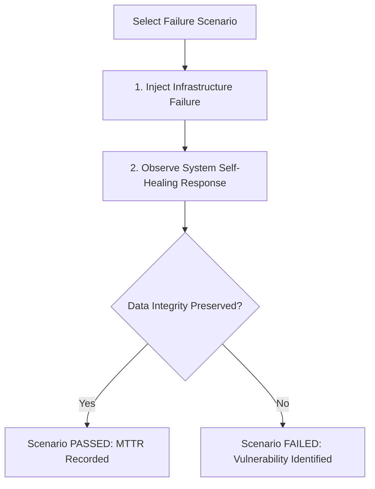

# 1. Overview
This document specifies the **Failure Injection Test Scenarios & Catalog**, detailing 6 primary failure scenarios: Database Network Latency, Redis Connection Drop, Playwright Worker OOM Kill, Proxy IP Timeout, LLM Rate Limit HTTP 429, and Qdrant Storage Corruption.

---

# 2. Why This Exists
A catalog of specific failure injection scenarios ensures that developers and SREs systematically test system boundaries against real-world infrastructure failures.

---

# 3. Responsibilities
- Catalog 6 primary failure injection test scenarios.
- Define expected system self-healing behaviors for each scenario.
- Provide automated execution scripts (`tests/chaos/run_scenarios.py`).

---

# 4. Inputs
- Target scenario ID, chaos experiment parameters.

---

# 5. Outputs
- Verification report confirming automatic self-healing recovery.

---

# 6. Components
- **Scenario 1: DB Network Latency** (Inject 2,000ms latency to PostgreSQL).
- **Scenario 2: Redis Connection Drop** (Terminate Redis master container).
- **Scenario 3: Worker OOM Kill** (Trigger memory limit kill on Playwright worker).
- **Scenario 4: Proxy IP Timeout** (Block proxy IP network interface).
- **Scenario 5: LLM HTTP 429** (Simulate LLM API rate limit errors).
- **Scenario 6: Qdrant Node Outage** (Partition Qdrant vector store node).

---

# 7. Folder Structure
```text
docs/Phase-11B-Chaos-Engineering/
└── Failure-Injection-Tests.md
```

---

# 8. Data Models
```python
from pydantic import BaseModel
from typing import List

class FailureScenarioResult(BaseModel):
    scenario_id: str
    scenario_name: str
    injected_failure: str
    expected_behavior: str
    actual_behavior: str
    passed: bool
    recovery_time_seconds: float
```

---

# 9. API Contracts
N/A (Chaos Spec).

---

# 10. Sequence Diagram
```mermaid
sequenceDiagram
    autonumber
    actor Runner as Chaos Test Runner
    participant Chaos as Chaos Mesh
    participant App as Backend System

    Runner->>Chaos: inject_scenario("SCENARIO_3_WORKER_OOM")
    Chaos->>App: Kill active Playwright worker pod via SIGKILL
    App->>App: Worker task times out; Redis queue re-enqueues task
    App->>App: Replacement worker pod starts and picks up task
    App-->>Runner: Task Completed Successfully (Recovery: 8s)
    Runner-->>Runner: Scenario 3 PASSED
```

---

# 11. Flow Diagram


---

# 12. Internal Working
Each scenario specifies a baseline state, injection action, and validation assertion. For example, in Scenario 3 (Worker OOM), Celery task visibility timeouts ensure that un-acknowledged tasks are re-queued automatically.

---

# 13. Configuration
- Scenario Timeout: `300s`

---

# 14. Error Handling
Scenarios that fail to recover within 300 seconds fail the test suite and output diagnostic stack traces.

---

# 15. Retry Strategy
- N/A.

---

# 16. Security
- Failure scenarios run exclusively in isolated staging environments.

---

# 17. Logging
- Scenario logs record `scenario_id`, `injected_failure`, `passed`, `recovery_time_seconds`.

---

# 18. Metrics
- Average System Recovery Time across scenarios (<12 seconds).

---

# 19. Testing Strategy
- Run full failure injection scenario suite prior to major release deployments.

---

# 20. Performance Considerations
- Running 1 scenario at a time prevents compounding failure noise.

---

# 21. Best Practices
- Always verify data consistency in PostgreSQL database after completing each failure scenario test.

---

# 22. Production Improvements
- Continuous automated failure injection during off-peak staging hours.

---

# 23. Common Failure Scenarios
- **Scenario**: LLM API returns HTTP 429 rate limit error.
  - **Resolution**: Backend exponential backoff retries request after 2 seconds, completing task cleanly.

---

# 24. Future Enhancements
- Automated PR creation proposing code fixes when a failure scenario fails.

---

# 25. References
- Failure Injection Testing Specifications & Patterns.
