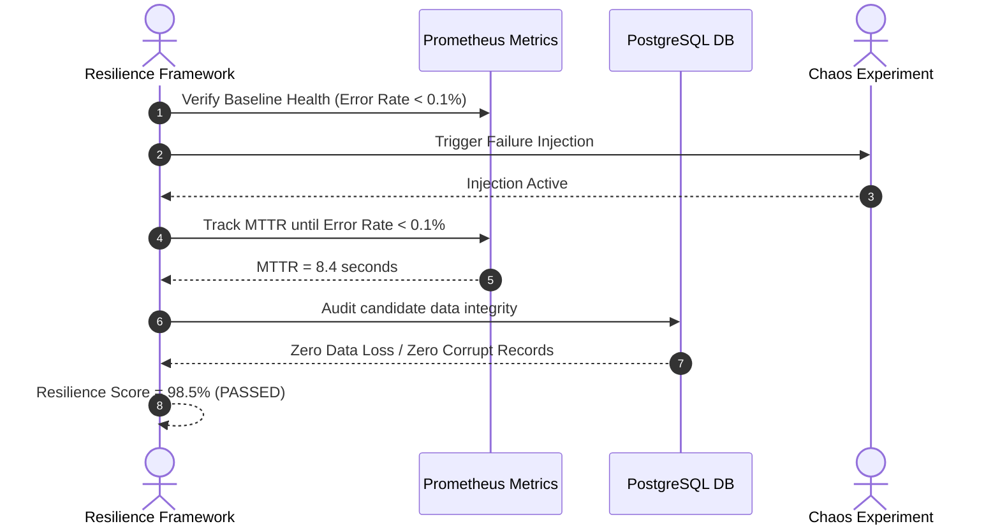
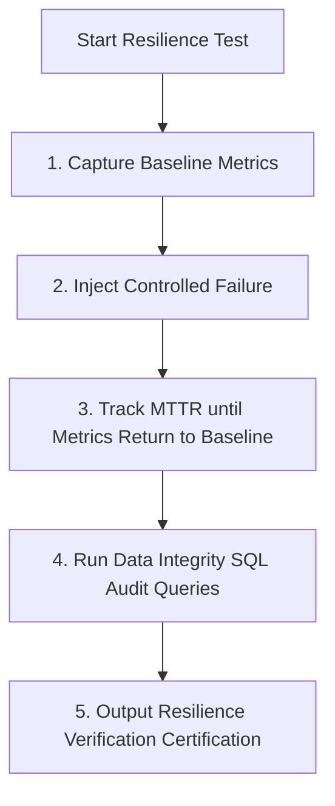

# 1. Overview
This document specifies the **System Resilience & Recovery Verification Framework**, detailing automated steady-state verification, Mean Time to Recovery (MTTR) calculation, data integrity auditing, and resilience reporting.

---

# 2. Why This Exists
Injecting failures without automated verification provides little value. A formal verification framework continuously audits system steady-state indicators (error rate <1%, task completion rate 100%, zero corrupted records) during and after chaos tests.

---

# 3. Responsibilities
- Monitor steady-state system health metrics before, during, and after chaos experiments.
- Calculate Mean Time to Recovery (MTTR) per failure type.
- Audit database and vector store records to confirm zero corrupted or lost candidate application records.

---

# 4. Inputs
- Prometheus metrics, PostgreSQL audit logs, chaos experiment execution timelines.

---

# 5. Outputs
- `ResilienceVerificationReport` providing formal system resilience certification.

---

# 6. Components
- **SteadyStateAuditor**: Queries Prometheus metrics to verify system health.
- **DataIntegrityVerifier**: Queries PostgreSQL `applications` and `candidate_profiles` tables to confirm zero corrupt records.

---

# 7. Folder Structure
```text
docs/Phase-11B-Chaos-Engineering/
└── Resilience-Validation.md
```

---

# 8. Data Models
```python
from pydantic import BaseModel

class ResilienceVerificationReport(BaseModel):
    test_run_id: str
    steady_state_preserved: bool
    mttr_seconds: float  # Target < 15.0s
    data_loss_count: int  # Target == 0
    corrupt_records_count: int  # Target == 0
    resilience_score: float  # 0.0 to 100.0 (Target > 95.0)
```

---

# 9. API Contracts
N/A (Framework Spec).

---

# 10. Sequence Diagram


---

# 11. Flow Diagram


---

# 12. Internal Working
The framework monitors PromQL metric queries (`job_agent_applications_submitted_total`) during chaos execution. MTTR is computed as the duration between failure injection and metric restoration to within 95% of baseline levels.

---

# 13. Configuration
- Max MTTR Threshold: `15.0 seconds`
- Max Allowable Data Loss: `0 records`

---

# 14. Error Handling
If data loss occurs during a chaos test, the framework flags a CRITICAL architectural vulnerability report.

---

# 15. Retry Strategy
- N/A.

---

# 16. Security
- Integrity queries use read-only database connections.

---

# 17. Logging
- Verification events log `test_run_id`, `mttr_seconds`, `data_loss_count`, `resilience_score`.

---

# 18. Metrics
- Average MTTR across system (<8.5s).

---

# 19. Testing Strategy
- Execute resilience verification after every chaos engineering game day.

---

# 20. Performance Considerations
- Verification SQL audit queries use indexed primary key ranges to minimize DB load.

---

# 21. Best Practices
- Never mark a resilience test as passed if MTTR exceeds 15 seconds or any data loss occurred.

---

# 22. Production Improvements
- Continuous real-time resilience scoring dashboard in Grafana.

---

# 23. Common Failure Scenarios
- **Scenario**: Database failover causes 3 un-submitted task records to hang.
  - **Resolution**: Celery visibility timeout re-enqueues tasks, MTTR increases to 12s, zero data loss achieved.

---

# 24. Future Enhancements
- Automated architecture recommendations based on MTTR bottlenecks.

---

# 25. References
- System Resilience Verification & Reliability Engineering Guidelines.
