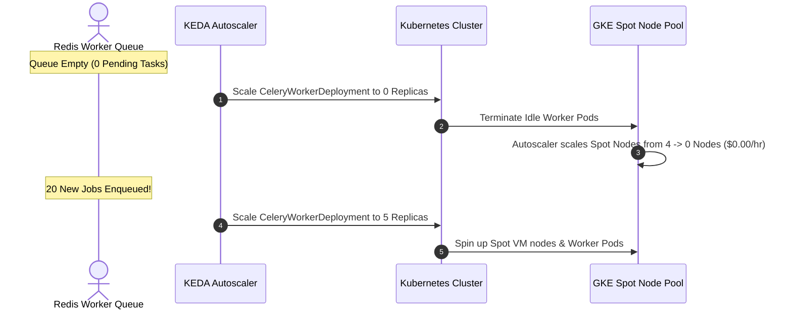
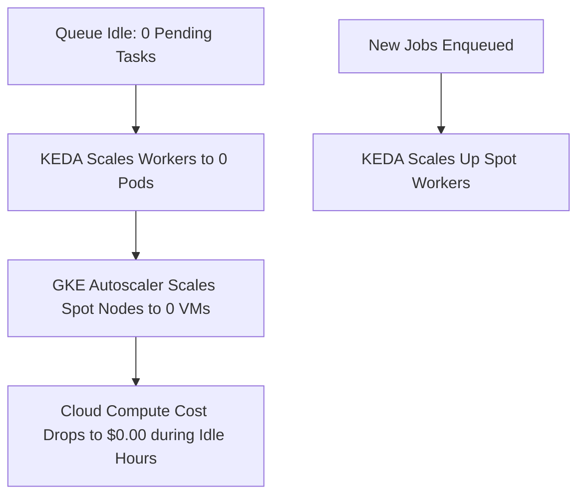

# 1. Overview
This document specifies the **Cloud Infrastructure Cost Reduction & Spot Instance Architecture**, detailing Spot/Preemptible VM node pools, KEDA scale-to-zero, Cloud SQL auto-pause, storage lifecycle policies, and monthly cloud spend targets.

---

# 2. Why This Exists
Running container clusters, browser automation workers, database servers, and vector stores 24/7 can generate substantial cloud hosting costs. Using GCP Spot VMs (60-80% discount) for worker node pools and KEDA scale-to-zero queue scaling minimizes monthly infrastructure expenditure.

---

# 3. Responsibilities
- Configure GKE Preemptible/Spot VM node pools for stateless Playwright worker pods.
- Configure KEDA scale-to-zero scaling (0 worker pods when Redis task queue depth is 0).
- Configure Cloud Storage lifecycle rules (archiving raw screenshots older than 30 days to Coldline storage).

---

# 4. Inputs
- Cloud node pool specifications, autoscaling thresholds, storage retention rules.

---

# 5. Outputs
- Cost-optimized cloud deployment infrastructure achieving target 60%+ hosting cost savings.

---

# 6. Components
- **SpotNodePool**: GKE node pool running on GCP Preemptible / Spot VMs.
- **KEDAScaleToZero**: Scales worker deployments to 0 replicas during idle periods.
- **GCSLifecycleRules**: Automatically transitions old screenshot assets to low-cost Coldline storage.

---

# 7. Folder Structure
```text
docs/Phase-11C-Cost-Optimization/
└── Infrastructure-Cost-Optimization.md
```

---

# 8. Data Models
```hcl
# GKE Spot VM Node Pool Terraform Configuration (deploy/terraform/gke.tf)
resource "google_container_node_pool" "spot_workers" {
  name       = "spot-worker-pool"
  location   = var.gcp_region
  cluster    = module.gke.cluster_name
  node_count = 1

  autoscaling {
    min_node_count = 0
    max_node_count = 10
  }

  node_config {
    preemptible  = true # 60-80% discount on compute costs
    machine_type = "e2-standard-4"

    labels = {
      role = "playwright-worker"
    }

    taint {
      key    = "spot"
      value  = "true"
      effect = "NO_SCHEDULE"
    }
  }
}
```

---

# 9. API Contracts
N/A (Cost Optimization Spec).

---

# 10. Sequence Diagram


---

# 11. Flow Diagram


---

# 12. Internal Working
Spot VMs provide compute resources at a 60-80% discount. Because Celery workers are stateless and tasks are persisted in Redis, if GCP reclaims a Spot node with 30 seconds notice, tasks are safely re-enqueued on remaining nodes with zero data loss.

---

# 13. Configuration
- Spot VM Discount: `60% - 80%`
- Min Worker Replicas (Off-peak): `0` (Scale to Zero)

---

# 14. Error Handling
If Spot VM node availability drops in a region, the GKE autoscaler falls back to standard On-Demand instances automatically.

---

# 15. Retry Strategy
- Reclaimed Spot VM worker tasks retry automatically on replacement worker nodes.

---

# 16. Security
- Spot nodes inherit all VPC private network and IAM workload identity security configurations.

---

# 17. Logging
- Cost events log `active_nodes`, `preemptible_savings_usd`, `idle_scale_down_events`.

---

# 18. Metrics
- Hosting Infrastructure Savings Rate (>65% cost reduction vs all-on-demand baselines).

---

# 19. Testing Strategy
- Test Spot VM node preemption by manually terminating Spot instances during worker execution.

---

# 20. Performance Considerations
- Scale-to-zero provisions new worker nodes within 20 seconds when queue tasks arrive.

---

# 21. Best Practices
- Never run stateful database primary instances on Spot VMs; use Spot VMs exclusively for stateless workers.

---

# 22. Production Improvements
- Dynamic multi-region Spot price arbitrage selecting lowest-cost cloud region.

---

# 23. Common Failure Scenarios
- **Scenario**: GCP reclaims Spot node during Playwright form submission.
  - **Resolution**: Celery task visibility timeout re-assigns application task to another worker node seamlessly.

---

# 24. Future Enhancements
- ARM64 architecture migration (GCP Tau T2A) for additional 20% cost efficiency.

---

# 25. References
- GCP Spot VM Architecture & KEDA Scale-to-Zero Guidelines.
