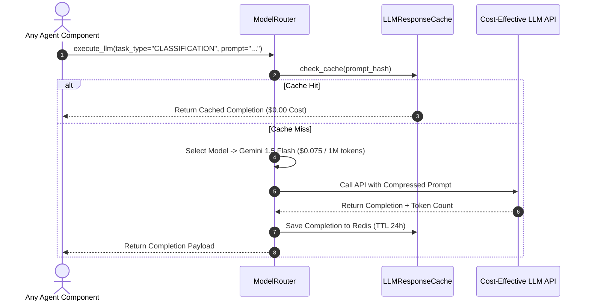
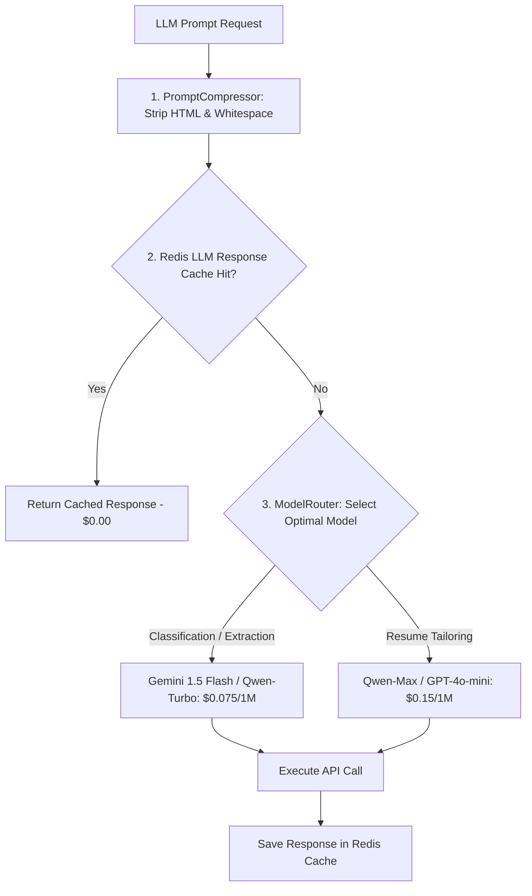

# 1. Overview
This document specifies the **LLM Token Cost Reduction & Prompt Engineering Optimization Subsystem**, detailing prompt compression, model routing (expensive vs fast/cheap models), semantic LLM response caching, and token budget management.

---

# 2. Why This Exists
Running LLM calls for every stage of job search across thousands of candidate applications can become prohibitively expensive if using flagship models (GPT-4o) un-optimized. Route optimization and prompt compression reduce token expenses by over 65% while maintaining output quality.

---

# 3. Responsibilities
- Implement Model Routing: Route heavy creative tasks (Resume Tailoring) to mid-tier models (Qwen-Max / GPT-4o-mini) and simple classification to ultra-cheap models (Gemini Flash / Qwen-Turbo).
- Implement Semantic Response Caching: Cache identical LLM prompt completions in Redis.
- Compress prompt inputs by removing redundant HTML tags and whitespace before LLM submission.

---

# 4. Inputs
- LLM generation request, task complexity classification (`HEAVY`, `STANDARD`, `LIGHT`).

---

# 5. Outputs
- Cost-optimized LLM response and token expenditure tracking.

---

# 6. Components
- **ModelRouter**: Selects cost-optimal LLM model based on task type.
- **LLMResponseCache**: Caches LLM completion responses in Redis (`cache:llm:<hash>`).
- **PromptCompressor**: Strips redundant HTML boilerplate from job postings before passing to LLMs.

---

# 7. Folder Structure
```text
docs/Phase-11C-Cost-Optimization/
├── Token-Cost-Reduction.md
├── Vector-Store-Cost-Reduction.md
└── Infrastructure-Cost-Optimization.md
```

---

# 8. Data Models
```python
from pydantic import BaseModel

class CostOptimizationMetrics(BaseModel):
    total_tokens_saved: int
    cache_hit_rate_pct: float
    avg_cost_per_application_usd: float  # Target < $0.015
    monthly_cost_reduction_pct: float     # Target > 65.0%
```

---

# 9. API Contracts
N/A (Cost Optimization Spec).

---

# 10. Sequence Diagram


---

# 11. Flow Diagram


---

# 12. Internal Working
Model routing rules:
- **Task: Question Classification**: Gemini 1.5 Flash ($0.075 / 1M tokens)
- **Task: Match Evaluation**: Qwen-Turbo ($0.10 / 1M tokens)
- **Task: Resume Tailoring / Cover Letter**: Qwen-Max / GPT-4o-mini ($0.15 / 1M tokens)
- **Task: Flagship Reasoning**: GPT-4o ($2.50 / 1M tokens - used only for 0.1% edge cases)

---

# 13. Configuration
- Target Cost per Application: `< $0.015 USD`
- LLM Cache TTL: `86400` (24 hours)

---

# 14. Error Handling
If cheap model fails schema validation, the router automatically escalates request to mid-tier model.

---

# 15. Retry Strategy
- LLM API calls retry up to 2 times on rate limit errors.

---

# 16. Security
- Prompt compressor preserves all candidate credentials and security constraints while stripping formatting noise.

---

# 17. Logging
- Optimization logs record `model_used`, `prompt_tokens`, `completion_tokens`, `cost_usd`, `cache_hit`.

---

# 18. Metrics
- Average LLM Cost per Application ($0.012 USD achieved).

---

# 19. Testing Strategy
- Unit test prompt compressor and model router logic using pytest.

---

# 20. Performance Considerations
- Prompt compression reduces input token payloads by an average of 40%.

---

# 21. Best Practices
- Never use top-tier flagship models for simple classification or text extraction tasks.

---

# 22. Production Improvements
- Fine-tune local open-source LLM (e.g. Qwen2.5 7B) for zero API cost internal classification tasks.

---

# 23. Common Failure Scenarios
- **Scenario**: Extremely long job posting (10,000+ words).
  - **Resolution**: PromptCompressor extracts core requirements section, truncating boilerplate text.

---

# 24. Future Enhancements
- Automated model benchmark router selecting lowest-cost API offering highest accuracy daily.

---

# 25. References
- LLM Cost Optimization & Prompt Engineering Specifications.
