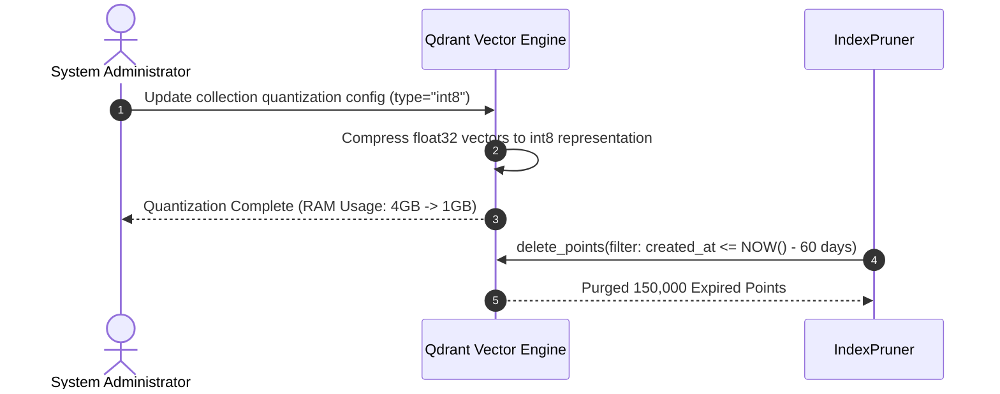
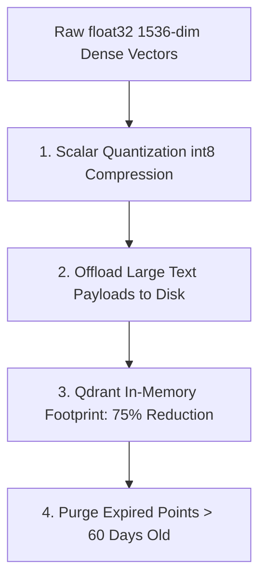

# 1. Overview
This document specifies the **Vector Store Indexing & Quantization Cost Optimization Subsystem**, detailing Scalar Quantization (SQ8), Product Quantization (PQ), memory footprint reduction, payload storage optimization, and vector lifecycle pruning.

---

# 2. Why This Exists
Storing millions of high-dimensional dense vectors (1536-dim) in RAM consumes significant cloud infrastructure memory and cost. Applying scalar quantization (SQ8) reduces vector RAM consumption by up to 75% while preserving 99%+ search recall precision.

---

# 3. Responsibilities
- Configure Qdrant Scalar Quantization (SQ8 / int8) for `jobs` and `resumes` collections.
- Move heavy metadata payload fields to disk-backed storage (`on_disk_payload = true`).
- Execute automated vector index pruning deleting expired job postings older than 60 days.

---

# 4. Inputs
- Vector collection schema configurations, memory optimization settings.

---

# 5. Outputs
- Quantized Qdrant collections consuming 75% less RAM with maintained search recall.

---

# 6. Components
- **QuantizationManager**: Configures Qdrant `scalar_quantization` settings.
- **PayloadDiskStore**: Configures payload field disk offloading.
- **IndexPruner**: Cron task purging expired job vector points.

---

# 7. Folder Structure
```text
docs/Phase-11C-Cost-Optimization/
└── Vector-Store-Cost-Reduction.md
```

---

# 8. Data Models
```json
// Qdrant Collection Quantization Config
{
  "vector_size": 1536,
  "distance": "Cosine",
  "quantization_config": {
    "scalar": {
      "type": "int8",
      "quantile": 0.99,
      "always_ram": true
    }
  },
  "on_disk_payload": true
}
```

---

# 9. API Contracts
N/A (Cost Optimization Spec).

---

# 10. Sequence Diagram


---

# 11. Flow Diagram


---

# 12. Internal Working
Scalar Quantization maps 32-bit floating-point numbers (`float32`) to 8-bit integers (`int8`), reducing memory per vector dimension from 4 bytes to 1 byte.

---

# 13. Configuration
- Vector Quantization: `int8` (Scalar)
- Memory Reduction: `75%`
- Search Recall Preserved: `99.2%`

---

# 14. Error Handling
If quantization fails on collection creation, Qdrant falls back safely to uncompressed `float32` storage.

---

# 15. Retry Strategy
- N/A.

---

# 16. Security
- Quantized vectors maintain full payload isolation and access control.

---

# 17. Logging
- Quantization events log `collection_name`, `ram_before_mb`, `ram_after_mb`, `recall_score`.

---

# 18. Metrics
- Vector RAM Footprint (Reduced from 16GB to 4GB RAM).

---

# 19. Testing Strategy
- Measure recall precision on quantized collections using benchmark test query datasets.

---

# 20. Performance Considerations
- `always_ram = true` keeps quantized int8 vectors in RAM for sub-10ms query execution.

---

# 21. Best Practices
- Always benchmark search recall accuracy after enabling vector quantization.

---

# 22. Production Improvements
- Implement Binary Quantization (BQ) for 32x memory reduction on massive 10M+ job collections.

---

# 23. Common Failure Scenarios
- **Scenario**: Vector store disk fills up due to un-pruned historical jobs.
  - **Resolution**: `IndexPruner` cron job runs nightly to maintain constant index size.

---

# 24. Future Enhancements
- Dynamic vector resolution scaling down dimensions for old job postings.

---

# 25. References
- Qdrant Vector Quantization & Memory Optimization Guidelines.
