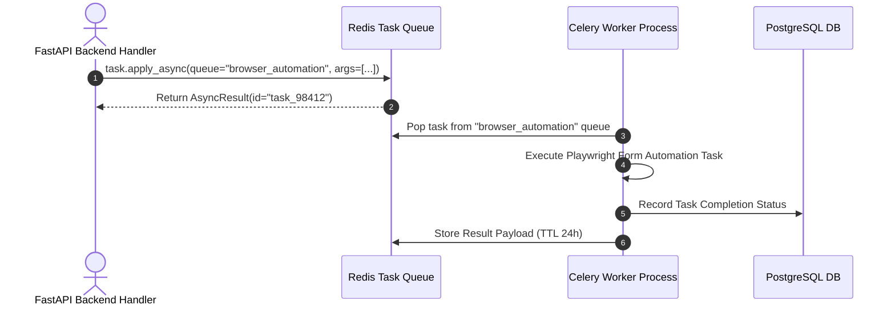
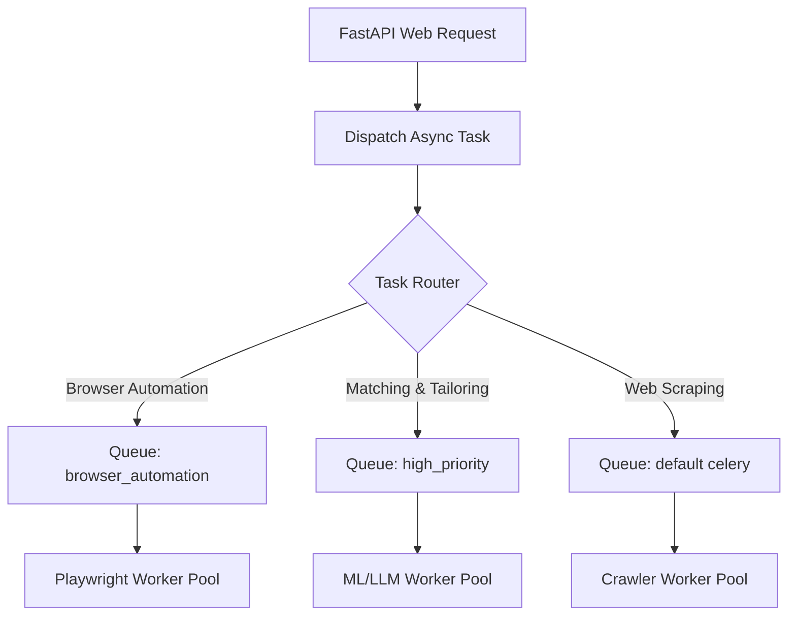

# 1. Overview
This document specifies the **Celery Distributed Task Queue & Worker Architecture**, detailing task queues (`celery`, `browser_automation`, `high_priority`), worker pool concurrency, task routing, visibility timeouts, and dead-letter queues.

---

# 2. Why This Exists
Executing multi-step agent operations (scraping 100 job boards, running LLM resume tailoring, automating Playwright form fills) cannot be executed synchronously inside web request threads. Celery offloads asynchronous background tasks to scalable worker process pools.

---

# 3. Responsibilities
- Manage background task queues (`celery`, `browser_automation`, `high_priority`).
- Execute asynchronous tasks (job crawling, resume PDF generation, Playwright form submission, email sync).
- Manage task routing, visibility timeouts, and retry policies.

---

# 4. Inputs
- Asynchronous task signature calls (`task.delay(...)` or `task.apply_async(...)`).

---

# 5. Outputs
- Asynchronous task execution results, task status updates, and error logs.

---

# 6. Components
- **CeleryApp**: Core Celery application configuration (`celery_app.py`).
- **WorkerPool**: Scalable worker process pool executing tasks.
- **BeatScheduler**: Celery Beat scheduler executing periodic cron tasks.

---

# 7. Folder Structure
```text
docs/Phase-12-Infrastructure/
└── Celery-Workers.md
```

---

# 8. Data Models
```python
# Celery Application Configuration (backend/app/celery_app.py)
from celery import Celery
from backend.app.config import settings

celery_app = Celery(
    'job_agent_tasks',
    broker=settings.REDIS_URL,
    backend=settings.REDIS_URL
)

celery_app.conf.update(
    task_routes={
        'backend.app.tasks.browser.*': {'queue': 'browser_automation'},
        'backend.app.tasks.matching.*': {'queue': 'high_priority'},
        'backend.app.tasks.scraping.*': {'queue': 'celery'},
    },
    task_serializer='json',
    result_serializer='json',
    accept_content=['json'],
    result_expires=86400,
    task_acks_late=True,             # Re-queue task if worker crashes
    visibility_timeout=600            # 10 minutes for Playwright tasks
)
```

---

# 9. API Contracts
N/A (Infrastructure Spec).

---

# 10. Sequence Diagram


---

# 11. Flow Diagram


---

# 12. Internal Working
Celery uses Redis as the message broker. Workers run with `task_acks_late = True`; if a worker process crashes mid-task (e.g. OOM kill), Redis automatically re-queues the task for execution on another worker node after `visibility_timeout` (600s).

---

# 13. Configuration
- Broker URL: `redis://localhost:6379/0`
- Worker Concurrency: `4` processes per worker pod
- Visibility Timeout: `600s`

---

# 14. Error Handling
Failed tasks retry up to 3 times using exponential backoff. Tasks that fail all retries are moved to a dead-letter queue (`failed_tasks`) for manual inspection.

---

# 15. Retry Strategy
- Tasks retry up to 3 times (`autoretry_for=(Exception,), retry_backoff=True`).

---

# 16. Security
- Task payloads use JSON serialization (`task_serializer='json'`), prohibiting un-trusted Python pickle deserialization vulnerabilities.

---

# 17. Logging
- Celery events log `task_id`, `task_name`, `state`, `runtime_seconds`.

---

# 18. Metrics
- Task Queue Depth, Worker Processing Rate (tasks/sec).

---

# 19. Testing Strategy
- Unit test Celery tasks using `task.apply()` in synchronous testing mode (`CELERY_TASK_ALWAYS_EAGER = True`).

---

# 20. Performance Considerations
- Routing Playwright tasks to dedicated `browser_automation` queues prevents heavy browser processes from starving fast API tasks.

---

# 21. Best Practices
- Always configure `task_acks_late = True` for idempotent background tasks.

---

# 22. Production Improvements
- Integration with Flower monitoring dashboard (`http://localhost:5555`).

---

# 23. Common Failure Scenarios
- **Scenario**: Celery worker dies due to node preemption.
  - **Resolution**: Redis visibility timeout expires, re-enqueueing task automatically on replacement node.

---

# 24. Future Enhancements
- RabbitMQ migration for enterprise-grade message queuing features.

---

# 25. References
- Celery 5 Distributed Task Queue Specifications.
