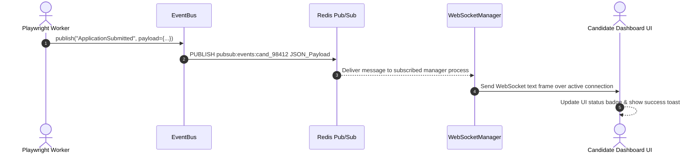
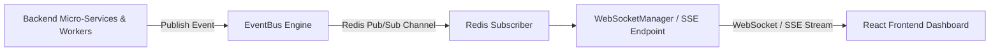

# 1. Overview
This document specifies the **Asynchronous Event Bus & Real-Time Notification Architecture**, detailing event topics, WebSocket broadcasting, Server-Sent Events (SSE), event schema validation, and decoupled publish/subscribe pipelines.

---

# 2. Why This Exists
Asynchronous system components (LangGraph planner nodes, Playwright browser workers, Email status parsers) must notify candidate frontend dashboards of status updates in real time without creating direct, tightly coupled dependencies between backend services.

---

# 3. Responsibilities
- Provide lightweight in-memory and Redis-backed Pub/Sub Event Bus.
- Publish system event domain topics (`JobDiscovered`, `MatchEvaluated`, `ResumeTailored`, `ApplicationSubmitted`, `HITLRequired`).
- Deliver real-time events to candidate React frontend UI via WebSockets and Server-Sent Events (SSE).

---

# 4. Inputs
- Internal domain event dispatches (`event_bus.publish(topic, payload)`).

---

# 5. Outputs
- Broadcasted event messages delivered to active WebSocket / SSE connections.

---

# 6. Components
- **EventBus**: Main Event Bus publisher and subscriber manager.
- **WebSocketManager**: Manages active client WebSocket connections (`/ws/progress`).
- **SSEBroadcaster**: Streams Server-Sent Events for text token previews.

---

# 7. Folder Structure
```text
docs/Phase-12-Infrastructure/
└── Event-Bus.md
```

---

# 8. Data Models
```python
from pydantic import BaseModel, Field
from typing import Dict, Any
from datetime import datetime

class DomainEvent(BaseModel):
    event_id: str
    topic: str  # JobDiscovered, MatchEvaluated, ResumeTailored, ApplicationSubmitted, HITLRequired
    candidate_id: str
    payload: Dict[str, Any]
    timestamp: datetime = Field(default_factory=datetime.utcnow)
```

---

# 9. API Contracts
WebSocket Event Stream Message Contract:
```json
{
  "event_id": "evt_98412",
  "topic": "ApplicationSubmitted",
  "candidate_id": "cand_98412",
  "payload": {
    "job_id": "gh_98412",
    "company_name": "Acme Corp",
    "status": "APPLIED",
    "screenshot_url": "/api/v1/storage/proof/cand_98412_gh_98412.png"
  },
  "timestamp": "2026-07-28T14:32:00.124Z"
}
```

---

# 10. Sequence Diagram


---

# 11. Flow Diagram


---

# 12. Internal Working
The Event Bus uses Python `asyncio.Queue` for local in-process delivery and Redis Pub/Sub (`PUBLISH pubsub:events:<candidate_id>`) for cross-process delivery across FastAPI worker instances.

---

# 13. Configuration
- WebSocket Endpoint: `ws://localhost:8000/ws/progress`
- SSE Endpoint: `http://localhost:8000/api/v1/stream/events`

---

# 14. Error Handling
Disconnected WebSocket clients drop messages safely; historical events remain accessible via PostgreSQL REST status endpoints.

---

# 15. Retry Strategy
- N/A.

---

# 16. Security
- WebSocket connection requests validate JWT tokens passed in query parameters before accepting connection handshakes.

---

# 17. Logging
- Event bus logs record `topic`, `candidate_id`, `event_id`, `subscribers_count`, `duration_ms`.

---

# 18. Metrics
- Event Broadcast Latency (<10ms end-to-end).

---

# 19. Testing Strategy
- Unit test Event Bus publishing and subscriber queues using pytest-asyncio.

---

# 20. Performance Considerations
- Non-blocking async event publishing ensures workers never wait on client UI rendering speeds.

---

# 21. Best Practices
- Keep event payload sizes minimal (<10KB) to ensure rapid WebSocket transmission.

---

# 22. Production Improvements
- Apache Kafka / RabbitMQ migration for high-throughput enterprise event streams.

---

# 23. Common Failure Scenarios
- **Scenario**: Candidate client experiences intermittent mobile network disconnect.
  - **Resolution**: Frontend auto-reconnects WebSocket and fetches missed events via REST API.

---

# 24. Future Enhancements
- Event replay engine allowing candidates to re-watch application execution steps in UI.

---

# 25. References
- Asynchronous Event-Driven Architecture Specifications.
