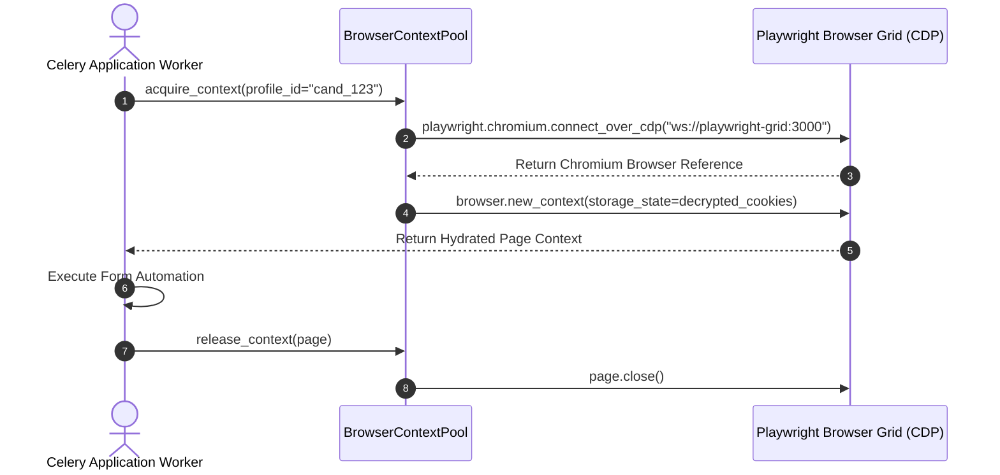
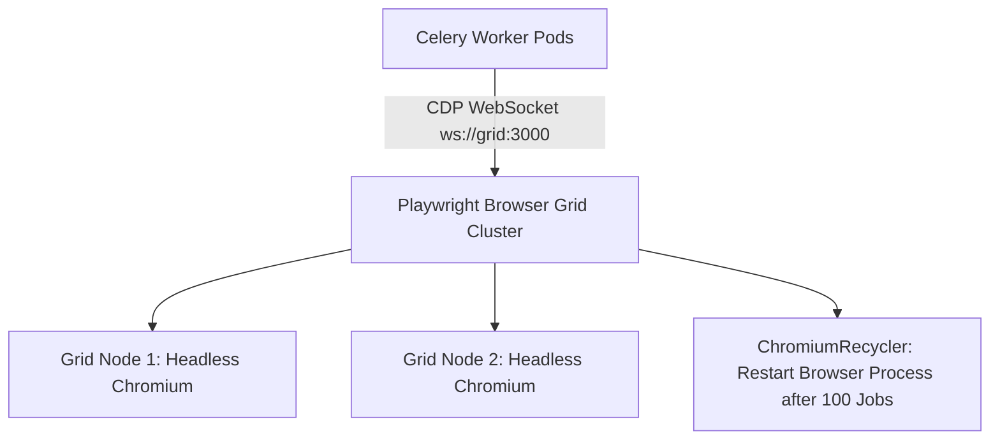

# 1. Overview
This document specifies the **Playwright Headless Browser Cluster & Grid Architecture**, detailing browser process pooling, context isolation, memory leak prevention, CDP WebSocket connections, and grid node scaling ([playwright_client.py](file:///d:/Personal%20Imp/Projects/Automated-job-Agent/backend/app/automation/browser/playwright_client.py)).

---

# 2. Why This Exists
Executing hundreds of concurrent browser automation sessions (filling Workday, Greenhouse, and Lever forms) consumes significant CPU and RAM. Managing headless Chromium instances via a dedicated Playwright Browser Grid isolates browser process memory and prevents worker node exhaustion ([playwright_client.py](file:///d:/Personal%20Imp/Projects/Automated-job-Agent/backend/app/automation/browser/playwright_client.py)).

---

# 3. Responsibilities
- Manage persistent browser process pool for fast Playwright context creation ([playwright_client.py](file:///d:/Personal%20Imp/Projects/Automated-job-Agent/backend/app/automation/browser/playwright_client.py)).
- Connect Celery workers to remote browser grid instances via CDP WebSocket (`ws://playwright-grid:3000`).
- Prevent Chromium memory leaks by automatically recycling browser processes after 100 context executions.

---

# 4. Inputs
- Browser context creation requests from Celery worker nodes.

---

# 5. Outputs
- Connected Playwright browser context ready for DOM manipulation.

---

# 6. Components
- **PlaywrightGridServer**: Remote Playwright headless Chromium server.
- **BrowserContextPool**: Recycles browser contexts and manages active connections ([browser_manager.py](file:///d:/Personal%20Imp/Projects/Automated-job-Agent/backend/app/services/browser_manager.py)).
- **ChromiumRecycler**: Restarts browser processes periodically to purge memory buildup.

---

# 7. Folder Structure
```text
docs/Phase-12-Infrastructure/
└── Playwright-Grid.md
```

---

# 8. Data Models
```python
from pydantic import BaseModel

class BrowserGridStatus(BaseModel):
    total_grid_nodes: int
    active_contexts: int
    max_supported_contexts: int = 50
    memory_usage_mb: float
    status: str = "HEALTHY"
```

---

# 9. API Contracts
N/A (Infrastructure Spec).

---

# 10. Sequence Diagram


---

# 11. Flow Diagram


---

# 12. Internal Working
Celery workers connect remotely to the browser grid over Chrome DevTools Protocol (CDP). Browsers run in headless mode (`--headless=new`). `ChromiumRecycler` monitors process memory and restarts browser processes when memory exceeds 800MB.

---

# 13. Configuration
- Specified in [backend/app/automation/browser/playwright_client.py](file:///d:/Personal%20Imp/Projects/Automated-job-Agent/backend/app/automation/browser/playwright_client.py).
- Grid Connection URL: `ws://playwright-grid:3000`
- Max Contexts per Browser: `100`

---

# 14. Error Handling
Grid connection drops trigger context re-connection attempts to an alternate grid node.

---

# 15. Retry Strategy
- CDP WebSocket connection attempts retry up to 3 times with 1-second delays.

---

# 16. Security
- Grid CDP WebSocket connections require authentication token headers (`x-grid-auth`).

---

# 17. Logging
- Grid events log `active_contexts`, `memory_mb`, `recycle_events`, `latency_ms`.

---

# 18. Metrics
- Browser Context Provisioning Latency (<150ms over CDP).

---

# 19. Testing Strategy
- Unit test CDP browser grid connection and context acquisition routines.

---

# 20. Performance Considerations
- Connecting to pre-warmed remote browser instances saves 1.5 seconds per application execution compared to launching local browser binaries.

---

# 21. Best Practices
- Always close Playwright browser contexts explicitly (`await context.close()`) in `finally:` blocks.

---

# 22. Production Improvements
- Dynamic grid node scaling using Browserless / Playwright Docker grid pods.

---

# 23. Common Failure Scenarios
- **Scenario**: Single browser process encounters memory leak.
  - **Resolution**: `ChromiumRecycler` detects memory limit breach and restarts browser process cleanly.

---

# 24. Future Enhancements
- Visual browser session live-stream proxy for operational debugging.

---

# 25. References
- Playwright CDP & Remote Browser Server Specifications.
