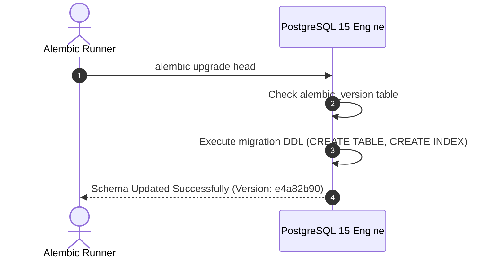
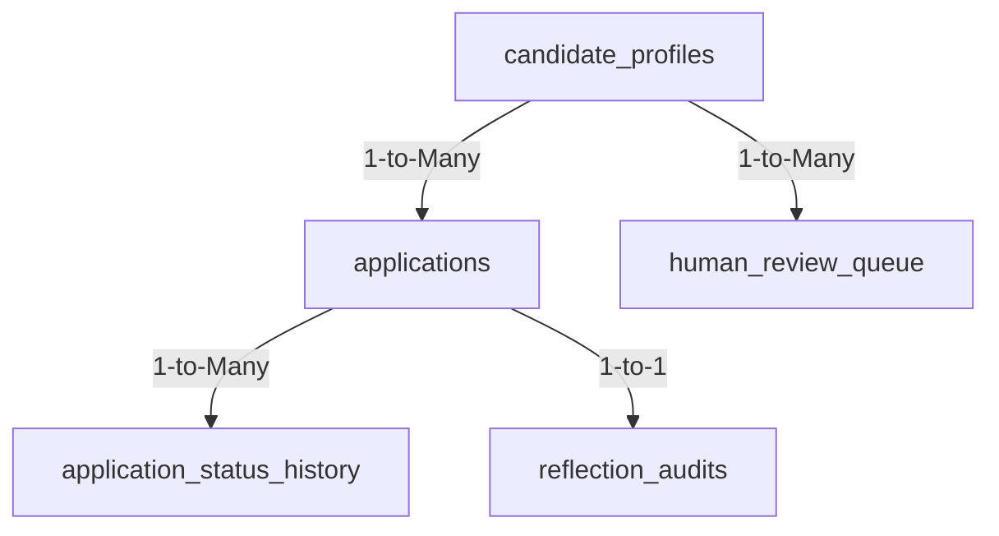

# 1. Overview
This document specifies the **PostgreSQL Database Schema & Relational Model Architecture**, detailing DDL schemas, foreign key relationships, indexes, migration strategies (Alembic), and query optimization ([models.py](file:///d:/Personal%20Imp/Projects/Automated-job-Agent/backend/app/models/models.py)).

---

# 2. Why This Exists
PostgreSQL serves as the primary relational database storing core candidate data, application records, reflection audits, review queues, and background task states. A normalized, well-indexed database schema ensures high data integrity and sub-10ms query execution ([models.py](file:///d:/Personal%20Imp/Projects/Automated-job-Agent/backend/app/models/models.py)).

---

# 3. Responsibilities
- Define SQLAlchemy ORM data models and DDL schemas ([models.py](file:///d:/Personal%20Imp/Projects/Automated-job-Agent/backend/app/models/models.py)).
- Manage database schema migrations using Alembic (`alembic upgrade head`).
- Maintain indexes on high-frequency query columns (`candidate_id`, `job_id`, `status`, `created_at`).

---

# 4. Inputs
- Application state mutations, candidate data requests.

---

# 5. Outputs
- Relational database schema tables and query result sets.

---

# 6. Components
- **CandidateProfiles**: Stores candidate master profile records ([profile.py](file:///d:/Personal%20Imp/Projects/Automated-job-Agent/backend/app/models/profile.py)).
- **JobPostings**: Stores normalized job posting data ([job.py](file:///d:/Personal%20Imp/Projects/Automated-job-Agent/backend/app/models/job.py)).
- **Applications**: Stores application submission records ([models.py](file:///d:/Personal%20Imp/Projects/Automated-job-Agent/backend/app/models/models.py)).
- **ReflectionAudits**: Stores safety audit evaluation logs.
- **HumanReviewQueue**: Stores pending candidate review items.

---

# 7. Folder Structure
```text
docs/Phase-12-Infrastructure/
├── PostgreSQL-Schema.md
├── Redis-Cache.md
├── Qdrant-Cluster.md
├── Playwright-Grid.md
├── Celery-Workers.md
└── Event-Bus.md
```

---

# 8. Data Models
```sql
-- DDL Schema Excerpt for Core Database Tables
CREATE TABLE candidate_profiles (
    id VARCHAR(64) PRIMARY KEY,
    full_name VARCHAR(255) NOT NULL,
    email VARCHAR(255) UNIQUE NOT NULL,
    phone VARCHAR(64),
    skills JSONB NOT NULL DEFAULT '[]',
    work_history JSONB NOT NULL DEFAULT '[]',
    created_at TIMESTAMP WITH TIME ZONE DEFAULT NOW()
);

CREATE TABLE applications (
    id VARCHAR(64) PRIMARY KEY,
    candidate_id VARCHAR(64) REFERENCES candidate_profiles(id) ON DELETE CASCADE,
    job_id VARCHAR(64) NOT NULL,
    job_title VARCHAR(255) NOT NULL,
    company_name VARCHAR(255) NOT NULL,
    platform VARCHAR(64) NOT NULL,
    status VARCHAR(64) NOT NULL DEFAULT 'APPLIED',
    confirmation_id VARCHAR(128),
    tailored_resume_path TEXT NOT NULL,
    screenshot_path TEXT NOT NULL,
    applied_at TIMESTAMP WITH TIME ZONE DEFAULT NOW(),
    CONSTRAINT uq_candidate_job UNIQUE (candidate_id, job_id)
);

CREATE INDEX idx_apps_cand_status ON applications(candidate_id, status);
CREATE INDEX idx_apps_applied_at ON applications(applied_at DESC);
```

---

# 9. API Contracts
N/A (Database DDL Spec).

---

# 10. Sequence Diagram


---

# 11. Flow Diagram


---

# 12. Internal Working
Alembic manages schema evolution. Migrations are written as Python scripts (`alembic/versions/`) and executed automatically in CI/CD before rolling out new application code.

---

# 13. Configuration
- Specified in [backend/app/database.py](file:///d:/Personal%20Imp/Projects/Automated-job-Agent/backend/app/database.py).

---

# 14. Error Handling
Schema constraint violations (e.g. duplicate insertion on `uq_candidate_job`) throw `IntegrityError`, caught by application services.

---

# 15. Retry Strategy
- Database operations retry up to 2 times on connection pool pre-ping failures.

---

# 16. Security
- Sensitive columns (tokens, passwords) are encrypted using pgcrypto or application-level AES-256 before insertion.

---

# 17. Logging
- SQLAlchemy logs slow queries (>200ms) with execution parameters.

---

# 18. Metrics
- Query Latency (<5ms average).

---

# 19. Testing Strategy
- Unit test database schema migrations against fresh SQLite / PostgreSQL test databases.

---

# 20. Performance Considerations
- `JSONB` GIN indexing enables fast containment queries (`skills @> '["Python"]'`).

---

# 21. Best Practices
- Always create explicit indexes on columns used in `WHERE`, `JOIN`, and `ORDER BY` clauses.

---

# 22. Production Improvements
- Table partitioning by range on `applied_at` date column for archiving historical application data.

---

# 23. Common Failure Scenarios
- **Scenario**: Un-indexed query scans 100,000 application rows.
  - **Resolution**: Prometheus query duration alert fires, engineer adds missing index to migration script.

---

# 24. Future Enhancements
- Foreign Data Wrapper (FDW) integration for federated cross-database analytics.

---

# 25. References
- PostgreSQL 15 Official Documentation & Alembic Migration Guidelines.
