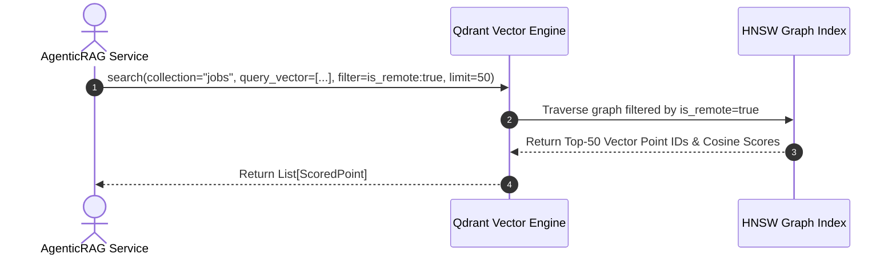
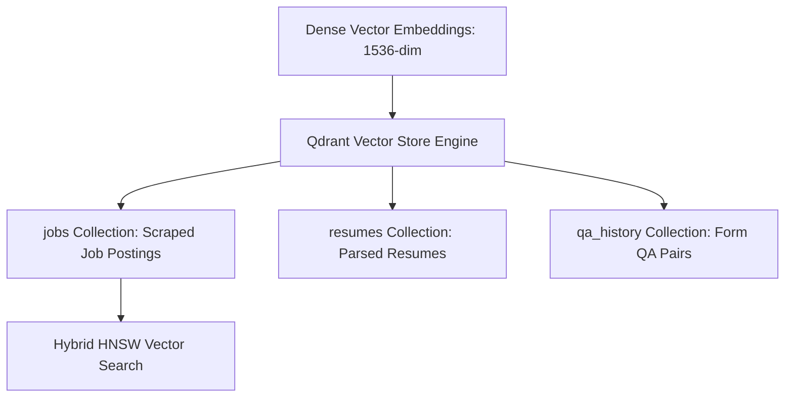

# 1. Overview
This document specifies the **Qdrant Vector Database Cluster & Collection Architecture**, detailing vector index topologies, collections (`jobs`, `resumes`, `qa_history`), payload schema indexing, HNSW graph parameters, and cluster replication ([agentic_rag.py](file:///d:/Personal%20Imp/Projects/Automated-job-Agent/backend/app/services/matching/agentic_rag.py)).

---

# 2. Why This Exists
Hybrid candidate matching and semantic QA retrieval require high-performance vector similarity search over dense vector embeddings (1536-dim). Qdrant provides vector indexing with payload filtering and HNSW graph traversal ([agentic_rag.py](file:///d:/Personal%20Imp/Projects/Automated-job-Agent/backend/app/services/matching/agentic_rag.py)).

---

# 3. Responsibilities
- Manage Qdrant vector database collections (`jobs`, `resumes`, `qa_history`) ([agentic_rag.py](file:///d:/Personal%20Imp/Projects/Automated-job-Agent/backend/app/services/matching/agentic_rag.py)).
- Configure HNSW graph parameters (`m=16`, `ef_construct=100`) for vector search accuracy.
- Manage payload field indexes (`candidate_id`, `is_remote`, `company_name`, `created_at`).

---

# 4. Inputs
- Dense vector embedding arrays, metadata payload dictionaries, vector search queries.

---

# 5. Outputs
- Ranked vector point IDs, similarity scores, and attached metadata payloads.

---

# 6. Components
- **QdrantClient**: Python gRPC / REST client wrapper ([agentic_rag.py](file:///d:/Personal%20Imp/Projects/Automated-job-Agent/backend/app/services/matching/agentic_rag.py)).
- **JobsCollection**: Stores scraped job vector embeddings and metadata payloads.
- **ResumesCollection**: Stores candidate resume section embeddings.
- **QAHistoryCollection**: Stores historical candidate form question/answer vectors.

---

# 7. Folder Structure
```text
docs/Phase-12-Infrastructure/
└── Qdrant-Cluster.md
```

---

# 8. Data Models
```json
// Qdrant Collection Scheme Payload Example
{
  "collection_name": "jobs",
  "vector_config": {
    "size": 1536,
    "distance": "Cosine"
  },
  "hnsw_config": {
    "m": 16,
    "ef_construct": 100
  },
  "payload_indexes": [
    {"field_name": "candidate_id", "field_schema": "keyword"},
    {"field_name": "is_remote", "field_schema": "bool"},
    {"field_name": "created_at", "field_schema": "integer"}
  ]
}
```

---

# 9. API Contracts
N/A (Infrastructure Spec).

---

# 10. Sequence Diagram


---

# 11. Flow Diagram


---

# 12. Internal Working
Qdrant uses HNSW (Hierarchical Navigable Small World) graphs for vector search. Payload indexes filtering on metadata (`candidate_id`) execute before vector distance calculations to minimize graph traversal costs.

---

# 13. Configuration
- Specified in [backend/app/services/matching/agentic_rag.py](file:///d:/Personal%20Imp/Projects/Automated-job-Agent/backend/app/services/matching/agentic_rag.py).
- HTTP Port: `6333`
- gRPC Port: `6334`

---

# 14. Error Handling
gRPC connection errors trigger automatic fallback to HTTP REST endpoints.

---

# 15. Retry Strategy
- Vector search calls retry up to 3 times on connection timeout.

---

# 16. Security
- API key authentication (`api-key` header) protects Qdrant endpoints in production.

---

# 17. Logging
- Qdrant events log `collection_name`, `search_latency_ms`, `points_returned_count`.

---

# 18. Metrics
- Vector Search Latency (<12ms over 100,000 vectors).

---

# 19. Testing Strategy
- Unit test vector search lookups using pytest and local Qdrant memory instance (`:memory:`).

---

# 20. Performance Considerations
- Using gRPC protocol over HTTP REST speeds up point retrieval by 2x.

---

# 21. Best Practices
- Always create explicit payload index filters for metadata fields used in search filters.

---

# 22. Production Improvements
- Deploy 3-node Qdrant Distributed Cluster with multi-replica collection sharding.

---

# 23. Common Failure Scenarios
- **Scenario**: Vector store pod runs low on memory.
  - **Resolution**: Enable scalar quantization (`Vector-Store-Cost-Reduction.md`) to cut RAM footprint by 75%.

---

# 24. Future Enhancements
- Dense-sparse hybrid vector search powered by Qdrant Sparse Vectors (SPLADE).

---

# 25. References
- Qdrant Vector Database Cluster Specifications.
