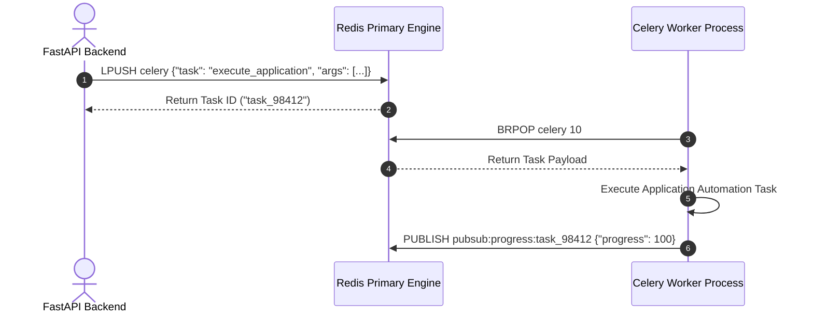
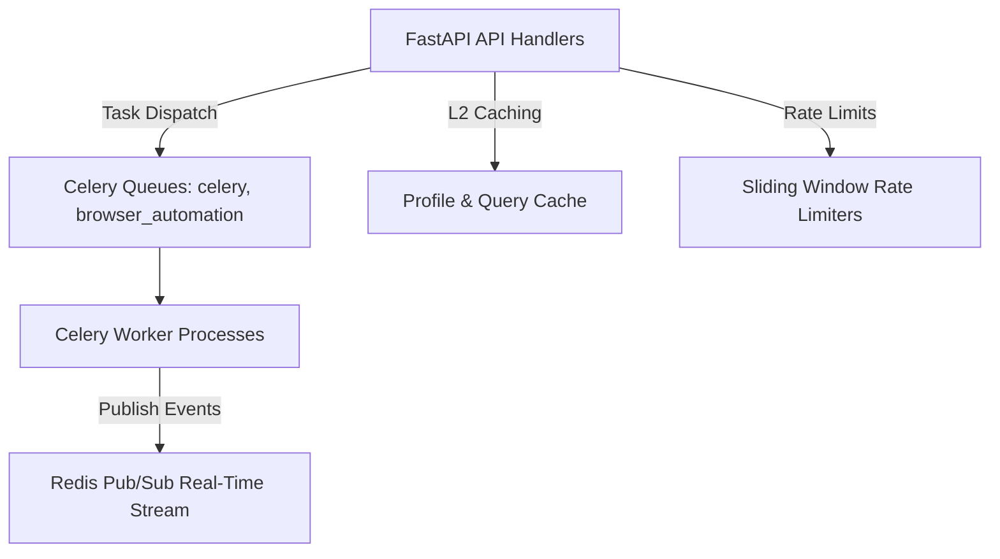

# 1. Overview
this document specifies the **Redis Cluster & In-Memory Data Store Architecture**, detailing Redis deployment topology, Celery message broker queues, cache invalidation, rate limit key management, and Sentinel high availability.

---

# 2. Why This Exists
Redis acts as the core high-speed data backbone: serving as the primary message broker for Celery worker tasks, providing L2 cache for candidate profiles, managing sliding window rate limit counters, and handling real-time WebSocket progress event streams.

---

# 3. Responsibilities
- Act as high-performance message broker for Celery worker queues (`celery`, `browser_automation`, `high_priority`).
- Manage candidate profile and job query L2 cache.
- Manage atomic rate limit counters (`INCRBY` / `EXPIRE`).
- Broadcast real-time execution events via Redis Pub/Sub channels.

---

# 4. Inputs
- Background tasks, cache write requests, rate limit increment commands.

---

# 5. Outputs
- Dispatched queue tasks, cached values, rate limit statuses, pub/sub event streams.

---

# 6. Components
- **RedisPrimary**: Primary read/write Redis 7 in-memory engine.
- **RedisReplica**: Read-only failover replica.
- **RedisSentinel**: High-availability sentinel process monitoring primary health.

---

# 7. Folder Structure
```text
docs/Phase-12-Infrastructure/
└── Redis-Cache.md
```

---

# 8. Data Models
```text
# Redis Key Naming Convention
celery                                    # Celery Task Queue List
cache:profile:<candidate_id>              # Candidate Profile L2 Cache (JSON)
cache:job_query:<md5_hash>               # Scraped Job Query Cache (JSON)
ratelimit:<platform>:<candidate_id>      # Daily Application Counter (Int)
pubsub:progress:<task_id>                # Real-Time Task Progress Channel
```

---

# 9. API Contracts
N/A (Infrastructure Spec).

---

# 10. Sequence Diagram


---

# 11. Flow Diagram


---

# 12. Internal Working
Redis operates single-threaded in-memory with non-blocking I/O multiplexing. RDB snapshots (saved every 5 minutes) and AOF (Append-Only File) logging ensure durability without sacrificing speed.

---

# 13. Configuration
- Port: `6379`
- Eviction Policy: `allkeys-lru`
- Max Memory: `2GB`

---

# 14. Error Handling
Redis node failures trigger Redis Sentinel to promote the read-replica to primary within 5 seconds.

---

# 15. Retry Strategy
- Client calls retry up to 3 times on connection socket drop.

---

# 16. Security
- Redis access is protected by TLS encryption (`rediss://`) and strong password authentication (`requirepass`).

---

# 17. Logging
- Redis logs record memory usage spikes, connected client counts, and replica synchronization events.

---

# 18. Metrics
- Read/Write Latency (<0.5ms).
- Throughput (>50,000 ops/sec).

---

# 19. Testing Strategy
- Unit test Redis cache integration using `fakeredis` test fixtures.

---

# 20. Performance Considerations
- `allkeys-lru` eviction guarantees Redis never crashes due to Out-Of-Memory (OOM) errors.

---

# 21. Best Practices
- Always set an explicit TTL expiration on cache keys to prevent memory clutter.

---

# 22. Production Improvements
- Deploy Redis Cluster across 3 availability zones for high-throughput scaling.

---

# 23. Common Failure Scenarios
- **Scenario**: Celery queue builds up 10,000 tasks.
  - **Resolution**: KEDA detects queue depth spike and scales worker pods up to 50 replicas.

---

# 24. Future Enhancements
- Redis Streams migration for persistent message streaming.

---

# 25. References
- Redis 7 Server Architecture & Celery Broker Guidelines.
