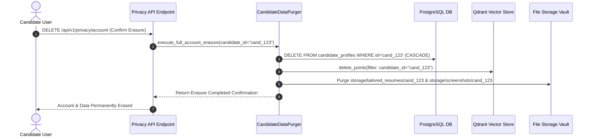
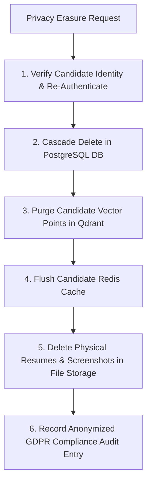

# 1. Overview
This document specifies the **GDPR, CCPA & Candidate Data Privacy Compliance Framework**, detailing Right to Erasure ("Right to be Forgotten"), Right to Data Portability, consent management, PII encryption at rest, data retention schedules, and automated privacy workflows.

---

# 2. Why This Exists
Candidate profiles, resumes, and application histories contain sensitive personally identifiable information (PII). Full compliance with global privacy regulations (GDPR in Europe, CCPA in California) is a non-negotiable legal requirement for enterprise software.

---

# 3. Responsibilities
- Implement automated Right to Erasure (`DELETE /api/v1/privacy/account`) purging all candidate data across PostgreSQL, Redis, Qdrant, and file storage vaults within 30 days.
- Implement Right to Data Portability (`GET /api/v1/privacy/export`) exporting complete JSON/ZIP archive of candidate data.
- Enforce explicit opt-in consent tracking for data processing.

---

# 4. Inputs
- Candidate privacy requests (Erasure, Export, Consent Withdrawal).

---

# 5. Outputs
- Purged database records or exported candidate privacy ZIP archives.

---

# 6. Components
- **PrivacyComplianceService**: Core GDPR/CCPA request handler.
- **CandidateDataExporter**: Packages candidate database records into portable JSON/ZIP archives.
- **CandidateDataPurger**: Cascades deletion across PostgreSQL, Redis, Qdrant, and storage vaults.

---

# 7. Folder Structure
```text
docs/Phase-12A-Security-Compliance/
├── GDPR-Compliance.md
├── SOC2-Controls.md
├── Penetration-Testing.md
└── Zero-Trust-Architecture.md
```

---

# 8. Data Models
```python
from pydantic import BaseModel, Field
from typing import Optional
from datetime import datetime

class PrivacyRequestSchema(BaseModel):
    request_id: str
    candidate_id: str
    request_type: str  # ERASURE, EXPORT, CONSENT_WITHDRAWAL
    status: str = "PENDING"  # PENDING, PROCESSING, COMPLETED
    requested_at: datetime = Field(default_factory=datetime.utcnow)
    completed_at: Optional[datetime] = None
```

---

# 9. API Contracts
Candidate Data Export REST API Endpoint:
```json
{
  "endpoint": "/api/v1/privacy/export",
  "method": "GET",
  "response": {
    "status": "Success",
    "export_download_url": "/api/v1/storage/exports/cand_98412_gdpr_export.zip",
    "expires_at": "2026-07-31T14:32:00Z"
  }
}
```

---

# 10. Sequence Diagram


---

# 11. Flow Diagram


---

# 12. Internal Working
The deletion cascade removes rows across `candidate_profiles`, `applications`, `human_review_queue`, `reflection_audits`, and `chat_messages`. Qdrant points with matching `candidate_id` are deleted, and physical files are unlinked from disk.

---

# 13. Configuration
- Max Erasure SLA: `30 days` (Executes in < 5 seconds automatically)

---

# 14. Error Handling
If file deletion encounters filesystem locks, the purger queues the file paths for background retry until verified deleted.

---

# 15. Retry Strategy
- File deletion retries up to 3 times.

---

# 16. Security
- Account erasure requires candidate password or OAuth re-authentication to prevent malicious deletion triggers.

---

# 17. Logging
- Privacy events log `request_id`, `candidate_id_hash`, `request_type`, `status`, `duration_seconds`.

---

# 18. Metrics
- Account Erasure Latency (<5.0 seconds total).

---

# 19. Testing Strategy
- Integration test privacy erasure service against test database fixtures to verify zero residual candidate records remain.

---

# 20. Performance Considerations
- Database cascading foreign key constraints (`ON DELETE CASCADE`) handle relational table deletion automatically.

---

# 21. Best Practices
- Never retain candidate PII in backup logs after an erasure request has been processed.

---

# 22. Production Improvements
- Automated annual privacy compliance audit reporting for SOC2 and ISO 27001 certifications.

---

# 23. Common Failure Scenarios
- **Scenario**: Candidate requests data export with 500MB of proof screenshots.
  - **Resolution**: Exporter streams ZIP creation asynchronously and provides background download link.

---

# 24. Future Enhancements
- Zero-knowledge encryption allowing candidate client to hold primary decryption key for all profile data.

---

# 25. References
- GDPR Article 17 (Right to Erasure) & CCPA Compliance Specifications.
