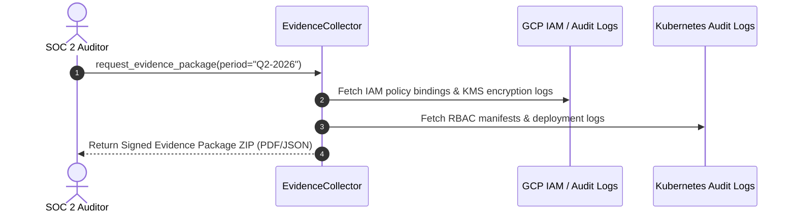
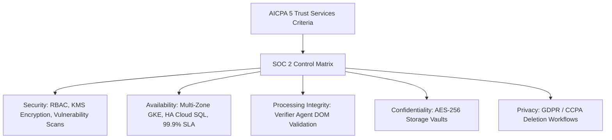

# 1. Overview
This document specifies the **SOC 2 Type II Security Trust Principles & Audit Control Matrix**, detailing 5 Trust Services Criteria (Security, Availability, Processing Integrity, Confidentiality, Privacy), control policies, access matrices, and automated evidence collection.

---

# 2. Why This Exists
Enterprise customer adoption requires demonstrating strict compliance with AICPA SOC 2 Type II trust principles. Documenting security controls, access policies, and audit trails guarantees readiness for external SOC 2 audits.

---

# 3. Responsibilities
- Implement controls across 5 Trust Services Criteria (Security, Availability, Processing Integrity, Confidentiality, Privacy).
- Maintain Role-Based Access Control (RBAC) matrices across cloud infrastructure.
- Collect continuous compliance evidence via automated audit scripts.

---

# 4. Inputs
- Cloud infrastructure configurations, IAM policies, audit logs.

---

# 5. Outputs
- SOC 2 Compliance Evidence Package and Audit Control Matrix.

---

# 6. Components
- **AccessControlMatrix**: Defines RBAC roles (Admin, Developer, Auditor, Candidate).
- **EvidenceCollector**: Script collecting weekly evidence for SOC 2 auditors.

---

# 7. Folder Structure
```text
docs/Phase-12A-Security-Compliance/
└── SOC2-Controls.md
```

---

# 8. Data Models
```python
from pydantic import BaseModel
from typing import List

class SOC2ControlMapping(BaseModel):
    control_id: str  # CC6.1, CC6.2, CC7.1, CC8.1
    trust_criterion: str  # Security, Availability, Processing Integrity
    description: str
    implementation_evidence: str
    is_automated: bool = True
```

---

# 9. API Contracts
N/A (Compliance Spec).

---

# 10. Sequence Diagram


---

# 11. Flow Diagram


---

# 12. Internal Working
Control mappings cover 4 key Common Criteria:
- **CC6.1 (Access Control)**: Multi-Factor Authentication (MFA) required for all cloud access.
- **CC6.2 (User Registration)**: Role-Based Access Control (RBAC) enforced via GCP IAM.
- **CC7.1 (Vulnerability Detection)**: Daily container vulnerability scanning with Trivy.
- **CC8.1 (Change Management)**: Automated CI/CD pipelines enforcing PR code reviews and test passing.

---

# 13. Configuration
- Evidence Collection Interval: `Weekly`

---

# 14. Error Handling
Missing evidence triggers an alert to security operations for immediate remediation.

---

# 15. Retry Strategy
- N/A.

---

# 16. Security
- SOC 2 evidence packages are encrypted with candidate-isolated decryption keys.

---

# 17. Logging
- Audit events log `control_id`, `evidence_collected`, `verification_status`.

---

# 18. Metrics
- SOC 2 Control Compliance Rate (100%).

---

# 19. Testing Strategy
- Conduct quarterly internal mock SOC 2 audits verifying control implementation evidence.

---

# 20. Performance Considerations
- Automated evidence collection scripts run in off-peak background threads.

---

# 21. Best Practices
- Maintain least-privilege IAM permissions across all cloud environments.

---

# 22. Production Improvements
- Continuous compliance monitoring using Vanta / Drata integration.

---

# 23. Common Failure Scenarios
- **Scenario**: Engineer granted temporary elevated GCP access for debugging.
  - **Resolution**: Automated IAM auditor revokes elevated permission after 4 hours automatically.

---

# 24. Future Enhancements
- ISO 27001 ISMS certification alignment.

---

# 25. References
- AICPA SOC 2 Trust Services Criteria Specifications.
