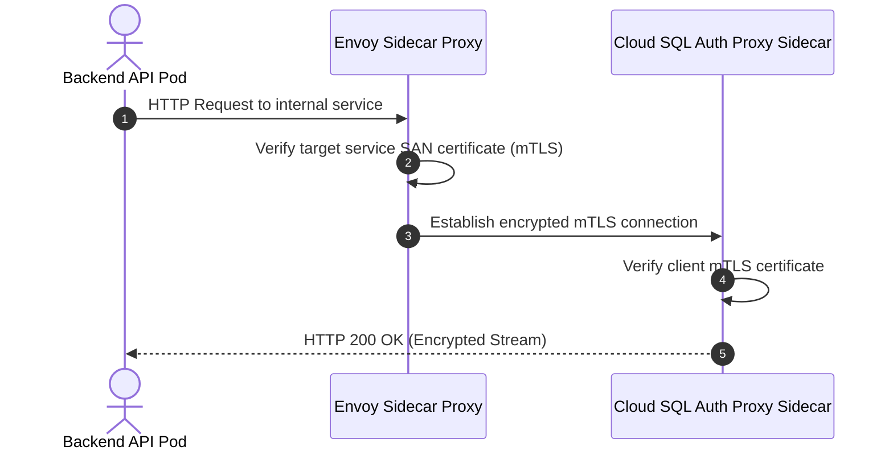
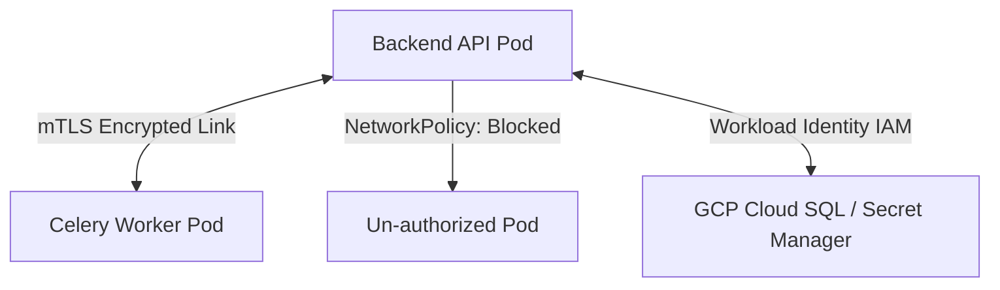

# 1. Overview
This document specifies the **Zero-Trust Network & Identity Security Architecture**, detailing microsegmentation, mTLS inter-service encryption, Workload Identity IAM, NetworkPolicies, and least-privilege security.

---

# 2. Why This Exists
Traditional perimeter security ("hard shell, soft interior") assumes inside network traffic is trustworthy. Zero-Trust Architecture enforces strict identity verification, mutual TLS (mTLS) encryption, and least-privilege access for every internal network request between microservices.

---

# 3. Responsibilities
- Enforce Zero-Trust principles ("Never Trust, Always Verify") across all services.
- Implement mutual TLS (mTLS) encryption for inter-pod service communication.
- Enforce Kubernetes `NetworkPolicy` rules blocking un-authorized inter-pod traffic.
- Authenticate container workloads to GCP services using Workload Identity IAM bindings.

---

# 4. Inputs
- Service identity tokens, network connection requests, IAM role definitions.

---

# 5. Outputs
- Encrypted mTLS connections and enforced network access controls.

---

# 6. Components
- **mTLSServiceMesh**: Manages transparent mTLS encryption for inter-pod communications.
- **NetworkPolicyEnforcer**: Restricts pod-to-pod network traffic.
- **WorkloadIdentityManager**: Binds Kubernetes Service Accounts to GCP IAM Service Accounts.

---

# 7. Folder Structure
```text
docs/Phase-12A-Security-Compliance/
└── Zero-Trust-Architecture.md
```

---

# 8. Data Models
```yaml
# Kubernetes NetworkPolicy Restricting Database Access
apiVersion: networking.k8s.io/v1
kind: NetworkPolicy
metadata:
  name: restrict-postgres-access
  namespace: job-agent-prod
spec:
  podSelector:
    matchLabels:
      app: postgres
  policyTypes:
  - Ingress
  ingress:
  - from:
    - podSelector:
        matchLabels:
          app: backend-api
    ports:
    - protocol: TCP
      port: 5432
```

---

# 9. API Contracts
N/A (Security Spec).

---

# 10. Sequence Diagram


---

# 11. Flow Diagram


---

# 12. Internal Working
Kubernetes `NetworkPolicy` objects specify explicit ingress rules. Traffic between backend pods and PostgreSQL is allowed only from pods matching `app: backend-api`. All other pod traffic is blocked by default (`default-deny-all`).

---

# 13. Configuration
- Policy: `Default Deny All Ingress / Egress`
- Encryption: `mTLS TLS v1.3`

---

# 14. Error Handling
Un-authorized network connection attempts fail at TCP handshake level and trigger security alert logs.

---

# 15. Retry Strategy
- N/A.

---

# 16. Security
- Eliminates static service account JSON keys by using ephemeral Workload Identity tokens.

---

# 17. Logging
- Zero-Trust events log `source_pod`, `target_pod`, `mtls_status`, `network_policy_action`.

---

# 18. Metrics
- mTLS Connection Handshake Latency (<1.2ms).

---

# 19. Testing Strategy
- Unit test NetworkPolicy rules using `reachability` testing scripts.

---

# 20. Performance Considerations
- Hardware-accelerated AES-GCM TLS 1.3 keeps mTLS CPU overhead under 1%.

---

# 21. Best Practices
- Never allow `0.0.0.0/0` ingress rules anywhere in Kubernetes or cloud network security groups.

---

# 22. Production Improvements
- SPIFFE/SPIRE implementation for cryptographic workload identity attestation.

---

# 23. Common Failure Scenarios
- **Scenario**: Compromised pod attempts lateral movement to database port.
  - **Resolution**: `NetworkPolicy` blocks traffic at network layer, failing attacker connection attempt instantly.

---

# 24. Future Enhancements
- Dynamic identity-aware microsegmentation rules adjusting to threat levels.

---

# 25. References
- NIST SP 800-207 Zero Trust Architecture Specifications.
