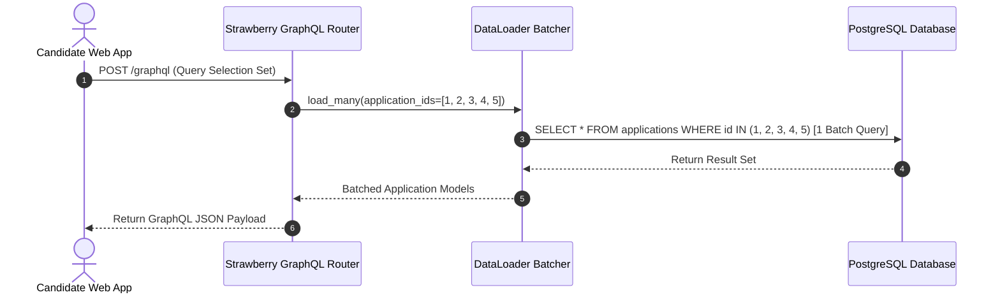
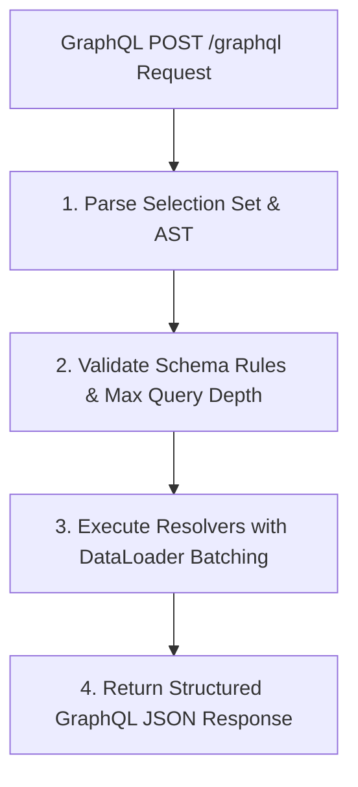

# 1. Overview
this document specifies the **GraphQL Flexible Query & Mutation API Architecture**, detailing Strawberry GraphQL schema definitions, query resolvers, mutation handlers, DataLoader optimization (preventing N+1 query problems), and subscription hooks.

---

# 2. Why This Exists
Complex frontend dashboard components require fetching nested candidate data (e.g. fetching candidate profile, top 5 matched jobs, active application status, and review queue items in a single HTTP request). GraphQL avoids over-fetching and under-fetching data.

---

# 3. Responsibilities
- Provide flexible GraphQL schema using `strawberry-graphql`.
- Implement query resolvers for profile, job discovery, matching, and application history.
- Implement mutation handlers for profile updates, campaign triggers, and HITL approvals.
- Use `DataLoader` batching to eliminate database N+1 query performance bottlenecks.

---

# 4. Inputs
- GraphQL query / mutation documents, GraphQL variables JSON.

---

# 5. Outputs
- GraphQL JSON response payload matching requested selection set.

---

# 6. Components
- **StrawberrySchema**: Master GraphQL schema wrapper.
- **QueryResolver**: Resolves query operations (`candidate`, `jobs`, `applications`, `analytics`).
- **MutationResolver**: Resolves mutation operations (`updateProfile`, `applyToJob`, `approveReview`).
- **ApplicationLoader**: DataLoader batching database lookups.

---

# 7. Folder Structure
```text
docs/Phase-13-API/
└── GraphQL-API.md
```

---

# 8. Data Models
```python
# Strawberry GraphQL Schema Excerpt
import strawberry
from typing import List, Optional

@strawberry.type
class CandidateType:
    id: str
    full_name: str
    email: str
    skills: List[str]

@strawberry.type
class Query:
    @strawberry.field
    async def candidate(self, info, id: str) -> Optional[CandidateType]:
        return await fetch_candidate_by_id(id)

schema = strawberry.Schema(query=Query)
```

---

# 9. API Contracts
GraphQL Query & Response Payload Sample:
```graphql
query GetCandidateDashboard {
  candidate(id: "cand_98412") {
    fullName
    skills
    applications(limit: 5) {
      companyName
      jobTitle
      status
    }
  }
}
```

---

# 10. Sequence Diagram


---

# 11. Flow Diagram


---

# 12. Internal Working
`strawberry-graphql` integrates with FastAPI router. `DataLoader` collects entity ID lookup requests during a single event loop tick and executes a single batched SQL `WHERE id IN (...)` query.

---

# 13. Configuration
- GraphQL Endpoint: `/graphql`
- Max Query Depth: `6`

---

# 14. Error Handling
GraphQL errors return in standard `errors` JSON array without crashing the query response.

---

# 15. Retry Strategy
- N/A.

---

# 16. Security
- Query depth limiting (max depth 6) and query complexity analysis prevent denial-of-service (DoS) attack queries.

---

# 17. Logging
- GraphQL events log `operation_name`, `query_hash`, `complexity_score`, `latency_ms`.

---

# 18. Metrics
- GraphQL Query Execution Latency (<25ms average).

---

# 19. Testing Strategy
- Unit test resolvers and mutations using Strawberry test client.

---

# 20. Performance Considerations
- DataLoader batching reduces database query volume by up to 90% on nested queries.

---

# 21. Best Practices
- Always enforce DataLoader batching for nested relational fields to avoid N+1 query performance degradation.

---

# 22. Production Improvements
- GraphQL schema stitching / federation support for microservice scaling.

---

# 23. Common Failure Scenarios
- **Scenario**: Deeply nested recursive GraphQL query submitted by client.
  - **Resolution**: Query depth validator rejects query with `MaxQueryDepthExceededError` before resolution.

---

# 24. Future Enhancements
- Real-time GraphQL Subscriptions over WebSocket protocol.

---

# 25. References
- Strawberry GraphQL & GraphQL Specification Guidelines.
