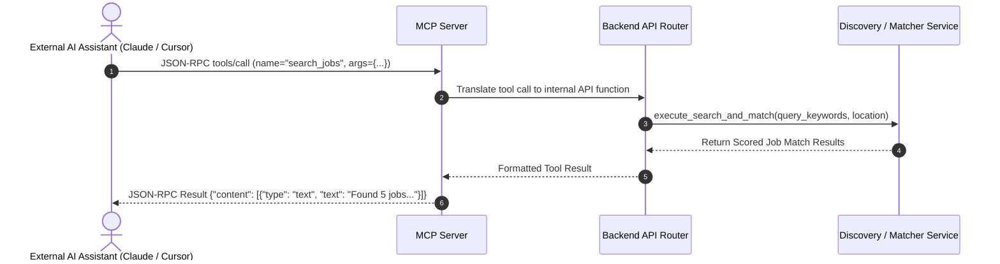
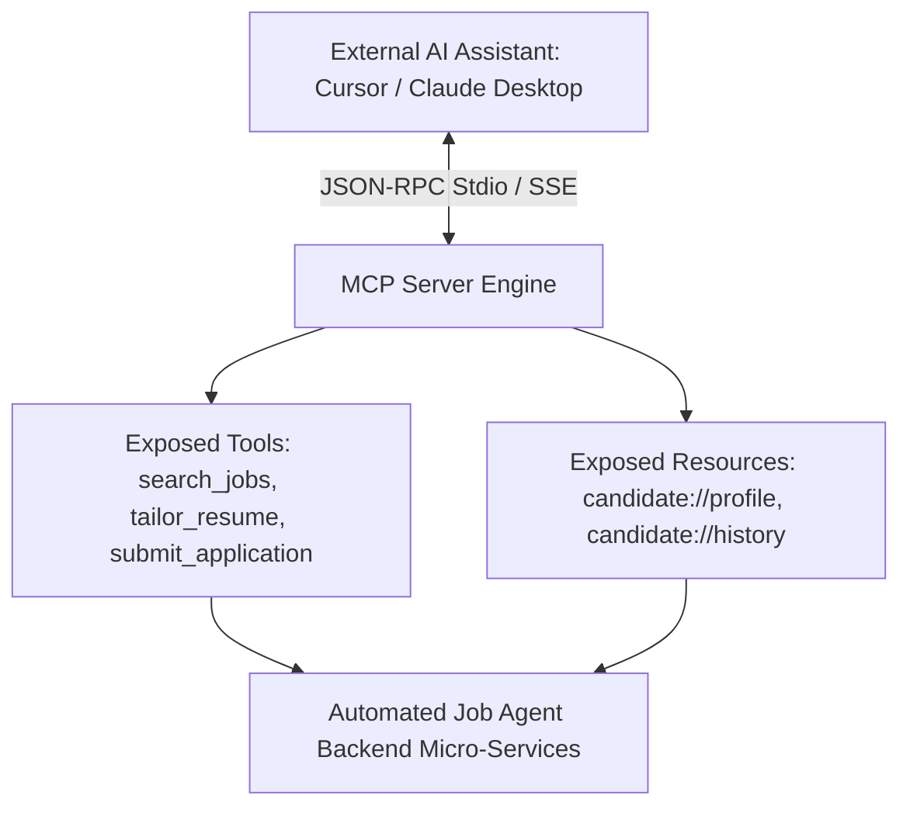

# 1. Overview
This document specifies the **Model Context Protocol (MCP) Server Integration**, detailing tool schemas (`search_jobs`, `tailor_resume`, `submit_application`, `get_application_status`), resource providers, prompt templates, and stdio / SSE transport interfaces.

---

# 2. Why This Exists
Exposing agent capabilities via Anthropic's open Model Context Protocol (MCP) enables external AI assistants (Cursor, Claude Desktop, Antigravity Agent, VS Code) to inspect candidate state, query job matches, tailor resumes, and execute applications as standard tool calls.

---

# 3. Responsibilities
- Implement MCP Server exposing job agent tools, resources, and prompt templates.
- Support JSON-RPC 2.0 stdio and SSE transport protocols.
- Provide secure access controls mapping external MCP tool calls to backend micro-services.

---

# 4. Inputs
- Model Context Protocol (MCP) JSON-RPC 2.0 requests over stdio or SSE.

---

# 5. Outputs
- Standardized MCP tool execution results, resource contents, and prompt template responses.

---

# 6. Components
- **MCPServerCore**: Core MCP server controller.
- **MCPToolRegistry**: Exposes agent tools (`search_jobs`, `tailor_resume`, `apply_job`).
- **MCPResourceProvider**: Exposes candidate resources (`candidate://profile`, `candidate://history`).

---

# 7. Folder Structure
```text
docs/Phase-13-API/
└── MCP-Server.md
```

---

# 8. Data Models
```python
# MCP Tool Definition Schema Example
from pydantic import BaseModel, Field

class SearchJobsMCPToolInput(BaseModel):
    query_keywords: str = Field(..., description="Job titles or skills to search for")
    location: str = Field(default="Remote", description="Target job location")
    min_salary: int = Field(default=100000, description="Minimum expected salary")

class MCPToolDefinition(BaseModel):
    name: str
    description: str
    input_schema: dict
```

---

# 9. API Contracts
MCP Tool Exposition Contract (JSON-RPC 2.0):
```json
{
  "jsonrpc": "2.0",
  "method": "tools/call",
  "params": {
    "name": "search_jobs",
    "arguments": {
      "query_keywords": "Senior Python Engineer",
      "location": "Remote"
    }
  },
  "id": 1
}
```

---

# 10. Sequence Diagram


---

# 11. Flow Diagram


---

# 12. Internal Working
The MCP server listens on stdio or HTTP SSE. When an external assistant executes a tool (e.g. `submit_application`), the MCP server validates arguments via Pydantic, invokes the internal backend service, and returns formatted text/image artifacts to the assistant.

---

# 13. Configuration
- Server Name: `automated-job-agent-mcp`
- Transport: `stdio` (Desktop plugins), `SSE` (Cloud integrations)

---

# 14. Error Handling
Tool errors return standard JSON-RPC error objects (`code: -32603`, `message: Internal error`).

---

# 15. Retry Strategy
- N/A.

---

# 16. Security
- MCP tool calls require an API key or local environment authentication token.

---

# 17. Logging
- MCP events log `tool_name`, `arguments_masked`, `duration_ms`, `status`.

---

# 18. Metrics
- MCP Tool Execution Latency (<15ms wrapper overhead).

---

# 19. Testing Strategy
- Unit test MCP tool definitions against sample JSON-RPC requests.

---

# 20. Performance Considerations
- Stdio transport provides microsecond local IPC communication speeds for desktop IDE extensions.

---

# 21. Best Practices
- Always write detailed human-readable tool descriptions so external LLMs select the correct tool.

---

# 22. Production Improvements
- Multi-tenant cloud MCP server hosting with OAuth2 authentication.

---

# 23. Common Failure Scenarios
- **Scenario**: External assistant passes malformed JSON arguments to tool.
  - **Resolution**: MCP server validation catches schema error and returns helpful JSON-RPC invalid params message.

---

# 24. Future Enhancements
- Interactive prompt template generator for custom candidate search strategies.

---

# 25. References
- [ADR-007: MCP Tool Exposition Architecture](../Architecture-Decision-Records/ADR-007-MCP-Tool-Exposition.md) & Model Context Protocol Specifications.
