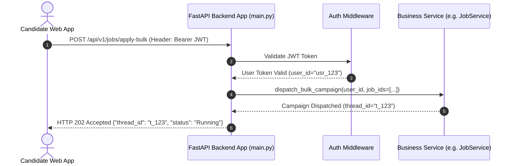
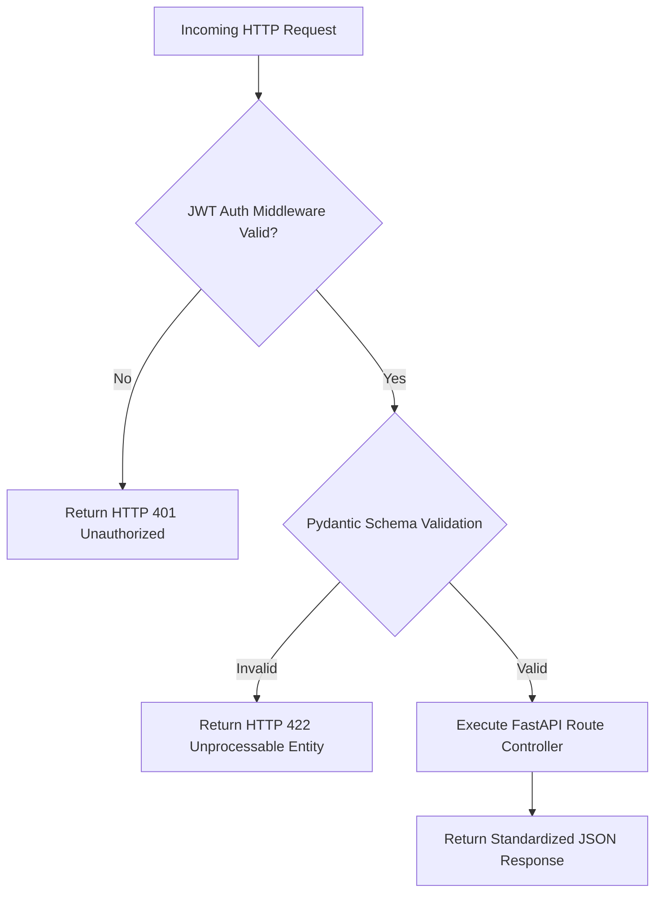

# 1. Overview
This document specifies the **FastAPI REST API OpenAPISpec & Endpoint Architecture**, detailing endpoint routes, OpenAPI 3.0 schema generation, request/response Pydantic models, rate limiting, and CORS security ([main.py](file:///d:/Personal%20Imp/Projects/Automated-job-Agent/backend/app/main.py)).

---

# 2. Why This Exists
The REST API serves as the primary gateway for frontend client applications, browser extensions, and third-party integrations to manage candidate profiles, trigger application campaigns, review human approval items, and fetch analytics ([main.py](file:///d:/Personal%20Imp/Projects/Automated-job-Agent/backend/app/main.py)).

---

# 3. Responsibilities
- Provide RESTful API endpoints for system resource management ([main.py](file:///d:/Personal%20Imp/Projects/Automated-job-Agent/backend/app/main.py)).
- Auto-generate interactive OpenAPI 3.0 Swagger UI documentation (`/docs`).
- Validate incoming JSON payloads using Pydantic schemas.

---

# 4. Inputs
- HTTP requests (GET, POST, PUT, PATCH, DELETE), Bearer JWT tokens, JSON body payloads.

---

# 5. Outputs
- Standardized HTTP JSON API responses and HTTP status codes.

---

# 6. Components
- **APIRouter**: Modular FastAPI route definitions ([main.py](file:///d:/Personal%20Imp/Projects/Automated-job-Agent/backend/app/main.py)).
- **ProfileRouter**: Routes for candidate profile CRUD operations.
- **JobRouter**: Routes for job search, matching, and bulk application dispatches.
- **ReviewRouter**: Routes for human approval queue items.
- **AnalyticsRouter**: Routes for funnel metrics and search analytics.

---

# 7. Folder Structure
```text
docs/Phase-13-API/
├── REST-API.md
├── GraphQL-API.md
├── WebSocket-and-SSE.md
└── MCP-Server.md
```

---

# 8. Data Models
```python
# API Error Response Schema Example
from pydantic import BaseModel
from typing import Optional, List

class APIErrorDetail(BaseModel):
    loc: List[str]
    msg: str
    type: str

class APIErrorResponse(BaseModel):
    status_code: int
    error: str
    message: str
    details: Optional[List[APIErrorDetail]] = None
```

---

# 9. API Contracts
Primary REST API Route Table:
| Route | Method | Description | Auth Required |
|---|---|---|---|
| `/api/v1/auth/login` | `POST` | Candidate OAuth / Login | No |
| `/api/v1/profile/me` | `GET` / `PUT` | Read/Update Master Profile | Yes |
| `/api/v1/jobs/search` | `POST` | Trigger Job Discovery Search | Yes |
| `/api/v1/jobs/apply-bulk` | `POST` | Dispatch Campaign Auto-Apply | Yes |
| `/api/v1/review/queue` | `GET` | Fetch Pending HITL Items | Yes |
| `/api/v1/review/respond` | `POST` | Submit Candidate HITL Response | Yes |
| `/api/v1/applications/history`| `GET` | Fetch Application History | Yes |
| `/api/v1/analytics/funnel` | `GET` | Fetch Search Funnel Metrics | Yes |

---

# 10. Sequence Diagram


---

# 11. Flow Diagram


---

# 12. Internal Working
FastAPI uses `uvicorn` and `asyncio` for non-blocking route execution. Pydantic models automatically validate incoming JSON bodies and parse parameters into typed Python objects.

---

# 13. Configuration
- Base Path: `/api/v1`
- Swagger UI Path: `/docs`
- Redoc Path: `/redoc`

---

# 14. Error Handling
Global exception handlers catch `HTTPException`, `ValidationError`, and generic errors, returning standardized `APIErrorResponse` payloads.

---

# 15. Retry Strategy
- N/A.

---

# 16. Security
- CORS middleware enforces origin restrictions (`CORSMiddleware`). CORS origins are configured via `ALLOWED_ORIGINS` environment settings.

---

# 17. Logging
- API middleware logs `method`, `path`, `status_code`, `client_ip`, `latency_ms`.

---

# 18. Metrics
- REST API P99 Latency (<45ms for non-AI routes).

---

# 19. Testing Strategy
- Integration test REST API endpoints using `httpx.AsyncClient` and pytest.

---

# 20. Performance Considerations
- Asynchronous route handlers (`async def`) maintain high throughput under 1,000+ RPS concurrency.

---

# 21. Best Practices
- Always return appropriate HTTP status codes (`200 OK`, `201 Created`, `202 Accepted`, `400 Bad Request`, `401 Unauthorized`, `404 Not Found`).

---

# 22. Production Improvements
- Automatic API client SDK code generation (TypeScript, Python, Swift) from OpenAPI spec.

---

# 23. Common Failure Scenarios
- **Scenario**: Incoming JSON payload contains invalid email format.
  - **Resolution**: Pydantic validation raises `ValidationError`, returning HTTP 422 with clear field error details.

---

# 24. Future Enhancements
- gRPC API gateway layer for ultra-low-latency microservice communications.

---

# 25. References
- FastAPI & OpenAPI 3.0 Specifications.
