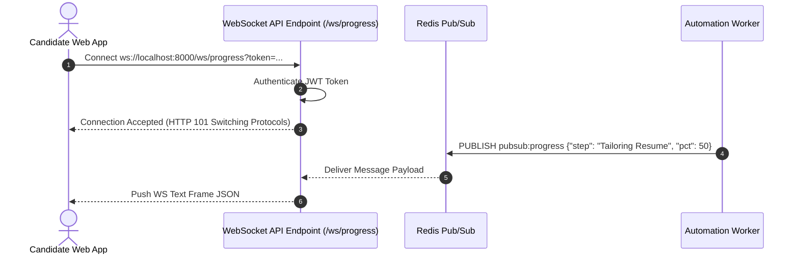

# 1. Overview
This document specifies the **WebSocket & Server-Sent Events (SSE) Real-Time API Architecture**, detailing connection handshakes, heartbeats, token streaming endpoints, reconnect protocols, and Redis Pub/Sub integration ([main.py](file:///d:/Personal%20Imp/Projects/Automated-job-Agent/backend/app/main.py)).

---

# 2. Why This Exists
Real-time user interfaces require low-latency bi-directional or uni-directional streaming channels to display Playwright application progress, live candidate review interrupts, and streaming LLM resume tailoring text tokens without inefficient client polling ([main.py](file:///d:/Personal%20Imp/Projects/Automated-job-Agent/backend/app/main.py)).

---

# 3. Responsibilities
- Provide WebSocket endpoint (`/ws/progress`) for bi-directional execution tracking and HITL response dispatches ([main.py](file:///d:/Personal%20Imp/Projects/Automated-job-Agent/backend/app/main.py)).
- Provide SSE endpoint (`/api/v1/stream/tokens`) for uni-directional LLM text token streaming.
- Manage active connection pools, heartbeats (ping/pong), and automatic client reconnection protocols.

---

# 4. Inputs
- WebSocket upgrade requests, SSE subscription GET requests, client authentication tokens.

---

# 5. Outputs
- Real-time JSON text frames and Server-Sent Event data streams (`text/event-stream`).

---

# 6. Components
- **WebSocketEndpointManager**: Manages `/ws/progress` connections and heartbeats ([main.py](file:///d:/Personal%20Imp/Projects/Automated-job-Agent/backend/app/main.py)).
- **SSEStreamProvider**: Serves `EventSource` responses for LLM token streams.
- **PubSubSubscriber**: Connects real-time API endpoints to Redis Pub/Sub event channels.

---

# 7. Folder Structure
```text
docs/Phase-13-API/
└── WebSocket-and-SSE.md
```

---

# 8. Data Models
```typescript
// WebSocket Message Protocol Contract
export interface WSProgressMessage {
  event_type: 'PROGRESS_UPDATE' | 'HITL_INTERRUPT' | 'CAMPAIGN_COMPLETE';
  task_id: string;
  step_name: string;
  progress_pct: number;
  message: string;
  timestamp: string;
}
```

---

# 9. API Contracts
WebSocket Connection URL:
`ws://localhost:8000/ws/progress?token=<JWT_TOKEN>`

SSE Stream URL:
`http://localhost:8000/api/v1/stream/tokens?task_id=task_98412`

---

# 10. Sequence Diagram


---

# 11. Flow Diagram
```mermaid
flowchart TD
    Client[Client Browser UI] <-->|WebSocket ws://host/ws/progress| WSManager[WebSocket Endpoint Manager]
    Client <--|SSE EventSource text/event-stream| SSEManager[SSE Stream Endpoint]
    WSManager <--> Redis[Redis Pub/Sub Event Backbone]
    SSEManager <--> Redis
```

---

# 12. Internal Working
WebSocket connections maintain an active ping/pong heartbeat (every 30s). SSE endpoints format output text as `event: token_chunk\ndata: {"chunk": "..."}\n\n`.

---

# 13. Configuration
- Specified in [backend/app/main.py](file:///d:/Personal%20Imp/Projects/Automated-job-Agent/backend/app/main.py).
- Heartbeat Interval: `30 seconds`

---

# 14. Error Handling
Disconnected clients trigger automatic cleanup of active connection handles; events continue buffering in Redis.

---

# 15. Retry Strategy
- Client reconnects with exponential backoff (1s, 2s, 4s, 8s).

---

# 16. Security
- Query parameter JWT authentication verifies client permission prior to upgrading HTTP connection to WebSocket protocol.

---

# 17. Logging
- Connection events log `client_id`, `connection_type`, `active_connections_count`, `duration_seconds`.

---

# 18. Metrics
- Real-Time Frame Delivery Latency (<5ms).

---

# 19. Testing Strategy
- Integration test WebSocket and SSE endpoints using `websockets` Python test client.

---

# 20. Performance Considerations
- Asynchronous non-blocking I/O supports 10,000+ simultaneous open WebSocket connections per backend pod.

---

# 21. Best Practices
- Always handle unexpected client disconnections gracefully without leaking open socket handles.

---

# 22. Production Improvements
- Multi-node WebSocket state synchronization using Redis adapter for Socket.io / ASGI servers.

---

# 23. Common Failure Scenarios
- **Scenario**: Proxy (NGINX) terminates idle WebSocket after 60 seconds.
  - **Resolution**: Ping/pong heartbeat sent every 30 seconds keeps connection active indefinitely.

---

# 24. Future Enhancements
- Binary WebAssembly protocol buffers for high-density telemetry streams.

---

# 25. References
- W3C WebSocket & Server-Sent Events (SSE) Specifications.
