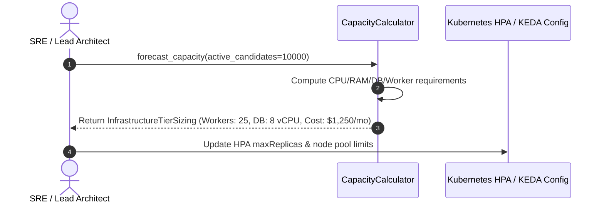
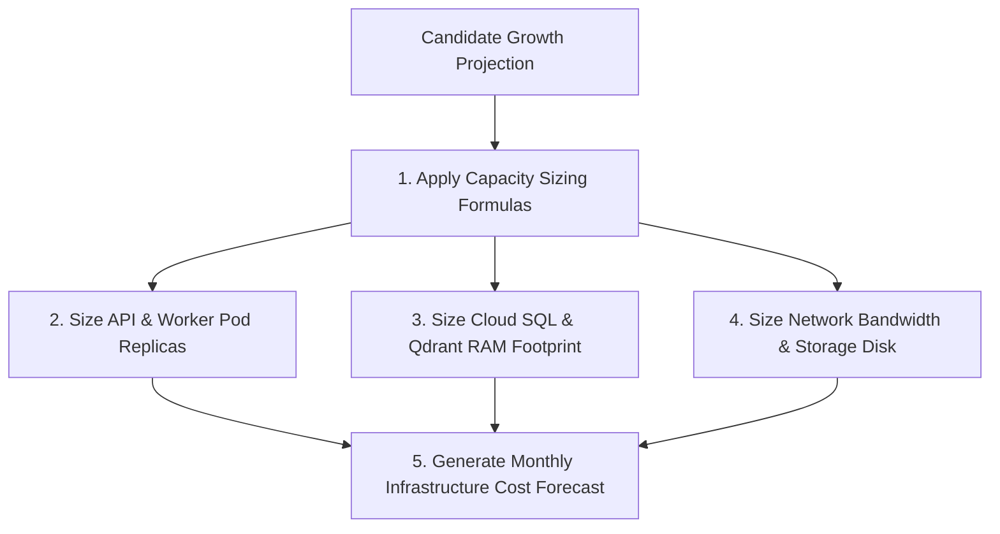

# 1. Overview
This document specifies the **Infrastructure Capacity Planning & Scaling Forecast Framework**, detailing resource estimation formulas (CPU, RAM, Disk, IOPS, Network), user scaling tiers (1,000 -> 10,000 -> 100,000 active candidates), worker queue sizing, and cloud cost projections.

---

# 2. Why This Exists
Scaling from 1,000 candidates submitting 5,000 daily applications to 100,000 candidates submitting 500,000 daily applications requires clear mathematical resource sizing models to prevent unexpected infrastructure bottlenecks or ballooning cloud costs.

---

# 3. Responsibilities
- Calculate compute, RAM, database storage, and vector RAM requirements across 3 growth tiers.
- Define worker queue scaling ratios (1 Playwright worker process per 10 active concurrent applications).
- Provide monthly infrastructure budget projections.

---

# 4. Inputs
- Target candidate user growth metrics, daily application volume targets.

---

# 5. Outputs
- Capacity sizing model tables, node pool scaling limits, and resource allocation specifications.

---

# 6. Components
- **CapacityCalculator**: Sizing formula engine computing cluster resources.
- **ResourceForecastModel**: Computes 12-month cloud cost and capacity forecasts.

---

# 7. Folder Structure
```text
docs/Phase-14-Operations/
└── Capacity-Planning.md
```

---

# 8. Data Models
```python
from pydantic import BaseModel

class InfrastructureTierSizing(BaseModel):
    active_candidates: int
    daily_applications: int
    api_pods_required: int
    celery_worker_pods: int
    postgres_cpu_cores: int
    postgres_ram_gb: int
    qdrant_ram_gb: int
    estimated_monthly_cloud_cost_usd: float
```

---

# 9. API Contracts
N/A (Operations Spec).

---

# 10. Sequence Diagram


---

# 11. Flow Diagram


---

# 12. Internal Working
Scaling Tier Specifications:
- **Tier 1 (1,000 Candidates / 5,000 daily apps)**:
  - API: 3 Pods (250m CPU, 512Mi RAM)
  - Workers: 5 Spot Pods (e2-standard-4)
  - Cloud SQL: 2 vCPU, 8GB RAM
  - Qdrant: 4GB RAM (int8 Quantized)
  - Estimated Cost: **~$280 / month**
- **Tier 2 (10,000 Candidates / 50,000 daily apps)**:
  - API: 8 Pods (500m CPU, 1Gi RAM)
  - Workers: 25 Spot Pods
  - Cloud SQL: 8 vCPU, 32GB RAM
  - Qdrant: 16GB RAM
  - Estimated Cost: **~$1,450 / month**
- **Tier 3 (100,000 Candidates / 500,000 daily apps)**:
  - API: 30 Pods
  - Workers: 150 Spot Pods
  - Cloud SQL: 32 vCPU, 128GB RAM (Read Replicas)
  - Qdrant: 64GB RAM (Distributed Cluster)
  - Estimated Cost: **~$8,900 / month**

---

# 13. Configuration
- Average Application Duration: `12 seconds`
- Average Memory per Playwright Worker: `250MB`

---

# 14. Error Handling
N/A.

---

# 15. Retry Strategy
- N/A.

---

# 16. Security
- Capacity plans allocate dedicated node pools for isolated candidate workloads.

---

# 17. Logging
- Capacity events log `active_candidates_count`, `allocated_cpu_cores`, `allocated_ram_gb`, `projected_cost`.

---

# 18. Metrics
- Resource Utilization Target (Maintain average CPU / RAM utilization at 65-75%).

---

# 19. Testing Strategy
- Load test staging environment to 10,000 candidate scale to validate capacity sizing formulas.

---

# 20. Performance Considerations
- Scale-to-zero capabilities (`Infrastructure-Cost-Optimization.md`) reduce off-peak compute costs by 70%.

---

# 21. Best Practices
- Review and update capacity sizing forecasts quarterly.

---

# 22. Production Improvements
- Automated capacity sizing recommendation engine based on historical Prometheus resource usage.

---

# 23. Common Failure Scenarios
- **Scenario**: Sudden viral candidate signup event quadruples active users overnight.
  - **Resolution**: Kubernetes HPA and GKE node pool autoscalers provision additional node capacity automatically.

---

# 24. Future Enhancements
- Multi-cloud capacity bursting (GCP primary -> AWS secondary overflow).

---

# 25. References
- Infrastructure Capacity Planning & Cost Forecasting Guidelines.
