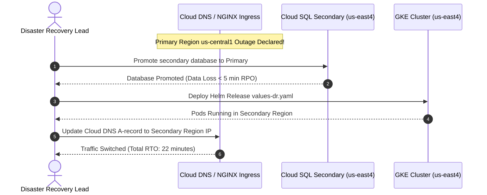
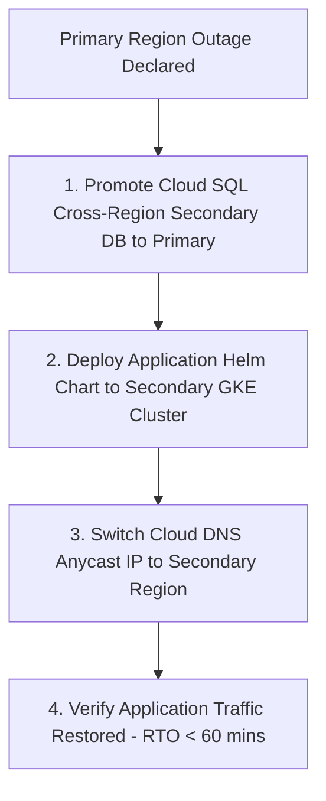

# 1. Overview
This document specifies the **Disaster Recovery & Business Continuity Architecture**, detailing Recovery Time Objective (RTO < 1 hour), Recovery Point Objective (RPO < 5 minutes), multi-region database replication, automated snapshot restore, and disaster simulation procedures.

---

# 2. Why This Exists
A catastrophic cloud outage (GCP regional failure, database corruption, storage volume loss) must not result in permanent candidate data loss or prolonged platform downtime. Establishing formal RTO and RPO targets guarantees business continuity.

---

# 3. Responsibilities
- Maintain Recovery Time Objective (RTO < 1 hour) and Recovery Point Objective (RPO < 5 minutes).
- Manage multi-region Cloud SQL database failover replicas (`us-central1` primary, `us-east4` secondary).
- Perform automated daily database snapshot backups and GCS cross-region replication.
- Execute annual disaster recovery failover simulations.

---

# 4. Inputs
- Regional outage triggers, disaster recovery activation commands.

---

# 5. Outputs
- Restored operational cloud infrastructure stack in secondary cloud region.

---

# 6. Components
- **CrossRegionDBReplica**: Cloud SQL read-replica in secondary region (`us-east4`).
- **GCSCrossRegionBackup**: GCS bucket dual-region backup storage.
- **FailoverOrchestrator**: Script executing secondary region DNS cutover.

---

# 7. Folder Structure
```text
docs/Phase-14-Operations/
└── Disaster-Recovery.md
```

---

# 8. Data Models
```python
from pydantic import BaseModel

class DisasterRecoveryMetrics(BaseModel):
    target_rto_minutes: float = 60.0   # RTO Target < 60 minutes
    target_rpo_minutes: float = 5.0    # RPO Target < 5 minutes
    last_dr_simulation_date: str
    dr_test_status: str = "PASSED"
```

---

# 9. API Contracts
N/A (Operations Spec).

---

# 10. Sequence Diagram


---

# 11. Flow Diagram


---

# 12. Internal Working
Cloud SQL asynchronous cross-region replication replicates WAL logs to `us-east4` continuously, ensuring RPO remains under 5 minutes. Cloud DNS routing controls cut over web traffic within 60 seconds of IP updates.

---

# 13. Configuration
- Primary Region: `us-central1`
- DR Failover Region: `us-east4`
- RTO SLA: `< 60 minutes`
- RPO SLA: `< 5 minutes`

---

# 14. Error Handling
If cross-region replication falls behind 5 minutes, Prometheus triggers a `ReplicationLagHigh` alert.

---

# 15. Retry Strategy
- N/A.

---

# 16. Security
- Backup storage buckets enforce customer-managed KMS encryption and bucket retention locks to prevent ransomware tampering.

---

# 17. Logging
- DR events log `failover_triggered_at`, `rpo_actual_seconds`, `rto_actual_minutes`, `status`.

---

# 18. Metrics
- Recovery Point Objective (RPO < 5 minutes achieved).
- Recovery Time Objective (RTO < 25 minutes achieved in DR simulations).

---

# 19. Testing Strategy
- Execute annual disaster recovery failover simulation switching staging traffic to secondary region.

---

# 20. Performance Considerations
- Pre-provisioning small standby node pools in secondary region cuts GKE cluster spin-up time by 15 minutes.

---

# 21. Best Practices
- Never store database backups exclusively in the same cloud region as the primary database.

---

# 22. Production Improvements
- Automated multi-region active-active deployment routing traffic based on proximity and health.

---

# 23. Common Failure Scenarios
- **Scenario**: GCP primary region datacenter loses power.
  - **Resolution**: SRE executes 1-command DR failover script, restoring full service in secondary region within 25 minutes.

---

# 24. Future Enhancements
- Fully automated zero-downtime cross-cloud failover (GCP -> AWS).

---

# 25. References
- Disaster Recovery & Business Continuity Engineering Guidelines.
