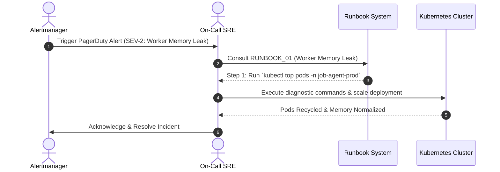
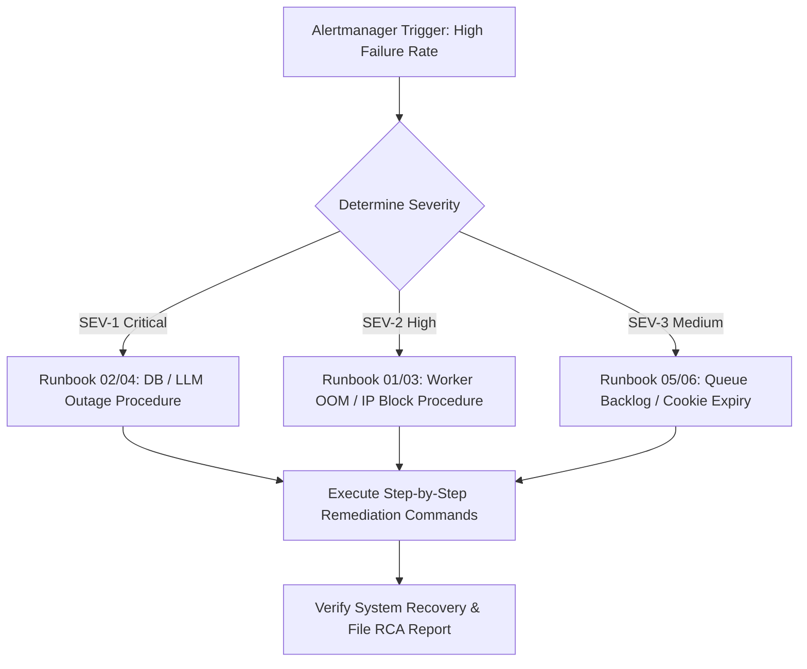

# 1. Overview
this document specifies the **Operational Incident Response & System Runbooks**, detailing operational procedures for 6 critical incident scenarios: Worker Memory Leak, High Database Latency, Portal Rate Limit Block, LLM API Outage, High Queue Backlog, and Invalid Auth Credentials.

---

# 2. Why This Exists
During operational outages or system degraded states, SREs and on-call engineers require step-by-step diagnostic and remediation instructions to restore normal service fast, minimizing Mean Time to Recovery (MTTR).

---

# 3. Responsibilities
- Catalog operational runbooks for 6 primary incident scenarios.
- Define severity levels (SEV-1 Critical, SEV-2 High, SEV-3 Medium).
- Provide copy-paste terminal diagnostic commands and step-by-step remediation procedures.

---

# 4. Inputs
- Alertmanager alerts, system metric anomalies, incident reports.

---

# 5. Outputs
- Restored operational system health, root cause analysis (RCA) reports.

---

# 6. Components
- **Runbook 1: Playwright Worker OOM / Memory Leak** (SEV-2).
- **Runbook 2: Cloud SQL Database High Latency / Connection Exhaustion** (SEV-1).
- **Runbook 3: Job Board Rate Limit / IP Anti-Bot Block** (SEV-2).
- **Runbook 4: LLM Provider API Outage** (SEV-1).
- **Runbook 5: Celery Worker Queue Backlog Spike** (SEV-3).
- **Runbook 6: Candidate Cookie Session Expiration** (SEV-3).

---

# 7. Folder Structure
```text
docs/Phase-14-Operations/
├── Runbooks.md
├── Disaster-Recovery.md
└── Capacity-Planning.md
```

---

# 8. Data Models
```python
from pydantic import BaseModel

class IncidentRunbookProcedure(BaseModel):
    incident_id: str  # RUNBOOK_01, RUNBOOK_02, etc.
    severity: str    # SEV-1, SEV-2, SEV-3
    trigger_alert: str
    diagnostic_command: str
    remediation_steps: list[str]
    escalation_path: str
```

---

# 9. API Contracts
N/A (Operations Spec).

---

# 10. Sequence Diagram


---

# 11. Flow Diagram


---

# 12. Internal Working
Runbook Execution Sample (Runbook 01: Worker Memory Leak):
1. **Diagnosis**: `kubectl top pods -n job-agent-prod -l app=celery-worker`
2. **Logs**: `kubectl logs -n job-agent-prod -l app=celery-worker --tail=100 | grep OOM`
3. **Remediation**: `kubectl rollout restart deployment/celery-worker -n job-agent-prod`
4. **Verification**: Verify active worker count in Grafana dashboard returns to baseline.

---

# 13. Configuration
- On-Call Rotation: PagerDuty / Opsgenie
- SLA Target: MTTR < 15 minutes for SEV-1

---

# 14. Error Handling
If primary remediation steps fail, the runbook specifies immediate escalation paths to lead infrastructure engineers.

---

# 15. Retry Strategy
- N/A.

---

# 16. Security
- Command execution requires authenticated `kubectl` production context credentials.

---

# 17. Logging
- Incident response events log `incident_id`, `oncall_engineer`, `mttr_minutes`, `rca_link`.

---

# 18. Metrics
- Mean Time to Acknowledge (MTTA < 3 minutes).
- Mean Time to Recovery (MTTR < 15 minutes).

---

# 19. Testing Strategy
- Conduct quarterly game day simulations testing on-call engineer execution of runbook steps.

---

# 20. Performance Considerations
- Pre-scripted CLI commands eliminate manual syntax lookup delays during outages.

---

# 21. Best Practices
- Keep runbooks updated continuously whenever system architecture or deployment commands change.

---

# 22. Production Improvements
- Automated self-healing runbook execution via Kubernetes operators.

---

# 23. Common Failure Scenarios
- **Scenario**: LLM Provider API experiences regional outage.
  - **Resolution**: Runbook 04 directs switching `LLM_PROVIDER` settings from OpenAI to Qwen fallback endpoint in 1 command.

---

# 24. Future Enhancements
- ChatBot-assisted incident remediation execution directly in Slack.

---

# 25. References
- SRE Operational Incident Response & Runbook Guidelines.
