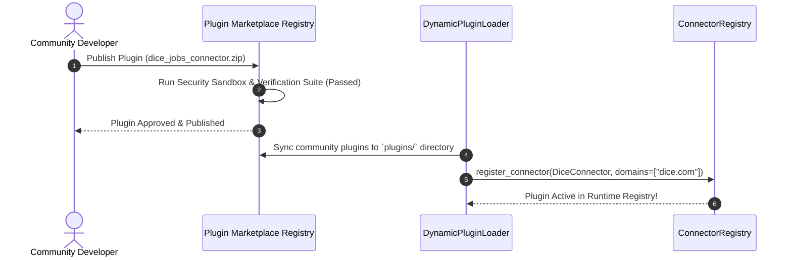
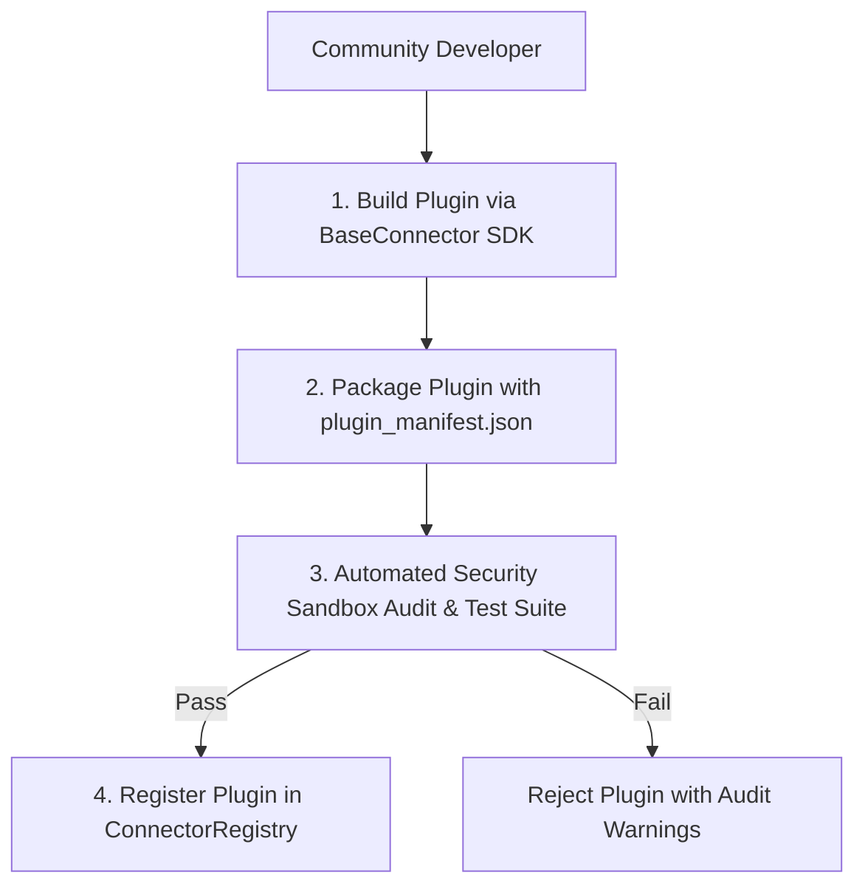

# 1. Overview
This document specifies the **Open Community Connector Plugin & Agent Marketplace Architecture**, detailing plugin SDK specifications, dynamic plugin loading, sandbox isolation, community plugin marketplace registry, and plugin verification suites.

---

# 2. Why This Exists
There are thousands of specialized niche job boards worldwide (niche tech boards, regional portals, university career centers). Allowing community developers to build, test, and publish modular connector plugins extends job board support exponentially without bloating core system code ([registry.py](file:///d:/Personal%20Imp/Projects/Automated-job-Agent/backend/app/automation/portal_plugins/registry.py)).

---

# 3. Responsibilities
- Provide Plugin SDK interface for community connector development ([base_ats.py](file:///d:/Personal%20Imp/Projects/Automated-job-Agent/backend/app/automation/ats/base_ats.py)).
- Enable dynamic runtime plugin loading via Python module reflection ([registry.py](file:///d:/Personal%20Imp/Projects/Automated-job-Agent/backend/app/automation/portal_plugins/registry.py)).
- Isolate third-party plugins inside Restricted Security Sandboxes to prevent unauthorized data access.

---

# 4. Inputs
- Community plugin packages (`.zip` / PyPI modules), plugin manifest parameters.

---

# 5. Outputs
- Verified, registered community connector plugin available in `ConnectorRegistry` ([registry.py](file:///d:/Personal%20Imp/Projects/Automated-job-Agent/backend/app/automation/portal_plugins/registry.py)).

---

# 6. Components
- **PluginSDK**: Base class and utility library for plugin development ([base_ats.py](file:///d:/Personal%20Imp/Projects/Automated-job-Agent/backend/app/automation/ats/base_ats.py)).
- **DynamicPluginLoader**: Loads plugins at runtime from `plugins/` directory ([registry.py](file:///d:/Personal%20Imp/Projects/Automated-job-Agent/backend/app/automation/portal_plugins/registry.py)).
- **PluginSandbox**: Restricted execution environment insulating core system from plugin crashes.

---

# 7. Folder Structure
```text
docs/Phase-15-Future/
└── Plugin-Ecosystem.md
```

---

# 8. Data Models
```python
# Plugin Manifest Definition Schema (plugin_manifest.json)
from pydantic import BaseModel
from typing import List

class CommunityPluginManifest(BaseModel):
    plugin_id: str  # e.g. "dice_jobs_connector"
    name: str
    version: str
    author: str
    description: str
    target_domains: List[str]  # e.g. ["dice.com"]
    entrypoint_class: str      # e.g. "DiceConnector"
    min_agent_version: str = "1.0.0"
```

---

# 9. API Contracts
N/A (Plugin Architecture Spec).

---

# 10. Sequence Diagram


---

# 11. Flow Diagram


---

# 12. Internal Working
Community plugins inherit from `BaseConnector` ([base_ats.py](file:///d:/Personal%20Imp/Projects/Automated-job-Agent/backend/app/automation/ats/base_ats.py)). At boot time, `DynamicPluginLoader` scans `plugins/`, parses `plugin_manifest.json`, dynamically imports the Python class via `importlib`, and registers target domain regex mappings in `ConnectorRegistry` ([registry.py](file:///d:/Personal%20Imp/Projects/Automated-job-Agent/backend/app/automation/portal_plugins/registry.py)).

---

# 13. Configuration
- Plugins Directory: `plugins/`
- Plugin Manifest File: `plugin_manifest.json`

---

# 14. Error Handling
Plugin execution exceptions are caught by `PluginSandbox`, logging diagnostic errors without crashing calling agent workers.

---

# 15. Retry Strategy
- Plugin load attempts retry up to 2 times on filesystem read errors.

---

# 16. Security
- Plugins run inside restricted sandboxes without access to raw database connections or system environment variables.

---

# 17. Logging
- Plugin events log `plugin_id`, `author`, `target_domains`, `version`, `status`.

---

# 18. Metrics
- Dynamic Plugin Load Time (<10ms per plugin).

---

# 19. Testing Strategy
- Execute automated plugin verification test suite (`python -m tests.plugins.verify <plugin_dir>`) before approving plugins.

---

# 20. Performance Considerations
- Lazy loading plugins on first domain match saves startup memory.

---

# 21. Best Practices
- Always enforce strict static type checking and security audits on third-party community plugins.

---

# 22. Production Improvements
- Public developer documentation portal and CLI tool (`jobagent-plugin init`) for building new connectors.

---

# 23. Common Failure Scenarios
- **Scenario**: Third-party plugin attempts to access forbidden OS environment variable.
  - **Resolution**: `PluginSandbox` intercepts restricted call and raises `SecurityViolationError`.

---

# 24. Future Enhancements
- Monetized plugin marketplace allowing developers to earn revenue for maintaining popular job board connectors.

---

# 25. References
- Plugin Ecosystem & Dynamic Class Loading Specifications.
